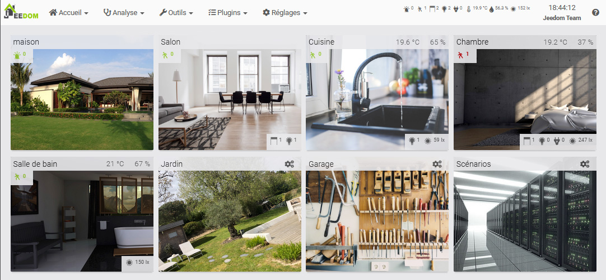
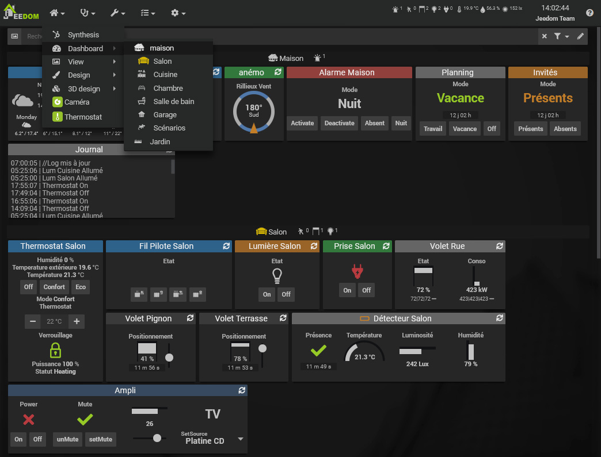

# Concept

Hier sind die wichtigsten Grundkonzepte von Jeedom. Diese Dokumentation bleibt freiwillig einfach, damit Sie die Kontrolle über Ihre Hausautomation übernehmen können.

Die Möglichkeiten von Jeedom sind nahezu unbegrenzt, da Sie mit ein paar Python- oder anderen PHP-Skripten viele Dinge erstellen können, aber darum geht es hier nicht.

> Tip
>
> Die folgenden Links verweisen auf Core v4.1. Auf der Dokumentationsseite (Benutzerhandbuch oder Konfiguration) können Sie die Version im Menü oben links ändern, um zu der Version zu wechseln, die dem gewünschten Core entspricht.

## Affichage

Mit Jeedom können Sie eine große Anzahl von Geräten miteinander verbinden, unabhängig davon, ob diese auf den Protokollen Z-Wave, Enocean, Zigbee usw., APIs mithilfe von Plugins oder direkt in Form von Skripten basieren. Sie können auf die schauen [Markt](https://market.jeedom.com/) um einen Überblick über die unterstützten Geräte zu erhalten.

Sie können diese Geräte auf verschiedene Arten anzeigen :

- Auf dem [Armaturenbrett](/de_DE/core/4.1/dashboard)
- Auf dem [Synthese](/de_DE/core/4.1/overview) (v4.1)
- Auf einem [Ansicht](/de_DE/core/4.1/view)
- Auf einem [Design](/de_DE/core/4.1/design)
- Auf einem [Design 3D](/de_DE/core/4.1/design3d)

Diese können in einem Browser auf einem Desktop-Computer oder auf einem Smartphone mit der WebApp oder einer mobilen Anwendung angezeigt werden : [Mobil Version](/de_DE/mobile/index")

## Objekte

Um Ihre Geräte zu organisieren, können Sie erstellen [Objekte](/de_DE/core/4.1/object).

Diese Objekte können Teile des Hauses darstellen (Wohnzimmer, Schlafzimmer, Werkstatt). Jedes Objekt kann ein übergeordnetes Objekt haben. Diese Hierarchie wird für die Anzeige im Dashboard verwendet. Sie können beispielsweise ein Objekt haben **Haus**, dann Objekte **Wohnzimmer** **Schlafzimmer** Objekt Kind **Haus**. Einmal im Dashboard, das Objekt **Haus** zeigt auch unten seine untergeordneten Objekte an.

> Tips
>
> IN **Einstellungen → Einstellungen** Sie können festlegen, für welches Objekt Sie im Dashboard ankommen möchten. [Vorlieben](/de_DE/core/4.1/profils)

## Ausrüstung und ihre Kontrollen

### Commandes

Für die Interaktion mit unserer Hausautomation benötigen Sie Befehle ! Es gibt zwei Arten :

> Note
>
> Seien Sie versichert, Bestellungen werden normalerweise automatisch erstellt ! Diese Erklärungen dienen dem besseren Verständnis.

- Bestellungen *Info* :
Diese Befehle speichern Informationen von Sensoren. Zum Beispiel die Temperatur einer Sonde, eine Bewegung eines Anwesenheitssensors usw.
Diese Befehle können protokolliert werden, um diese Informationen über die Zeit in Form einer Kurve zu erhalten : [Chronik](/de_DE/core/4.1/history)

Diese Befehle können auch zum Auslösen verwendet werden [Szenarien](/de_DE/core/4.1/scenario) um Aktionen basierend auf den von Ihren Sensoren gemeldeten Informationen zu automatisieren. Ein Bewegungssensor erkennt beispielsweise eine Anwesenheit, die ein Szenario auslöst, das das Licht einschaltet.

- Bestellungen *Aktion* :
Mit diesen Befehlen können Sie Ihre Aktuatoren steuern. Zum Beispiel Befehle ``on`` und ``off`` Mit einer kontrollierten Steckdose können Sie sie ein- und ausschalten.

Aktionsbefehle sind normalerweise mit Info-Befehlen verknüpft. Hier hat unsere Einstellung zwei Aktionen ``on`` und ``off``, in der Regel im Zusammenhang mit Informationen **Zustand**.

Diese beiden Arten von Befehlen werden in Form von Geräten angehängt. Das Gerät verfügt daher über Info- und / oder Aktionsbefehle. Dieses Gerät verfügt über ein übergeordnetes Objekt, mit dem Sie es an der gewünschten Stelle anzeigen können.

### Équipement

- Physiquement: Ich habe eine Steckdose mit einem Ein / Aus-Knopf und einer Status-LED im Wohnzimmer.
- In Jeedom: Ich habe Geräte mit zwei Ein- und Ausschaltaktionen und einer Statusinformation im Salonobjekt.

Diese Geräte werden von Plugins erstellt. Mit dem Z-Wave-Plugin können Sie beispielsweise Ihren Z-Waze-Plugin einbinden, wodurch ein Gerät mit seinen Steuerelementen erstellt wird, das Sie benennen und mit einem Objekt verknüpfen können.

In Bezug auf die Anzeige wird jede Bestellung mit einem Widget angezeigt. Der Core bietet die wichtigsten Widgets sowie ein Tool zum Erstellen dieser Widgets (V4) : [Widgets](/de_DE/core/4.1/widgets).

Diese Befehle sind in einer Kachel zusammengefasst, die Ihrer Ausrüstung entspricht. Diese Kachel wird im Dashboard des von Ihnen ausgewählten Objekts angezeigt.

## Conclusion

Unabhängig von Ihrem Gerät wird es in Form von Geräten erstellt, aus a [Plugin](/de_DE/core/4.1/plugin).

Dieses Gerät verfügt über eigene Befehle *Info* oder *Aktion*. Diese Befehle werden als Widgets angezeigt, die die Gerätekachel in ihrem übergeordneten Objekt bilden.

Sie werden dann sehen, dass jedes Objekt, jede Ausrüstung, jede Bestellung viele Optionen in Bezug auf Funktionalität oder Anzeige hat. Aber alles zu seiner Zeit, jetzt sollten Sie die Grundkonzepte von Jeedom verstanden haben und somit in der Lage sein, Ihre Hausautomation zu organisieren und zu wissen, wo Sie suchen müssen.
