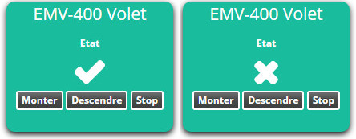
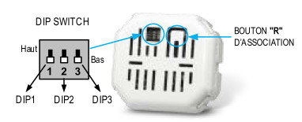
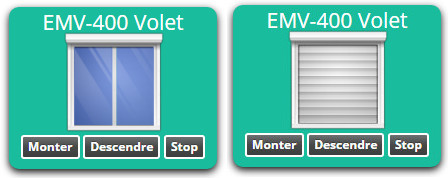

-   **Das Modul**

-   **Das Jeedom Visual**

Zusammenfassung 
======

Mit dem Mikromodul EMV-400 können Sie einen Motor verwalten
bidirektionale oder elektrische Geräte. Es ermöglicht die Kontrolle
2 Ein / Aus-Ausgänge oder ein Verschluss zum Öffnen / Stoppen / Schließen.

Darüber hinaus ist eine Interaktion mit anderen Protokollen möglich
steuerbar über Markenschalter und / oder Fernbedienungen
Edisio, direkt aus Jeedom, aber auch von jedem
Z-Wave-Sender in Ihrem Netzwerk.

Jedes Edisio-Modul im Stromnetz mit der Möglichkeit von
arbeiten als drahtloser Repeater mit den anderen Modulen, also
Stellen Sie eine vollständige Abdeckung Ihres Hauses sicher.

Schließlich kann jedes Modul im Remote-Modus verwendet werden, es ist sehr
praktisch, weil es ermöglicht, einen Sender zuzuordnen, ohne auf den zugreifen zu müssen
Empfänger.

> **Important**
>
> Neutral ist nur für den "Shutter" -Modus erforderlich"

Funktionen 
=========

-   2 Relaisausgänge geliefert

-   Wird in einer 55-mm-Unterputzdose oder direkt in installiert
    die öffnenden Kisten

-   Art der Verwendung: Ein / Aus, Öffnen / Stoppen / Schließen

-   Kompatibel mit elektronischen Endschaltern und
    mechanisch

-   Remote-Modus

-   Timer-Funktion: Ein / Aus-Modus: 30min oder 60min

-   Signalreplik (Repeater)

-   Bidirektionales Mikromodul

-   Niedriger Batteriestand des Senders

-   Klein, diskret und ästhetisch

-   Benutzerfreundlichkeit und Installation

Technische Daten 
===========================

-   Modultyp: Edisio Empfänger

-   Alimentation: 230 VAC, 50 Hz

-   Verkabelung: 4-Draht, 2 für die Steuerung und 2 für die Stromversorgung

-   Frequenz: 868,3 MHz

-   Angetriebene Ausgänge: 2 Relais

-   Maximale Leistung: 2A pro Ausgang

-   Widerstandslast: 460W

-   Sonstige Gebühren: 100W

-   Betriebstemperatur: -10 ° C + 45 ° C.

-   Dimensions: 48 x 46 x 26 mm

-   Schutzart: IP20

Moduldaten 
=================

-   Machen Sie : Edisio Smart Home

-   Nachname : EMV-400

Allgemeine Konfiguration 
======================

So konfigurieren Sie das Edisio-Plugin und ordnen Jeedom ein Modul zu,
beziehen sich darauf
[Dokumentation](https://www.jeedom.fr/doc/documentation/plugins/edisio/de_DE/edisio.html).

> **Important**
>
> Denken Sie daran, dass Jeedom Ihre Sendermodule automatisch erstellt
> Aktivieren Sie die Option in der Plugin-Konfiguration nicht.

> **Important**
>
> Umgekehrt müssen Edisio-Empfänger manuell in erstellt werden
> Jeedom.

DIP-Schalter und "R" -Taste" : 
--------------------------

-   Mit dem DIP-Schalter können Sie die Parameter anpassen
    (Repeater / Verschlussmodus / Beleuchtung / Timer) des Moduls:

> **Note**
>
> Aktivieren Sie niemals den Modus, um unnötige Redundanzen zu vermeiden
> "Repeater "an allen Empfängern, maximal 5 Empfänger pro
> Installation.

-   Mit der Taste "R" kann dem Empfänger ein Sender zugeordnet werden,
    Aktivieren oder deaktivieren Sie die Timer-Funktion und aktivieren Sie den Modus
    deportiert :

> **Note**
>
> Durch Drücken von R 3x wird der Fernbedienungsmodus aktiviert.

Funktionsplan 
---------------------------

Weiter, wenn Ihr Sender im Modus "1 Taste" oder "2" konfiguriert ist
Schlüssel ", so funktioniert das Modul:

> **Note**
>
> Informationen hierzu finden Sie in der Dokumentation des Herstellers
> Konfigurieren Sie Ihren Sender.

Timer-Funktion 
------------------

Die Timer-Funktion schaltet die Relais am Ende automatisch aus
30 oder 60 Minuten.

> **Note**
>
> Diese Funktion wird nur im "Beleuchtungs" -Modus verwendet"

Der "Shutter" -Modus" 
===============

Im "Shutter" -Modus können Sie am Ende einen bidirektionalen Motor steuern
elektronisches und mechanisches Distanzrennen.

> **Important**
>
> Neutral ist erforderlich

Elektrische Konfiguration und Anschlüsse : 
--------------------------------------------

> **Important**
>
> Damit sich das Modul im "Shutter" -Modus befindet, muss sich der DIP-Schalter 2 in befinden
> bas

> **Important**
>
> NIEMALS UNTER SPANNUNG ANSCHLIESSEN

Erstellung des Moduls in Jeedom 
------------------------------

Um ein Edisio-Empfängermodul mit Jeedom zu verknüpfen, müssen Sie es erstellen
Ausrüstung manuell.

Sobald Ihre Ausrüstung erstellt ist, sollten Sie diese erhalten :

> **Note**
>
> Denken Sie daran, Ihre neue Ausrüstung zu aktivieren.

Wählen Sie in der Geräteliste rechts "Mikromodul-Verschluss"
roulant" :

Bestellungen 
---------

Sobald Ihre Ausrüstung gespeichert ist, sollten Sie die Bestellungen erhalten
mit dem Modul verbunden :

Hier ist die Liste der Befehle :

-   Staat : Es ist der Befehl, der die Rückkehr des Status simuliert

-   Geh hoch : Dies ist der Befehl, der den Verschluss öffnet

-   Hör auf : Es ist der Befehl, der es ermöglicht, die Bewegung des Verschlusses zu stoppen

-   Geh runter : Dies ist der Befehl, der den Verschluss schließt

-   E. : Dies ist der Befehl, mit dem Sie den Remote-Modus verwenden können

> **Important**
>
> Die Statusrückmeldung wird von Jeedom simuliert. Deshalb, wenn Sie
> Wenn Sie einen anderen Sender verwenden, kann Jeedom den Status nicht aktualisieren
> des Empfängers.

Informationen 
------------

Sobald Ihre Ausrüstung mit Jeedom verbunden ist, werden verschiedene Informationen angezeigt
verfügbar :

-   Schöpfung : Gibt das Datum an, an dem das Gerät erstellt wurde

-   Kommunikation : Zeigt die letzte zwischen aufgezeichnete Kommunikation an
    Jeedom und das Mikromodul

-   Batterie : Zeigt den Batteriestatus für Batteriemodule an

-   Status : Gibt den Status des Moduls zurück

Assoziation des Mikromoduls mit Jeedom 
===================================

Damit du mit Jeedom interagieren kannst, als wäre es ein
Edisio Sender.

> **Note**
>
> Einer der großen Vorteile von Edisio ist, dass ein Empfänger haben kann
> mehrere assoziierte Emittenten

Standardmethode 
----------------

Jeder Ausgang muss einem Jeedom-Befehl zugeordnet sein:

-   Ausgabe 1 zuordnen :

    -   Drücken Sie 1x auf dem "R" des Empfängers, einzelner Piepton (kurz)
        in Wiederholung) signalisiert die Programmierung von Ausgang 1 aktiviert.

    -   Drücken Sie innerhalb von 10 Sekunden im Befehl "Öffnen" auf "Test""
        In Jeedom signalisiert ein kontinuierlicher Piepton die Assoziation von
        Ausfahrt 1 bei Jeedom.

    -   Drücken Sie innerhalb von 10 Sekunden erneut "R" am Empfänger, um
        Überprüfen Sie die Zuordnung, der Piepton stoppt.

-   Ausgabe 2 zuordnen :

    -   Drücken Sie zweimal auf das "R" des Empfängers, doppelter Piepton (kurz)
        in Wiederholung) signalisiert die Programmierung von Ausgang 2 aktiviert.

    -   Drücken Sie innerhalb von 10 Sekunden im Befehl "Schließen" auf "Test""
        In Jeedom signalisiert ein kontinuierlicher Piepton die Assoziation von
        Ausfahrt 2 bei Jeedom.

    -   Drücken Sie innerhalb von 10 Sekunden erneut "R" am Empfänger, um
        Überprüfen Sie die Zuordnung, der Piepton stoppt.

> **Note**
>
> Es ist nicht erforderlich, den Befehl "Stop" zuzuordnen
> automatisch.

Remote-Methode 
----------------

Wir haben zu Beginn dieser Dokumentation darüber gesprochen, im Fall von
Module bereits in Zwischendecken oder sogar Dachböden eingebettet. Das hier
Methode ermöglicht das Hinzufügen eines neuen Senders ohne Zugriff auf das "R" des
Empfänger.

-   Verknüpfen Sie die Schaltfläche "R." :

    -   Drücken Sie 3x auf "R" am Empfänger, dreifacher Piepton (kurz)
        in Wiederholung) zeigt den aktiven Programmiermodus an.

    -   Drücken Sie innerhalb von 10 Sekunden "Test" auf dem Befehl "E" in
        Jeedom, ein kontinuierlicher Piepton signalisiert die Assoziation mit Jeedom.

    -   Drücken Sie innerhalb von 10 Sekunden erneut "E" am Empfänger, um
        Überprüfen Sie die Zuordnung, der Piepton stoppt.

Es ist geschafft, dein Jeedom ist jetzt verbunden und sein Befehl "E."
Ersetzt jetzt die Taste "R" am Empfänger.

-   Verknüpfen Sie einen neuen Sender mit einem Empfänger, dem Jeedom bereits zugeordnet ist
    :

    -   Ausfahrt 1 :

        -   Drücken Sie 1x auf "Test" den Befehl "E" in Jeedom, einfach
            Ein Piepton (kurz in der Wiederholung) signalisiert die Programmierung von
            Ausgang 1 aktiviert.

        -   Drücken Sie innerhalb von 10 Sekunden eine der "C" -Tasten am neuen
            Sender zugeordnet werden, signalisiert ein kontinuierlicher Piepton
            die Assoziation von Ausgang 1.

        -   Drücken Sie innerhalb von 10 Sekunden erneut "Test" auf dem
            Befehl "E" in Jeedom, um die Zuordnung zu bestätigen, den Piepton
            Der Ton hört auf.

    -   Ausfahrt 2 :

        -   Drücken Sie 2x auf "Test" des Befehls "E" in Jeedom,
            Doppelter Piepton (kurz in der Wiederholung) signalisiert die
            Programmierung von Ausgang 2 aktiviert.

        -   Drücken Sie innerhalb von 10 Sekunden eine der "C" -Tasten am neuen
            Sender zugeordnet werden, signalisiert ein kontinuierlicher Piepton
            die Assoziation von Ausgang 2.

        -   Drücken Sie innerhalb von 10 Sekunden erneut "Test" auf dem
            Befehl "E" in Jeedom, um die Zuordnung zu bestätigen, den Piepton
            Der Ton hört auf.

> **Note**
>
> Sie können so oft neu starten, wie Sie zuordnen möchten
> vom Sender zum Empfänger

Alternative visuelle 
=================

Faq. 
======

So löschen Sie den Empfängerspeicher ?

:   Halten Sie das "R" 10 Sekunden lang gedrückt, bis ein kontinuierlicher Piepton ertönt.

So steuern Sie den Empfänger über einen Z-Wave-Sender?

:   Mit dem Jeedom Scenario Plugin.

Wie kann ich das gleiche Bild haben ?

:   Mit dem Jeedom Widgets Plugin.

**@Jamsta**
