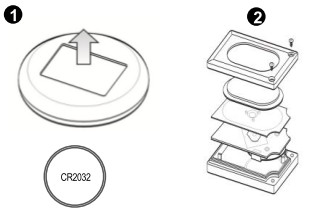
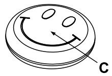

-   **Das Modul**

-   **Das Jeedom Visual**

Zusammenfassung 
======

Les Fernbedienungs “Smile” ont un canal, elles sont idéales pour la table
Bett, Bad und vor allem für Kinder, weil diese sind
sehr robust dank des verwendeten Materials. Sehr einfach und gleichzeitig
“fun” elles ont pour but d'être pratiques dans l'habitat. Sie existieren
in drei verschiedenen Farben.

Sie können problemlos an verschiedene Empfänger angeschlossen werden und können daher
steuern Sie die Ein / Aus-Lichter, variable Lichter,
Fensterläden, Tore, Garagentore. Erhältlich in 3 Farben.

Darüber hinaus ist eine Interaktion mit anderen Protokollen möglich
interagieren mit den Rezeptoren der Marke Edisio, mit Jeedom, aber
auch von jedem Z-Wave-Empfänger in Ihrem Netzwerk.

Funktionen 
=========

-   Art der Verwendung : Beleuchtung, Dimmer

-   Klein, diskret und ästhetisch

-   Benutzerfreundlichkeit und Installation

Technische Daten 
===========================

-   Modultyp : Edisio Sender

-   Versorgung : 3VDC (CR2032 Lithiumbatterie)

-   Kanäle : 1

-   Funkprotokoll : 868,3 MHz

-   Reichweite im freien Feld : 100M

-   Betriebstemperatur : -10 ° C + 50 ° C.

-   Abmessungen : 65 x 18 mm

-   Schutzart : IP64

Moduldaten 
=================

-   Machen Sie : Edisio Smart Home

-   Name : ETC1

-   Referenz : P01 / Y01 / L01

Allgemeine Konfiguration 
======================

So konfigurieren Sie das Edisio-Plugin und ordnen Jeedom ein Modul zu,
beziehen sich darauf
[Dokumentation](https://www.jeedom.fr/doc/Dokumentation/plugins/edisio/de_DE/edisio.html).

> **Wichtig**
>
> Denken Sie daran, dass Jeedom Ihre Sendermodule automatisch erstellt
> Aktivieren Sie die Option in der Plugin-Konfiguration nicht.

Funktionsplan 
---------------------------

So funktioniert die Fernbedienung :

Batteriewechsel 
-----------------------

Gehen Sie wie folgt vor, um die Batterie Ihrer Fernbedienung auszutauschen
:

Assoziation der Fernbedienung mit Jeedom 
=======================================

Die Zuordnung eines Edisio-Senders ist einfach und
automatisch. Drücken Sie einfach die Taste auf Ihrem
Fernbedienung.

Sobald Sie Ihre zugehörige Ausrüstung haben, sollten Sie diese erhalten :

Befehle 
---------

Sobald Ihre Ausrüstung erstellt ist, sollten Sie die Bestellungen erhalten
mit dem Modul verbunden :

Hier ist die Liste der Befehle :

-   bt01 : Mit diesem Befehl können Sie mit Schaltfläche 1 interagieren

-   Batterie : Zeigt den Batteriestatus an

Information 
------------

Sobald Ihre Ausrüstung mit Jeedom verbunden ist, werden verschiedene Informationen angezeigt
verfügbar :

-   Schaffung : Gibt das Datum an, an dem das Gerät erstellt wurde

-   Kommunikation : Zeigt die letzte zwischen aufgezeichnete Kommunikation an
    Jeedom und das Mikromodul

-   Batterie : Zeigt den Batteriestatus der Batteriemodule an

-   STATUS : Gibt den STATUS des Moduls zurück

Verwendung 
-----------

Sobald Ihre Fernbedienung konfiguriert ist, können Sie mit der
Jeedom-Szenario-Plugin, interagieren Sie mit Ihrer Fernbedienung auf Jeedom
und seine Ausrüstung.

> **Notiz**
>
> Die Fernbedienung mit binärer STATUSrückmeldung.

**@Jamsta**
