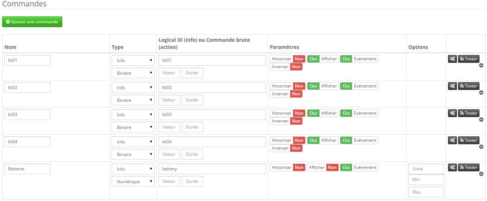

# Edisio ETC4

**Das Modul**

**Das Jeedom Visual**

## Zusammenfassung

Die e-Trendy 4-Kanal-Mini-Fernbedienung ist einfach, robust und konstruiert. Es lässt sich leicht an Empfänger anschließen und kann Ihre Ein / Aus- und dimmbaren Lichter, Motoren, Jalousien, Rollläden, Tore und Garagentore steuern. Es gibt zwei Programmiermodi.

Darüber hinaus ist die Interaktion mit anderen Protokollen möglich. Sie kann mit Empfängern der Marke Edisio, mit Jeedom, aber auch mit jedem Z-Wave-Empfänger in Ihrem Netzwerk interagieren.

## Funktionen 

-   Art der Verwendung : Ein / Aus, Öffnen / Stoppen / Schließen, Dimmer, Motorisierung, Jalousien, Rollläden, Tore, Garagentore
-   2 Programmiermodi
-   Klein, diskret und ästhetisch
-   Benutzerfreundlichkeit und Installation

## Technische Daten

-   Modultyp : Edisio Sender
-   Versorgung : 3VDC (Lithiumbatterie CR2430)
-   Kanäle : 4
-   Frequenz : 868,3 MHz
-   Betriebstemperatur : -10 ° C + 50 ° C
-   Abmessungen : 52 x 28 x 12 mm
-   Schutzart : IP40

## Moduldaten

-   Machen Sie : Edisio Smart Home
-   Name : ETC4

## Allgemeine Konfiguration

So konfigurieren Sie das Edisio-Plugin und ordnen Jeedom ein Modul zu,
beziehen sich darauf
[Dokumentation](https://doc.jeedom.com/de_DE/plugins/automation%20protocol/edisio/).

> **Wichtig**
>
> Denken Sie daran, dass Jeedom Ihre Sendermodule automatisch erstellt
> Aktivieren Sie die Option in der Plugin-Konfiguration nicht.

### Mode

Steuern und zentralisieren Sie Ihre Ein / Aus-Lichter und Dimmer, Öffnungen und Motoren mit derselben Taste oder mit 2 separaten Tasten. Die e-Trendy-Fernbedienungen verfügen über zwei Betriebsarten, MODE 1 und MODE 2 :

-   MODUS 1 : 1-Tasten-Steuerung : Ein / Aus, Öffnen / Schließen, Variation + / Variation-, Impuls
-   MODUS 2 : Steuerung auf 2 Tasten :
    -   UP-Tasten: Stop, Close, Variation-, Impulse
    -   Untere Tasten: Gehen, Öffnen, Variation +, Puls

## Funktionsplan

Je nachdem, ob Ihr Sender im Modus "1 Taste" oder "2 Tasten" konfiguriert ist, funktioniert die Fernbedienung folgendermaßen :

## Modus wechseln

-   MODUS 1 :
    -   Halten Sie die Taste "C4" gedrückt"
    -   Drücken Sie die Taste "C1" 1x und halten Sie die Taste "C4" gedrückt. Die LED blinkt einmal

-   MODUS 2 :
    -   Halten Sie die Taste "C4" gedrückt"
    -   Drücken Sie zweimal die Taste "C1" und halten Sie die Taste "C4" gedrückt. Die LED blinkt zweimal

## Assoziation der Fernbedienung mit Jeedom

Die Zuordnung eines Edisio-Senders erfolgt einfach und automatisch. Drücken Sie einfach eine beliebige Taste auf Ihrem Jeedom.

Sobald Sie Ihre zugehörige Ausrüstung haben, sollten Sie diese erhalten :

### Commandes

Sobald Ihre Ausrüstung erstellt ist, sollten Sie die mit dem Modul verknüpften Befehle erhalten :

Hier ist die Liste der Befehle :

-   bt01 : Mit diesem Befehl können Sie mit Schaltfläche 1 interagieren
-   bt02 : Es ist der Befehl, der die Interaktion mit Schaltfläche 2 ermöglicht
-   bt03 : Es ist der Befehl, der die Interaktion mit der Schaltfläche 3 ermöglicht
-   bt04 : Mit diesem Befehl können Sie mit Schaltfläche 4 interagieren
-   Batterie : Zeigt den Batteriestatus an

### Informations

Sobald Ihre Ausrüstung mit Jeedom verknüpft ist, stehen verschiedene Informationen zur Verfügung :

-   Schaffung : Gibt das Datum an, an dem das Gerät erstellt wurde
-   Kommunikation : Zeigt die letzte zwischen Jeedom und dem Mikromodul aufgezeichnete Kommunikation an
-   Batterie : Zeigt den Batteriestatus für Batteriemodule an
-   STATUS : Gibt den Status des Moduls zurück

### Utilisation

Sobald Ihre Fernbedienung konfiguriert ist, können Sie mit dem Jeedom Scenario-Plugin mit Ihrer Fernbedienung auf Jeedom interagieren.

> **Notiz**
>
> Jeder Schlüssel zu einem Binärstatus gibt zurück.

## Faq.

**So löschen Sie die Zuordnung eines Schlüssels zu einem Empfänger ?**

Drücken Sie 5 Sekunden auf das "R" des Empfängers, ein einfacher Piepton signalisiert den aktiven Programmiermodus. Drücken Sie zum Löschen die Taste "C". Wiederholen Sie diesen Vorgang für alle zu löschenden Tasten.
