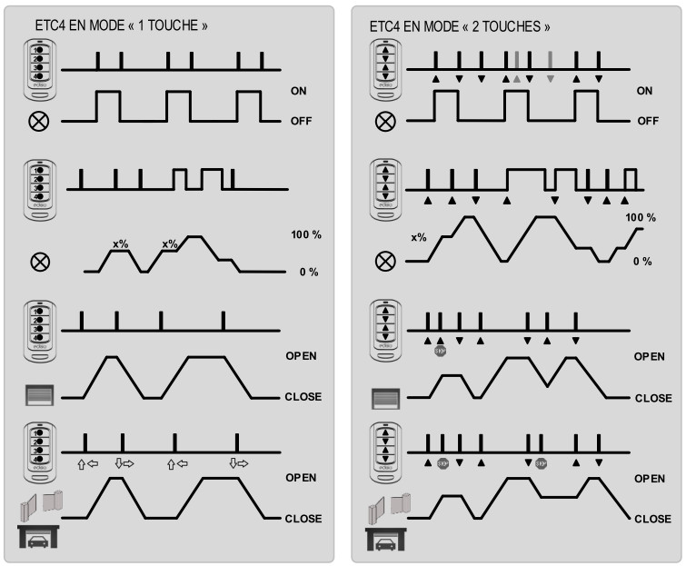

-   **Das Modul**

-   **Das Jeedom Visual**

Zusammenfassung 
======

,
. 
,
. 
Programmierung.

.

Funktionen 
=========

-   Art der Verwendung : ,
    

-   

-   Klein, diskret und ästhetisch

-   Benutzerfreundlichkeit und Installation

Technische Daten 
===========================

-   Modultyp : Edisio Sender

-   Versorgung : 

-    : 4

-   Frequenz : 868,3 MHz

-   Betriebstemperatur : -

-   Abmessungen : 

-   Schutzart : 

Moduldaten 
=================

-   Machen Sie : Edisio Smart Home

-   Name : 

Allgemeine Konfiguration 
======================

So konfigurieren Sie das Edisio-Plugin und ordnen Jeedom ein Modul zu,
beziehen sich darauf
[documentation](https://www.jeedom.fr/doc/documentation/plugins/edisio/de_DE/edisio.html).

> **Wichtig**
>
> Denken Sie daran, dass Jeedom Ihre Sendermodule automatisch erstellt
> Aktivieren Sie die Option in der Plugin-Konfiguration nicht.

Mode 
---------

,

:

-    :  : ,
    

-    :  :

    -   : 

    -   : 

Funktionsplan 
===========================

 :

 
===============

-    :

    -   "

    -   
        "

-    :

    -   "

    -   
        "

 
=======================================

.

 :

Befehle 
---------

Sobald Ihre Ausrüstung erstellt ist, sollten Sie die Bestellungen erhalten
mit dem Modul verbunden :

Hier ist die Liste der Befehle :

-    : 

-    : 

-    : 

-    : 

-   Batterie : Zeigt den Batteriestatus an

Information 
------------

Sobald Ihre Ausrüstung mit Jeedom verbunden ist, werden verschiedene Informationen angezeigt
verfügbar :

-   Schaffung : 

-   Kommunikation : Zeigt die letzte zwischen aufgezeichnete Kommunikation an
    Jeedom und das Mikromodul

-   Batterie : Zeigt den Batteriestatus für Batteriemodule an

-   STATUS : Gibt den STATUS des Moduls zurück

Verwendung 
-----------

.

> **Notiz**
>
> .

Faq. 
======

 ?

:   
    . .
    .

**@Jamsta**
