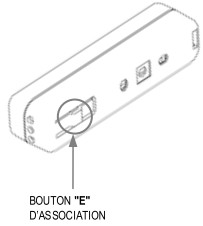
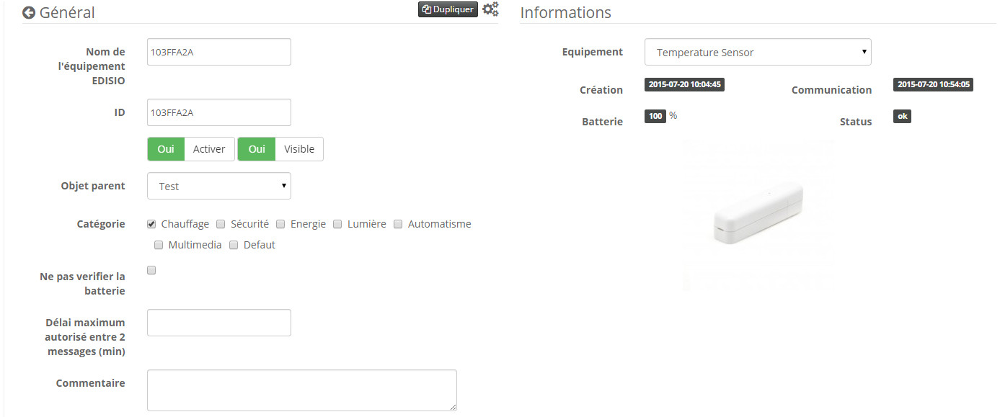

-   **Le module**

-   **Le visuel jeedom**

Zusammenfassung 
======

Placé dans une pièce, la température de la pièce voulue remontera
automatiquement. De plus, associé à un récepteur de type EMR-2000 ou
EDR-B4 (4 sorties) vous aurez un thermostat connecté et contrôlable
depuis n'importe ou dans le monde à travers internet.

Le signal est uniquement envoyé après avoir détecté une différence de
température de o,5°C ou 1°C ou toutes les 5 minutes. De plus, le capteur
est compact et discret.

L'indicateur LED intégré signal tout changement d'état.

Funktionen 
=========

-   Capteur de température sans fil alimenté par piles

-   Ultra compact

-   Signal transmis instantanément lors d'une augmentation ou diminution
    de la température

-   Facilité d'utilisation et d'installation

-   Montage au mur par des vis ou par double face

-   Information sur le niveau de la batterie

Caractéristiques Techniques 
===========================

-   Type de module : émetteur Edisio

-   Verwendung : En intérieur

-   Alimentation : 3VDC (Pile Lithium ER14250)

-   Autonomie : Jusqu'à 3 ans

-   fréquence : 868,3 MHz

-   Température de fonctionnement : 0°C +45°C

-   Portée en champs libre : 100M

-   Dimensions : 25x79x19mm

-   Degré de protection : IP20

Données du module 
=================

-   Marque : Edisio Smart Home

-   Name : ETS-200

Allgemeine Konfiguration 
======================

Pour configurer le plugin Edisio et associer un module à Jeedom,
référez-vous à cette
[documentation](https://www.jeedom.fr/doc/documentation/plugins/edisio/fr_FR/edisio.html).

> **wichtig**
>
> Pour que Jeedom crée automatiquement vos modules émetteurs, n'oubliez
> pas d'activer l'option dans la configuration du plugin.

> **Spitze**
>
> Le placement est conseillé à une hauteur de 150 cm et à proximité de
> la température ressentie voulue.

Bouton "E" 
----------

Vous trouverez dessous le bouton "E" qui est le bouton d'association du
Capteur de température.

Réglage du delta de température 
-------------------------------

Par défaut, le delta de température est programmé à 1°C (+/-10%) afin
d'optimiser l'autonomie de la batterie. Vous avez la possibilité de
régler ce paramètre:

Association du capteur à Jeedom 
===============================

L'association du Capteur de température, est un jeu d'enfant. Il suffit
d'appuyer sur le bouton "E", situé sous le capteur. Celui-ci sera
reconnu automatiquement. Placez-le dans un objet, donner lui un nom et
Speichern.

Une fois, votre équipement associé, vous devriez obtenir ceci :

Befehle 
---------

Une fois votre équipement créé, vous devriez obtenir les commandes
associées au module :

Voici la liste des commandes :

-   Température : C'est la commande qui indique la température relevée

-   Batterie : Indique l'état de la batterie

Information 
------------

Une fois votre équipement associé à Jeedom, diverses informations seront
verfügbar :

-   Schaffung : Indique la date à laquelle l'équipement à été créé

-   Communication : Indique la dernière communication enregistrée entre
    Jeedom et le micro-module

-   Batterie : Indique l'état de la batterie des modules à piles

-   STATUS : Retourne le status du module

**@Jamsta**
