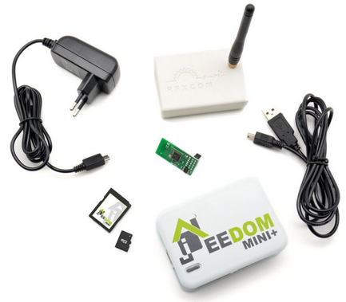
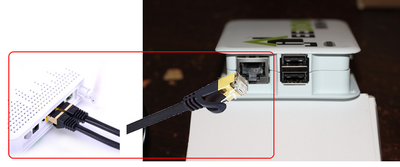

# Mini + Start

Zunächst einmal vielen Dank für den Kauf des Jeedom Mini +. Hier finden Sie eine ausführliche Dokumentation, in der erläutert wird, wie Sie diese Box in Betrieb nehmen und so die Heimautomation mit Jeedom entdecken.

Die Jeedom Mini + Box, die Sie erhalten haben, muss enthalten :

-   Eine Jeedom Mini + Box (JeedomBoard Mono Card - ARM Cortex A9 1.2 GHz & 512 MB RAM)
-   Ein 5V 2A Netzladegerät.
-   Eine Micro-SD-Karte mit vorinstallierter Jeedom-Software. (Diese Karte ist normalerweise bereits in die Box eingelegt.)
-   MicroSD / SD-Kartenadapter.
-   Jeedom Aufkleber.
-   *Ein RFXcom 433E-Modul mit USB-Kabel.* (Nur wenn Sie das Starterpaket mit RFXcom-Schnittstelle gekauft haben).
-   *RaZberry Z-Wave + Karte.* (Nur wenn Sie das Z-Wave + -kompatible Starterpaket gekauft haben) (Diese Karte ist normalerweise bereits in der Box installiert.)

Bevor Sie es verwenden können, müssen Sie Ihre Jeedom Mini + Box an Ihr lokales Netzwerk (über Router, Switch oder Internet-Box…) und an das Stromnetz anschließen.

Bevor Sie beginnen, beachten Sie bitte, dass Jeedom mit Plugins funktioniert. Auf Ihrem Jeedom Mini + sind mehrere Plugins vorinstalliert :

Das Z-Wave-Plugin, mit dem das Z-Wave-Netzwerk konfiguriert und hinzugefügt wird
neue Z-Wave Module.

Das Mail-Plugin.

Widget- und Skript-Plugins.

Das Wetter Plugin.

Sie finden noch viele andere Plugins direkt über die Jeedom-Oberfläche auf dem Jeedom Market.

Vergessen Sie auch nicht, dass Sie 2 Gutscheine haben (per E-Mail gesendet), mit denen Sie 2 kostenpflichtige Plugins kostenlos installieren können (RFXCOM und Alarm). Um es zu verwenden, müssen Sie ein Konto auf dem Jeedom Market erstellen (siehe Dokumentation) : [Doc Markt](https://doc.jeedom.com/de_DE/premiers-pas/index).

Die E-Mail, die Sie erhalten haben, enthält auch die mit dem Jeedom Mini + verknüpfte Service Pack-Nummer. Sie können es in Ihr Marktprofil eingeben. Auf diese Weise können Sie unter anderem auf die verschiedenen Services zugreifen, die Ihrem Service Pack entsprechen.

Sie können jetzt der Dokumentation folgen : [Erste Schritte mit Jeedom](https://doc.jeedom.com/de_DE/premiers-pas/index) Auf diese Weise können Sie die IP-Adresse Ihres Jeedom Mini + ermitteln und eine Verbindung herstellen, um mit der Konfiguration und Verwendung zu beginnen.

Um die Entdeckung und Verwendung von Jeedom zu vertiefen, verfügen Sie über eine vollständige Dokumentation : [Jeedom Dokumentation](https://doc.jeedom.fr) und auch einen Abschnitt mit den Video-Tutorials : [Video-Tutorials](https://doc.jeedom.com/de_DE/presentation/index#tocAnchor-1-3). Zögern Sie nicht, im Jeedom Forum weitere Fragen zu stellen : [Coomunity Jeedom](https://community.jeedom.com/).

Vielen Dank und gute Entdeckung der Heimautomation mit Jeedom.
