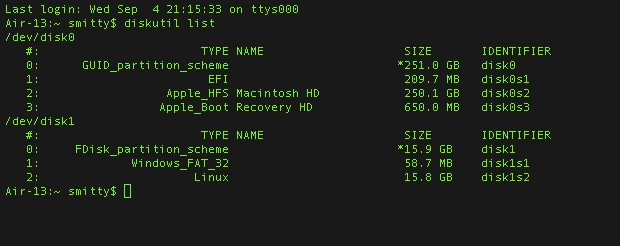

# So erstellen Sie Backups

Es gibt zwei Möglichkeiten, Jeedom zu retten, und jede hat Vor- und Nachteile.

Es ist möglich, über die Jeedom-Oberfläche zu speichern. Dies betrifft nur die Jeedom-Software und ihre Daten. Es hat den Vorteil, dass es heiß gemacht werden kann und die Sicherungsdatei auf andere Medien exportiert werden kann.

Es ist auch möglich, ein Backup zu erstellen, indem Sie ein Disk-Image der microSD-Karte (mini und mini +) erstellen). Dieser Weg hat den Vorteil, dass eine vollständige Sicherung des Systems sowie von Jeedom und seinen Daten möglich ist. Dies muss durch Ausschalten von Jeedom und Anschließen der microSD-Karte an einen anderen Computer erfolgen.

Der beste Weg, leise zu sein, ist, beide zu verwenden : Erstellen Sie von Zeit zu Zeit ein Backup der microSD-Karte und planen Sie ein regelmäßiges Backup von Jeedom.

> **Spitze**
>
> Das Verfahren zum Wiederherstellen der microSD-Karte kann nützlich sein, um ein Standard-Jeedom aus dem vom Team bereitgestellten Bild wiederherzustellen [hier](https://doc.jeedom.com/de_DE/installation/).

# Schutz/Verpflegung de Jeedom

Die Dokumentation zur Seite Administration → Backups ist bereits vorhanden. Du wirst es finden [hier](https://doc.jeedom.com/de_DE/core/3.3/backup).

# Schutz/Verpflegung de la carte microSD

## Vorbereitungen

Diese Sicherungen / Wiederherstellungen werden von einem anderen Computer aus durchgeführt, um ein "sauberes Image" der SD-Karte zu erstellen. Wir müssen zuerst den Mini + stoppen. Schalten Sie dazu Jeedom im Benutzermenü oben rechts in den Expertenmodus.


Und klicken Sie auf Ausschalten


Dann müssen Sie die microSD-Karte aus dem mini + nehmen und sie über einen Adapter / Kartenleser /… an Ihren Computer anschließen


## Windows

Sie müssen zunächst beispielsweise Software von Drittanbietern herunterladen : [Win32 Disk Imager](http://sourceforge.net/projects/win32diskimager/)

### Schutz

-   Starten Sie die Software und überprüfen Sie den folgenden Buchstaben *Gerät* entspricht der Ihrer Karte / Ihres Kartenlesers.
-   Auf dem Feld *Bilddatei*, Geben Sie den Namen der Bilddatei an, die Sie erstellen möchten, und wo sie gespeichert werden soll.
-   Klicken Sie abschließend auf die Schaltfläche *Lesen Sie*, um das Bild zu erstellen.
    image::images / save-restore09.jpg

### Verpflegung

-   Starten Sie die Software und überprüfen Sie den folgenden Buchstaben *Gerät* entspricht der Ihrer Karte / Ihres Kartenlesers.
-   Auf dem Feld *Bilddatei*, Suchen Sie die Bilddatei, die Sie wiederherstellen möchten.
-   Klicken Sie abschließend auf die Schaltfläche *Schreiben Sie*, um dieses Image auf der microSD-Karte wiederherzustellen.


## Unter MacOSX

Um Ihre Aufgabe zu vereinfachen, können Sie die Software herunterladen [ApplePi-Baker](http://www.tweaking4all.com/hardware/raspberry-pi/macosx-apple-pi-baker/)


### Schutz

-   Mit ApplePi-Baker : Wählen Sie die richtige Karte aus der Liste *Pi-Kruste*, und klicken Sie auf *Backup erstellen* um eine Bilddatei Ihrer microSD-Karte zu erstellen.

-   Im Shell-Befehl :
 -   Öffnen Sie ein Terminal und geben Sie den Befehl ein, um die der Karte entsprechende Festplatte zu finden : ``diskutil list``  
 
 -   Beginnen Sie mit der Erstellung des Bildes, indem Sie den Befehl eingeben : ``sudo dd if=/dev/disk1 of=~/Desktop/Backup_Jeedom.img bs=1m`` *Bemerkung: In diesem Beispiel lautet der Name der Kartendiskette "/ dev / disk1". Geben Sie daher den Sicherungsbefehl "/ dev / disk1" ein*

### Verpflegung

-   Mit ApplePi-Baker : Wählen Sie die richtige Karte aus der Liste *Pi-Kruste*, Geben Sie den Pfad zur wiederherzustellenden Bilddatei in das Feld ein *IMG-Datei* des Abschnitts *Pi-Zutaten*, und klicken Sie auf *Backup wiederherstellen* um das Image auf der microSD-Karte wiederherzustellen.
-   Im Shell-Befehl :
    -   Um die der Karte entsprechende Festplatte zu finden, öffnen Sie ein Terminal und geben Sie den gleichen Befehl wie für die Sicherung ein : ``diskutil list``
 -   Hängen Sie die Partitionen der Karte aus, indem Sie den Befehl eingeben : ``sudo diskutil unmountDisk /dev/disk1``
 -   Stellen Sie das Bild auf der microSD-Karte wieder her, indem Sie den Befehl eingeben : ``sudo dd bs=1m if=~/Desktop/Backup_Jeedom.img of=/dev/disk1`` *Bemerkung : In diesem Beispiel lautet der Name der Kartendiskette "/ dev / disk1". Geben Sie daher den Sicherungsbefehl "/ dev / disk1" ein*

## Unter Linux

### Schutz

-   Öffnen Sie ein Terminal und geben Sie den Befehl ein, um die der Karte entsprechende Festplatte zu finden : ``sudo fdisk -l | grep Dis``
    ````
    $ sudo fdisk -l | grep Dis
    Disk /dev/sda: 320.1 GB, 320072933376 bytes
    Disk /dev/sdb: 16.0 GB, 16012804096 bytes
    Disk /dev/sdc: 8.0 GB, 8006402048 bytes
    ````
-   Beginnen Sie mit der Erstellung des Bildes, indem Sie den Befehl eingeben : ``sudo dd if=/dev/sdc of=Backup_Jeedom.img bs=1m`` *Bemerkung: In diesem Beispiel lautet der Name der Festplatte / dev / sdc.*

### Verpflegung

-   Öffnen Sie ein Terminal und geben Sie den Befehl ein, um die der Karte entsprechende Festplatte zu finden : ``sudo fdisk -l | grep Dis``
-   Entfernen Sie die Partitionen von der Karte, indem Sie den Befehl eingeben (das X durch die Partitionsnummern ersetzen)) : ``sudo umount /dev/sdcX``
-   Stellen Sie das Bild auf der microSD-Karte wieder her, indem Sie den Befehl eingeben : ``sudo dd if=Backup_Jeedom.img of=/dev/sdc bs=1m`` *Bemerkung: In diesem Beispiel lautet der Name der Festplatte / dev / sdc.*
