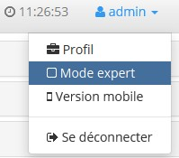
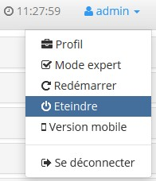

Beschreibung 
===========

Es gibt zwei Möglichkeiten, Jeedom zu retten, und jede hat
Vor- und Nachteile.

Es ist möglich, über die Schnittstelle zu speichern
Jeedom. Dies betrifft nur die Jeedom-Software und ihre Daten.
Es hat den Vorteil, heiß gemacht zu werden und die Datei von
Backup kann auf andere Medien exportiert werden.

Es ist auch möglich, ein Backup zu erstellen, indem Sie ein Image erstellen
microSD-Karten-Disc (Mini und Mini +). Dieser Weg hat den Vorteil
eine vollständige Sicherung des Systems sowie von Jeedom und seiner
Daten. Dies muss jedoch durch Ausschalten von Jeedom und erfolgen
Einstecken der microSD-Karte in einen anderen Computer.

Der beste Weg, leise zu sein, ist, beide zu verwenden : Machen Sie eine
Sichern Sie die microSD-Karte von Zeit zu Zeit und programmieren Sie a
regelmäßige Sicherung von Jeedom.

> **Tip**
>
> Das Verfahren zur Wiederherstellung der microSD-Karte kann für hilfreich sein
> Stellen Sie ein Standard-Jeedom aus dem von bereitgestellten Image wieder her
> das Team sehen
> [hier](https://www.jeedom.fr/doc/documentation/installation/de_DE/doc-installation.html).

Jeedom Backup / Restore 
=================================

Zur Erläuterung der Seite ist bereits eine Dokumentation vorhanden
Administration → Backups. Sie werden es finden
[hier](https://jeedom.github.io/core/de_DE/backup).

Sichern / Wiederherstellen der microSD-Karte 
===========================================

Vorbereitungen 
-----------

Diese Sicherungen / Wiederherstellungen werden von einem anderen durchgeführt
Computer, um ein "sauberes Bild" der SD-Karte zu machen. Es nimmt in
Stoppen Sie zuerst den Mini +. Versetzen Sie dazu Jeedom in den Modus
Experte im Benutzermenü oben rechts.

Und klicken Sie auf Ausschalten

Entfernen Sie dann die microSD-Karte aus dem mini + und schließen Sie sie an
Ihr Computer über einen Adapter / Kartenleser /…

Windows 
------------

Sie müssen zunächst beispielsweise Software von Drittanbietern herunterladen :
[Win32 Disk Imager](http://sourceforge.net/projects/win32diskimager/)

1.  **Sauvegarde**

    -   Starten Sie die Software und überprüfen Sie den folgenden Buchstaben
        *Device* entspricht der Ihrer Karte / Ihres Lesegeräts
        Karte.

    -   Auf dem Feld *Bilddatei*, Geben Sie den Namen der Bilddatei an, die
        Sie möchten erstellen und wo es gespeichert wird.

    -   Klicken Sie abschließend auf die Schaltfläche *Read*, um das Bild zu erstellen.
        image::images / save-restore09.jpg \ [align = "center" \]

2.  **Restauration**

    -   Starten Sie die Software und überprüfen Sie den folgenden Buchstaben
        *Device* entspricht der Ihrer Karte / Ihres Lesegeräts
        Karte.

    -   Auf dem Feld *Bilddatei*, Holen Sie sich die Bilddatei, die
        Sie möchten wiederherstellen.

    -   Klicken Sie abschließend auf die Schaltfläche *Write*, um dies wiederherzustellen
        Bild auf microSD-Karte.

Unter MacOSX 
-----------

Um Ihre Aufgabe zu vereinfachen, können Sie die Software herunterladen
[ApplePi-Baker](http://www.tweaking4all.com/hardware/raspberry-pi/macosx-apple-pi-baker/)

1.  **Sauvegarde**

    -   Mit ApplePi-Baker : Wählen Sie die richtige Karte aus der Liste
        *Pi-Crust*, und klicken Sie auf *Backup erstellen* um eine zu erstellen
        Bilddatei Ihrer microSD-Karte.

    -   Im Shell-Befehl :

        -   Öffnen Sie, um die der Karte entsprechende Festplatte zu finden
            ein Terminal und geben Sie den Befehl ein : `diskutil list`
            image::images / save-restore12.jpg \ [align = "center" \]

        -   Beginnen Sie mit der Erstellung des Bildes, indem Sie den Befehl eingeben :
            `sudo dd if = / dev / disk1 von = ~ / Desktop / Backup_Jeedom.img bs = 1m`
            *Remarque: In diesem Beispiel der Name der Karte
            ist `/ dev / disk1`, also geben Sie den Befehl ein
            backup \ `/ dev / disk1 \`*

2.  **Restauration**

    -   Mit ApplePi-Baker : Wählen Sie die richtige Karte aus der Liste
        *Pi-Crust*, Geben Sie den Pfad zur wiederherzustellenden Image-Datei ein
        auf dem Feld *IMG-Datei* des Abschnitts *Pi-Ingredients*, et
        Klicken Sie auf *Backup wiederherstellen* um das Bild auf dem wiederherzustellen
        microSD-Karte.

    -   Im Shell-Befehl :

        -   Öffnen Sie, um die der Karte entsprechende Festplatte zu finden
            ein Terminal und geben Sie den gleichen Befehl wie für die
            Schutz : `diskutil list`

        -   Hängen Sie die Partitionen der Karte aus, indem Sie den Befehl eingeben :
            `sudo diskutil unmountDisk / dev / disk1`

        -   Stellen Sie das Bild auf der microSD-Karte wieder her, indem Sie den Befehl eingeben
            :
            `sudo dd bs = 1m if = ~ / Desktop / Backup_Jeedom.img von = / dev / disk1`
            *Bemerkung : In diesem Beispiel der Name der Karte
            ist `/ dev / disk1`, also geben Sie den Befehl ein
            backup \ `/ dev / disk1 \`*

Unter Linux 
----------

1.  **Sauvegarde**

    -   Öffnen Sie a, um die der Karte entsprechende Festplatte zu finden
        Terminal und geben Sie den Befehl ein : `sudo fdisk -l | grep Dis`

        `` `{.bash}
        $ sudo fdisk -l | grep Dis
        Disk / dev / sda: 320.1 GB, 320072933376 Byte
        Disk / dev / sdb: 16.0 GB, 16012804096 Bytes
        Disk / dev / sdc: 8.0 GB, 8006402048 Byte
        `` ''

    -   Beginnen Sie mit der Erstellung des Bildes, indem Sie den Befehl eingeben :
        `sudo dd if = / dev / sdc von = Backup_Jeedom.img bs = 1m` * Hinweis: Dans
        In diesem Beispiel lautund der Name der Festplatte / dev / sdc.*

2.  **Restauration**

    -   Öffnen Sie a, um die der Karte entsprechende Festplatte zu finden
        Terminal und geben Sie den Befehl ein : `sudo fdisk -l | grep Dis`

    -   Hängen Sie die Partitionen der Karte aus, indem Sie den Befehl eingeben (in
        Ersetzen des X durch die Partitionsnummern) :
        `sudo umount / dev / sdcX`

    -   Stellen Sie das Bild auf der microSD-Karte wieder her, indem Sie den Befehl eingeben :
        `sudo dd if = Backup_Jeedom.img von = / dev / sdc bs = 1m` * Hinweis: Dans
        In diesem Beispiel lautund der Name der Festplatte / dev / sdc.*

