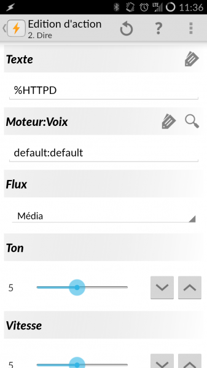

Ziel 
========

Der Zweck dieses Artikels ist es, Sie bei der Verwendung von Android zu unterstützen
mit Jeedom sprechen. Wir werden die Jeedom Interaktions-Engine verwenden, die
ermöglicht es, Anfragen zu stellen und Jeedom darauf zu antworten (und auch, wenn wir
wünschen, verschiedene Szenarien oder Elemente aktivieren).

Installation 
============

Die Voraussetzungen 
-------------

Natürlich benötigen Sie ein Android-Gerät (Tablet, Telefon, PC mit
Mikrofon und Lautsprecher) und installieren
[Tasker](https://play.google.com/store/apps/details?id=net.dinglisch.android.taskerm&hl=fr)
et
[AutoVoice](https://play.google.com/store/apps/details?id=com.joaomgcd.autovoice&hl=fr).
Mit letzterem können Sie Ihre eigenen Sprachbefehle für Google Now erstellen
Aufgaben mit Sprache zu automatisieren.

Hinweis : AutoVoice ist nur die Komponente für das Gespräch mit Jeedom, jedoch nicht
Erlaube Jeedom nicht zu antworten. Damit er das tun kann, brauchst du es nicht
Tasker-Plugin. Wir können dieses Beispiel auch verwenden, indem wir das ersetzen
AutoVoice-Spracherkennung durch NFC-Tag, Geolokalisierung,
eine SMS erhalten ...

Das Prinzip 
-----------

Wir werden ein Tasker-Profil für den Status verwenden. Dies wird ein
AutoVoice-Spracherkennung. Dann werden wir in der Aufgabe fragen
Tasker, um 2 Aktionen auszuführen. Das erste wird sein, Jeedom und ihn anzurufen
Übertragen Sie das Textergebnis der Spracherkennung. Der zweite
wird sein, die Rückkehr von Jeedom zu erklären.

Profilerstellung 
==================

Wir fügen ein neues Profil mit einem hinzu **état** als Auslöser.

Wir wählen **Plugin** auf dem ersten Bildschirm.

Im Plugin-Typ wählen wir **AutoVoice**.

Im Untermenü **AutoVoice**, Wir wählen **Recognized**.

Sie können die Standardkonfiguration speichern, sofern Sie dies nicht möchten
Geben Sie Schlüsselwörter oder andere Parameter an.

Wir können dem Profil einen Namen wie "Jeedom Interactions" und das geben
Das Backup wird nach dem Verknüpfen mit einer Aufgabe erstellt.

Die Aufgabe 
========

Wir fügen ein **neue Aufgabe** zum neu erstellten Profil. Von
Beispielsweise könnte es als "Jeedom API" bezeichnund werden".

Die Aufgabe gruppiert schließlich 2 Aktionen : **API-Aufruf** und **sag das
retour**.

Zuerst fügen wir eine Typaktion hinzu **Netzwerk**.

Dann wählen wir **Holen Sie sich HTTP**.

Hier werden wir mit Jeedom Informationen füllen. Hier sind die Informationen zu
eingeben :

-   Serveur:Port : `https://mondomain.tld`

-   Weg :
    `/jeedom/core/api/jeeApi.php?apikey = yourkey & type = interag & query =% avcommnofilter & utf8 = 1`

Vergessen Sie nicht, Ihren API-Schlüssel anstelle der Kette zu platzieren
`yourkey`. Sie müssen `% avcommonfilter` am Ende verlassen, es wird sein
ersetzt durch die Rückgabe von Autovoice.

Fügen Sie eine Typaktion hinzu **Dire**. Filtern Sie dazu die Aktionen nach
"Sagen" an der Lupe.

Und wir geben "% HTTPD" in das Textfeld ein.

Es ist vorbei. Bei der Texterkennung durch AutoVoice wird Jeedom
angerufen und Sie haben die Antwort in den Interaktionen konfiguriert, die
wird von Ihrem Telefon gesprochen. Vergessen Sie nicht, das zu konfigurieren
Jeedom Interaktionen und Sie können ihn fragen, was auch immer Sie
wollen. Von "Was ist die Temperatur im Wohnzimmer" bis "Licht einschalten"
salon".

> **Tip**
>
> Wenn es von Anfang an nicht funktioniert, liegt es oft an AutoVoice
> ist nicht aktiv. Klicken Sie dazu auf Google Now
> Integration und auf die erste Wahl ganz oben und autorisieren
> AutoVoice.

> **Tip**
>
> Standardmäßig deaktiviert AutoVoice die Google Now-Suche
> Es ist möglich, dieses Verhalten abzubrechen. Klicken Sie dazu in Tasker auf
> Ihr Profil dann "Edition" (kleiner Bleistift), dann "Advanced" (während
> unten) und deaktivieren Sie "Google Now Search durchführen" (unten).
