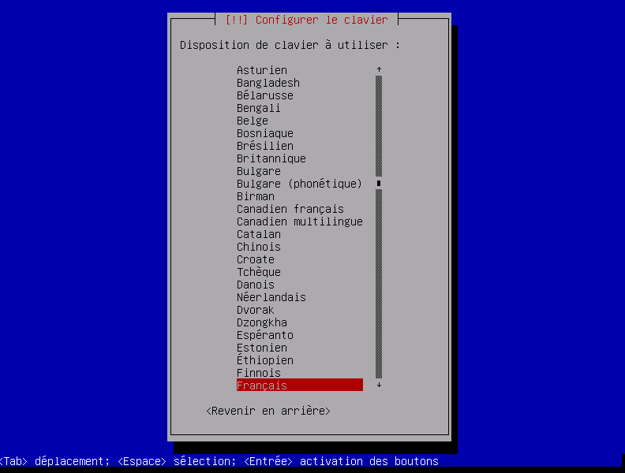
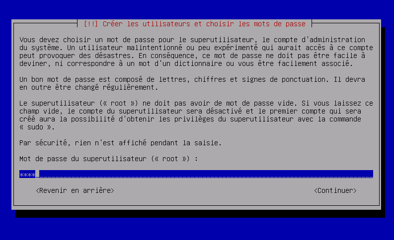
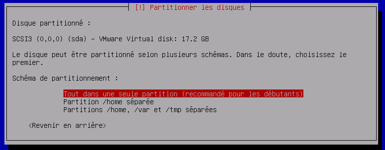
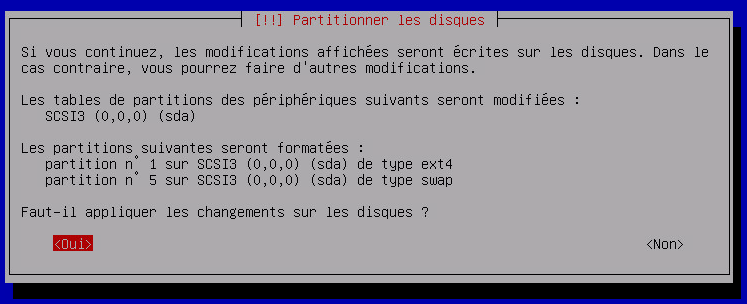
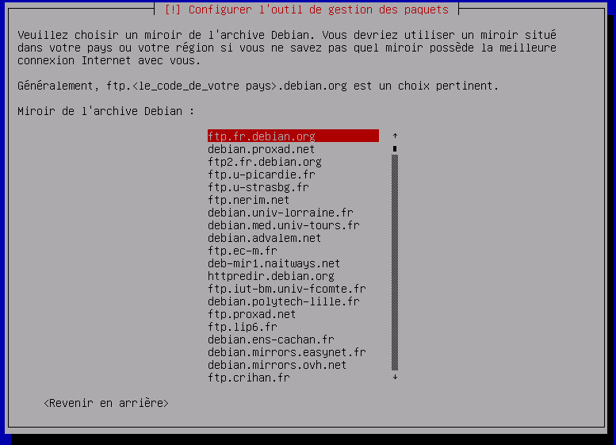

Wir werden hier sehen, wie man einen Debian installiert, sowie
als VM oder in direkter Installation auf einem physischen Computer

Quellenwiederherstellung 
========================

Sie finden die neueste Debian-Version in netinstall (Größe)
minimal, aber Internet für die Installation benötigen)
[hier](https://www.debian.org/CD/netinst) 
amd64) oder direkt klicken
[hier](http://cdimage.debian.org/debian-cd/9.1.0/amd64/iso-cd/debian-9.1.0-amd64-netinst.iso)
um die ISO herunterzuladen.

Installationsstart 
===========================

Auf einer physischen Maschine 
------------------------

Sie müssen entweder die ISO auf eine CD brennen und die CD in das Gerät einlegen
(aber heutzutage sind CD-Player immer seltener) oder so
Erstellen Sie einen bootfähigen USB-Stick.

Für den bootfähigen USB-Stick rufus herunterladen
[die](http://rufus.akeo.ie/downloads/rufus-2.9.exe), 
so konfigurieren :

> **Notiz**
>
> Denken Sie daran, die heruntergeladene ISO-Datei auszuwählen
> kurz zuvor

Sie müssen nur auf Start klicken und dann den USB-Stick einstecken
auf dem Computer und starten Sie es.

Auf einer VM 
----------

Die Handhabung ist ganz einfach, Sie erstellen eine neue Maschine
virtuell, stecken Sie ein, legen Sie einen virtuellen CD-Player darauf, der zeigt
an die ISO (denken Sie daran, sie anzuschließen) und Sie starten die Maschine. Siehe
[hier](https://doc.jeedom.com/de_DE/howto/doc-howto-vmware.creer_une_vm.html)
für weitere Details.

Installation 
============

Drücken Sie die Eingabetaste, um die Installation zu starten :

Wählen Sie "Französisch" und bestätigen Sie mit der Eingabetaste

Hier muss man "Französisch" wählen

Idem :

Geben Sie den Namen Ihrer Maschine ein (hier nabaztag, aber wenn es sich um eine Freiheit handelt
jeedom setzen)

Drücken Sie einfach die Eingabetaste :

Geben Sie ein Passwort ein, ich empfehle hier ein einfaches (wie oooo),
es kann später geändert werden (passwd Befehl) :

Legen Sie es gleich zurück :

Geben Sie den Namen des Hauptbenutzers an (hier nabaztag, aber wenn es ein ist
jeedom put jeedom)

Setzen Sie das gleiche zurück :

Geben Sie ein Passwort ein, ich empfehle hier ein einfaches (wie oooo),
es kann später geändert werden (passwd Befehl) :

Setzen Sie das gleiche zurück :

Bestätigen Sie mit der Eingabetaste :

Idem :

Bestätigen Sie erneut mit der Eingabetaste :

Wir validieren noch :

Und wieder :

Wählen Sie "Frankreich" und bestätigen Sie :

Bestätigen Sie mit der Eingabetaste :

Idem :

Und wieder (ja, wir validieren viel bei einer Debian-Installation) :

Jetzt komplizierter, müssen Sie die Umgebung von abwählen
Debian Desktop "durch Drücken der Leertaste und Auswahl von" Server
SSH "durch Drücken der Leertaste (bewegen Sie sich mit den Pfeilen auf der
Tastatur) und bestätigen Sie mit der Eingabetaste :

Wir validieren erneut :

Sie müssen / dev / sda auswählen und dann validieren :

Dort müssen Sie nur den USB-Stick, die CD-ROM oder die virtuelle CD-ROM entfernen
und drücken Sie die Eingabetaste :

Hier ist Ihre Debian-Installation abgeschlossen. Sie können die stoppen
Tutorial dort, wenn Sie wollen oder folgen Sie den nächsten Schritten für ein paar
Systemmodifikationen (nützlich besonders für Jeedom).

Optimierung für Jeedom 
========================

Um die Installation von Jeedom vorzubereiten, können Sie einige tun
Optimierungen :

Fügen Sie vim und sudo hinzu 
-------------------

    

Fügen Sie fail2ban hinzu 
----------------

Fail2ban ist eine Software, mit der Sie den Zugriff auf Ihr Debian sichern können,
Bei zu vielen Verbindungsfehlern wird der Zugriff blockiert
die betreffende IP (daher nicht an alle, nur an den Angreifer) a
einige Zeit.

    

Fügen Sie die Open VMware Tools hinzu 
-----------------------------

Öffnen Sie VMware Tools und installieren Sie systemspezifische Treiber
installiert und bringen Sie die Optimierungen dieses gehosteten Betriebssystems
auf einem ESXi-Hypervisor.

    

Sie müssen Jeedom nur installieren, indem Sie folgen
[diese](https://doc.jeedom.com/de_DE/installation/index#tocAnchor-1-27)
