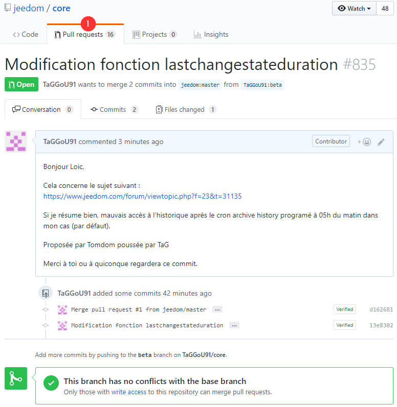

Dieses Tutorial präsentiert Ihnen :

-   Erstellen Sie ein GitHub-Konto

-   Jeedom Core Fork oder Dokumentation

-   Bearbeiten einer oder mehrerer Dateien

-   Senden Sie eine Änderung

-   Aktualisieren Sie Ihre Gabel

Damit Sie zu Jeedom beitragen können, müssen Sie
Änderungen vorschlagen (PR : Pull Request).

Erstellen Sie ein GitHub-Konto 
===========================

In diesem Tutorial wird erläutert, wie Sie ein GitHub-Konto erstellen,
um sogar Fehler melden zu können (Problem in der GitHub-Sprache)
sogar Korrekturen vorschlagen (Pull Request oder PR in Github-Sprache)
für das gesamte Jeedom-Projekt, einschließlich seiner kostenlosen Plugins oder der
Dokumentation oder ein anderes Github-Projekt, das Sie
möchte teilnehmen.

Se rendre sur <https://github.com> und klicken Sie auf die Schaltfläche Anmelden.
Sie sollten sich also auf einer Seite befinden, die wie die folgende und aussieht
muss daher einen Spitznamen, eine E-Mail und ein Passwort eingeben und dann
Klicken Sie auf **Erstellen Sie ein Konto**

Sie kommen also auf einer zweiten Seite wie unten an und ändern sich nicht
nichts, du klickst **Continue**

Sie sind registriert und auf der Optionskonfigurationsseite Ihres
Konto. Ich rate Ihnen, die E-Mail-Adresse zu überprüfen, damit Sie können
Stellen Sie Ihr Konto wieder her, wenn Sie beispielsweise Ihr Passwort vergessen haben
auch um Änderungen einreichen zu können. Ich verlasse dich
Entdecken Sie auch die anderen Optionen, wenn Sie neugierig sind.

Jeedom Core Fork oder Dokumentation 
==========================================

**Gabel - Warum - Wie**

Fork kopiert ein Projekt in Ihren Github-Bereich, damit Sie es können
Ändern Sie den Code und die Dokumentationsdateien und senden Sie sie ab
eine Pull-Anfrage zum Originalprojekt, die dann von der
Entwickler des Projekts

Jetzt, da Sie ein Github-Konto haben und angemeldet sind
mit Ihrer verifizierten E-Mail-Adresse, wenn Sie hier gehen
<https://github.com/jeedom/core> vous êtes sur le projet jeedom, à
Genau dort befindet sich eine Gabelschaltfläche, mit der Sie sie auf Ihre kopieren können
Github Raum.

Bearbeiten einer oder mehrerer Dateien 
---------------------------------------

In meinem Fall möchte ich daher eine Änderung an der Datei vornehmen
*history.class.php * Diese Datei befindet sich im Kern von jeedom und mehr
genau hier : Kern / Klasse /

1. Wir sind also auf meiner Einzahlung (TaGGoU91 / Kern), die als angegeben ist
    eine Gabel von Jeedom / Kern sein

2. Also gehen wir zu / core / class (der erste Kern ist fett gedruckt, es ist
    das Repository, in dem ich mich befinde (Kern, siehe Small 1)

3. Wir haben also unsere * history.class-Datei.php * - Wir klicken auf die
    Datei?

1. Wir sind also in unserer Akte

2. Klicken Sie auf den Stift, um die Änderung einzugeben

Positionieren Sie sich im Block, um die Datei zu durchsuchen
Text der Datei, die wir gerade im Bearbeitungsmodus mit dem Stift und geöffnet haben
Wir machen ein "Strg + F", um die Suche zu aktivieren. Du bleibst oder
Geben Sie den gesuchten Text an (ein wichtiges Element und a
Nur Zeile, nicht ein ganzer Block auf einmal). Bestätigen Sie mit "Enter"
Starten Sie die Suche.

> **Tip**
>
> Wenn Sie nicht in das Fenster klicken, das den Text oder den Code enthält
> Wenn Sie suchen, wird die Browsersuche geöffnet und
> In meinem Fall weiß Google Chrome nicht, wie die Recherche durchgeführt werden soll
> in Code oder Dokumentation direkt.

1. Das Forschungsfeld, ja es ist ziemlich dünn wie Information, das
    kopierte Zeile ist viel größer;).

1. In gelb ist dies das Ergebnis von Untersuchungen

2. In blau, was ich gerade ausgewählt habe und was ich will
    ändern / durch meinen Code ersetzen. Meine Änderung

Also lösche ich den Block und ersetze ihn.

Dann finden wir dies im unteren Teil : 1. Wir geben einen Titel an
wenn möglich explizit 2. Wir geben eine etwas genauere Beschreibung ein
(In meinem Fall wäre es zu lang, der Link zum Forum wird mehr sein
Sprechen) 3. Wir stellen sicher, dass es so angekreuzt ist 4. Wir verpflichten uns =
Senden Sie die Änderung

Senden Sie eine Änderung 
--------------------------

Die **commit** oben betrifft nur die Gabelung des Projekts in
dein GitHub-Speicherplatz. Änderungen am ursprünglichen Projekt einreichen,
Sie müssen eine PR (Pull Request) durchführen.

1. Wir klicken auf die Registerkarte Pull Request

2. Neue Pull-Anfrage (PR für Freunde)

1. Die PR startet einen Vergleich zwischen der Basis der Freiheit mit Ihrer
    Repository (die Gabelung).

2. Dies zeigt die Änderungen an (die erste ist, weil ich
    bin von jeedom aktualisiert, die zweite betrifft genau die
    Änderung der Lastchangestateduration-Funktion, perfekt !!!)

3. Der alte Code

4. Der neue Code

5. Wir erstellen die Pull Request (PR)

Es ist wichtig, die eingereichten Änderungen klar zu erläutern, damit die
Original-Projektentwickler verstehen und können Ihre validieren
demande.

1. Wir klicken auf die drei kleinen Punkte

2. Wir kopieren die zuvor eingegebenen Informationen

3. Gleiches kopieren wir (daher die Verwendung von… in Schritt 1 bis
    Umschreiben vermeiden)

4. Wir klicken auf Pull-Anfrage erstellen

**Es ist vorbei.** Sie müssen warten, bis Ihre PR validiert ist.

NB: Nur Benutzer mit einem Push rechts auf Jeedom wer
kann die PR validieren.

Um sicherzustellen, dass Ihre Änderung aufgelistet ist, müssen Sie
kann auf Pull Requests klicken

Wir erhalten die Liste der PR, die auf die Validierung wartet. Wir können das sehen
unsere

Aktualisieren Sie Ihre Gabel 
============================

Auszufüllen
