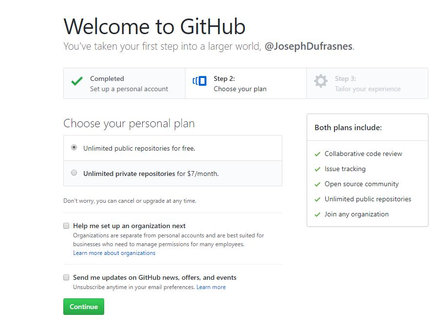

# Github-Tutorial

Dieses Tutorial präsentiert Ihnen :

-   Erstellen Sie ein GitHub-Konto
-   Jeedom Core Fork oder Dokumentation
-   Bearbeiten einer oder mehrerer Dateien
-   Senden Sie eine Änderung
-   Aktualisieren Sie Ihre Gabel

Damit Sie zu Jeedom beitragen können, müssen Sie die Änderungen vorschlagen (PR : Pull Request).

# Erstellen Sie ein GitHub-Konto

In diesem Tutorial wird erläutert, wie Sie ein GitHub-Konto erstellen, um Fehler (Problem in der GitHub-Sprache) melden oder sogar Korrekturen (Pull Request oder PR in der Github-Sprache) für das gesamte Jeedom-Projekt vorschlagen zu können. einschließlich der kostenlosen Plugins oder Dokumentationen oder anderer Github-Projekte, an denen Sie teilnehmen möchten.

Gehe zu [Github](https://github.com) und klicken Sie auf die Schaltfläche Anmelden. Sie sollten sich daher auf einer ähnlichen Seite wie der folgenden befinden und daher einen Spitznamen, eine E-Mail-Adresse und ein Passwort eingeben und dann auf klicken **Erstellen Sie ein Konto**

Sie kommen also wie unten auf einer zweiten Seite an und ändern nichts, Sie klicken auf **Mach weiter**

Sie sind registriert und auf der Konfigurationsseite Ihrer Kontooptionen. Ich empfehle Ihnen, die E-Mail-Adresse zu überprüfen, um Ihr Konto wiederherzustellen, wenn Sie beispielsweise Ihr Passwort vergessen haben, aber auch um Änderungen einreichen zu können. Ich lasse Sie auch die anderen Optionen entdecken, wenn Sie neugierig sind.

# Jeedom Core Fork oder Dokumentation

**Gabel - Warum - Wie**

Fork kopiert ein Projekt in Ihren Github-Bereich, um den Code und die Dokumentationsdateien ändern zu können, und sendet dann eine Pull-Anfrage an das ursprüngliche Projekt, die dann von den Entwicklern des Projekts untersucht wird

Jetzt, da Sie ein Github-Konto haben und mit Ihrer verifizierten E-Mail-Adresse identifiziert sind, wenn Sie gehen [hier](https://github.com/jeedom/core) Sie befinden sich im Jeedom-Projekt. Auf der rechten Seite befindet sich ein Gabelknopf, mit dem Sie ihn in Ihren Github-Bereich kopieren können.

## Bearbeiten einer oder mehrerer Dateien

In meinem Fall möchte ich daher eine Änderung an der Datei vornehmen *history.class.php* Diese Datei befindet sich im Kern von jeedom und genauer hier : Kern / Klasse /

- Wir befinden uns also in meinem Repository (TaGGoU91 / core), das als Gabelung von Jeedom / core angezeigt wird
- Also gehen wir zu / core / class (der erste Kern ist fett gedruckt, es ist das Repository, in dem ich mich befinde (Kern, siehe Klein 1)
- Also haben wir unsere Akte *history.class.php* - Wir klicken auf die Datei

- Wir sind also in unserer Akte
- Wir klicken auf den Stift, um die Änderung einzugeben

Um die Datei zu durchsuchen, positionieren Sie sich mit dem Stift im Textblock der Datei, die Sie gerade im Bearbeitungsmodus geöffnet haben, und drücken Sie "Strg + F", um die Suche zu aktivieren. Sie fügen den gesuchten Text ein oder geben ihn an (nur ein wichtiges Element und eine Zeile, nicht ein ganzer Block gleichzeitig). Bestätigen Sie mit "Enter", um die Suche zu starten.
> **Spitze**
>
> Wenn Sie nicht in das Fenster klicken, das den gesuchten Text oder Code enthält, wird die Browsersuche geöffnet und in meinem Fall weiß Google Chrome nicht, wie im Code oder gesucht werden soll Dokumentation direkt.

- Das Suchfeld, ja es ist ziemlich dünn als Information, die kopierte Zeile ist viel größer;).

- In gelb ist dies das Ergebnis der Forschung
- In blau, was ich gerade ausgewählt habe und was ich ändern / durch meinen Code ersetzen möchte. Meine Änderung

Also lösche ich den Block und ersetze ihn.

Dann finden wir dies im unteren Teil : 1. Wenn möglich, wird ein expliziter Titel angegeben. 2. Wir geben eine etwas genauere Beschreibung ein (in meinem Fall wäre es zu lang, der Link zum Forum wäre aussagekräftiger) 3. Wir stellen sicher, dass es so angekreuzt ist 4. On commit = Änderung senden

## Senden Sie eine Änderung

Die **begehen** Das oben Genannte betrifft nur den Zweig des Projekts in Ihrem GitHub-Bereich. Um Änderungen am ursprünglichen Projekt einzureichen, müssen Sie eine PR (Pull Request) durchführen

- Wir klicken auf die Registerkarte Pull Request
- Neue Pull-Anfrage (PR für Freunde)

- Der PR startet einen Vergleich zwischen der Jeedom-Datenbank und Ihrem Repository (der Gabelung).
- Dies zeigt die Änderungen an (die erste ist, weil ich mich seit jeedom aktualisiert habe, die zweite betrifft genau die Änderung der Funktion der letzten Änderung, perfekt !!!)
- Der alte Code
- Der neue Code
- Wir erstellen die Pull Request (PR)

Es ist wichtig, die eingereichten Änderungen klar zu erläutern, damit die Entwickler des ursprünglichen Projekts Ihre Anfrage verstehen und validieren können.

- Wir klicken auf die drei kleinen Punkte
- Wir kopieren die zuvor eingegebenen Informationen
- Gleiches kopieren wir (daher die Verwendung von… in Schritt 1, um ein Umschreiben zu vermeiden)
- Wir klicken auf Pull-Anfrage erstellen

**Es ist vorbei.** Sie müssen warten, bis Ihre PR validiert ist.

NB: Nur Benutzer mit einem Push-Recht auf Jeedom können die PR validieren.

Um sicherzustellen, dass Ihre Änderung in der Liste enthalten ist, können Sie auf Pull Requests klicken

Wir erhalten die Liste der PR, die auf die Validierung wartet. Wir können unsere klar sehen

