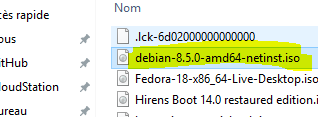
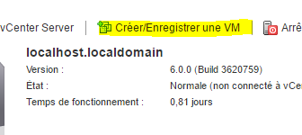
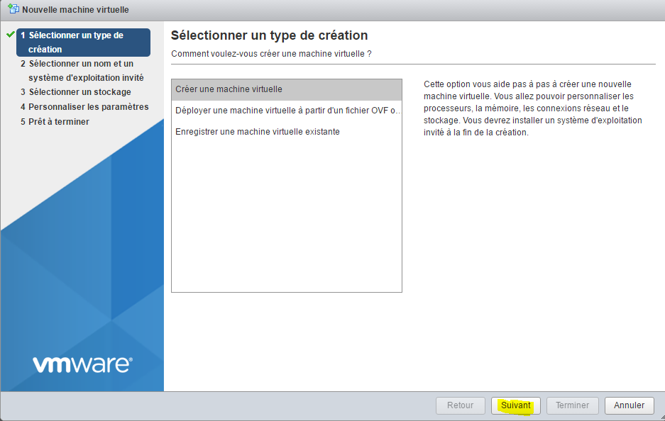

Nous allons voir ici comment créer une VM sous VMware.

Il y a avant une petit chose importante à savoir sur VMware, il y a 2
moyen de le manager :

-   l'interface web (présente par défaut en 6.0 update 2, ou par le
    biais d'un vib pour les autres versions), on y accède par
    IP\_ESXI/ui

-   le client lourd et historique de VMware (vSphere client)

Ici j'utiliserai principalement l'interface web car je pense que c'est
l'avenir de VMware qui délaisse de plus en plus le client lourd
(d'ailleurs toutes les nouveautées depuis la 5.1 ne sont pas utilisables
avec le client lourd).

A noter aussi que l'interface web est toujours en cours de mise en place
chez VMware, en effet vous allez surement rencontrer quelques bugs ou
ralentissements avec mais un petit rafrachissement de la page et ça
repart sans soucis.

Connexion à l'interface web 
===========================

Allez sur IP\_ESXI/ui avec votre navigateur internet, vous devez avoir :

> **Note**
>
> Si vous n'avez rien je vous conseille de faire l'installation de
> l'interface web, toutes les informations
> [ici](https://jeedom.github.io/documentation/howto/fr_FR/doc-howto-vmware.trucs_et_astuces.html)

Entrez vos identifiants de connexion à l'ESXI :

Comme vous pouvez le voir l'interface est plutôt sympa et permet de
faire pas mal de choses, je ne rentrerai pas dans les détails mais vous
pouvez déja à partir de cette écran :

-   arrêter/redémarrer l'ESXi

-   voir l'utilisation des ressources (CPU,mémoire et disque)

-   avoir des informations sur votre système (temps de fonctionnement,
    version de VMware, version du bios, affichage des datastores)

-   bouton pour créer une VM (on va s'en servir juste après)

-   un bouton action qui permet en autre de passer en mode maintenance
    (pratique si vous avez un cluster d'ESXi sinon vous ne vous en
    servirez jamais), activer/désactiver le service SSH (est utilisé
    dans le tutoriel de configuration des backups)

Envoi de l'iso d'installation 
=============================

Après avoir téléchargé votre iso d'installation
([ici](http://cdimage.debian.org/debian-cd/8.5.0/amd64/iso-cd/debian-8.5.0-amd64-netinst.iso)
par exemple pour debian 8.5 en netinstall), il vous faut le mettre sur
votre datastore.

Pour cela cliquez sur datastore :

Selectionnez votre datastore (en general il s'appelle datastore1) :

Cliquez sur "Navigateur de banque de données" :

Cliquez sur "Télécharger" (le premier) :

Selectionnez l'iso précédement téléchargé et validez :

Vous pouvez ensuite suivre l'avancement de l'envoi :

Une fois fini vous pouvez voir que votre iso est bien arrivé sur le
datastore :

Création de votre premiere VM 
=============================

Cliquez sur le bouton "Créer/Enregistrer une VM" :

Cliquez sur suivant :

Donnez ensuite un nom à votre machine et précisez son sytème
d'exploitation (ici on va installer une Débian) :

Indiquez le datastore cible :

Ici vous allez pouvoir configurer les paramètre de votre machine (disque
dure, cpu, mémoire…​) :

> **Note**
>
> Tous ces paramètres sont modifiable après coup sans soucis, à noter
> tout de meme qu'il n'est pas vraiment possible de réduire la taille
> d'un disque dur, on peut l'augmenter (mais il faut savoir gérer ça au
> niveau de l'OS ensuite) mais pas la réduire.

Au niveau du lecteur CD/DVD, selectionnez "Fichier ISO banque de
données" :

Sélectionner ensuite l'emplacement où est stocké votre ISO (voir
chapitre précedent) et validez :

Faites ensuite suivant :

VOus avez ensuite un résumé de votre configuration, cliquez sur
"Terminer" :

Un message en haut va vous indiquer que c'est bon, cliquez ensuite sur
"Machines virtuelles" :

Vous devez voir votre machine virtuelle (si ce n'est pas le cas cliquez
sur "Actualiser") cliquez dessus :

Vous devez avoir une page de ce type, cliquez sur le bouton lecture :

Votre machine va se lancer et vous allez pouvoir faire l'installation de
votre OS :

> **Important**
>
> Un fois votre machine installée il faut ABSOLUMENT installer les
> VMware tools (ça permet à VMware d'avoir des informations sur votre VM
> et d'éteindre celle-ci proprement). Sous debian il suffit de faire
> "sudo apt-get -y install open-vm-tools".

Pour la suite de l'installation je vous invite à lire ce
[tutoriel](https://jeedom.github.io/documentation/howto/fr_FR/doc-howto-debian.installation.html#_installation)

Monter les péripheriques USB dans la VM 
=======================================

> **Note**
>
> Si vous n'avez pas les options ci-dessous c'est qu'il faut mettre à
> jour l'ESXi Embedded Host Client , toutes les informations
> [ici](https://jeedom.github.io/documentation/howto/fr_FR/doc-howto-vmware.trucs_et_astuces.html)

C'est un besoin assez rare, mais j'ai dû m'en servir pour Jeedom, en
effet j'ai sur mon ESXi les clefs Zwave, RFXcom, edisio, enOcean et GSM
de branchées et il me fallait les relier à ma VM Jeedom pour pouvoir
m'en servir.

> **Note**
>
> Pour Zwave, RFXcom, edisio et enOcean il n'y a aucun soucis, pour les
> clefs GSM il vous faut suivre ce
> [tutoriel](https://jeedom.github.io/documentation/howto/fr_FR/doc-howto-gsm.huawei_mode_modem.html)
> avant pour forcer la clef en mode modem seulement sinon celle-ci n'est
> pas vue correctement sur l'ESXi.

Allez sur votre VM puis faites "Modifier les paramètres" :

Cliquez sur "Ajouter un autre périphérique" puis controleur USB :

> **Note**
>
> L'étape qui suit devra être repétée pour chaque périphérique USB que
> vous voulez connecter

Enregistrez, refaites "Modifier les paramètres", puis "Ajouter un autre
périphérique" et "USB device" :

Choisissez votre périphérique USB dans la liste déroulante :

Et voilà votre périphérique est branché sur votre VM. A chaque
redémarrage il sera automatique rebranché sur la VM et si vous le
deconnectez/connectez physiquement alors celui-ci sera rebranché sur
votre VM. En d'autres termes l'utilisation est maintenant totalement
transparente.
