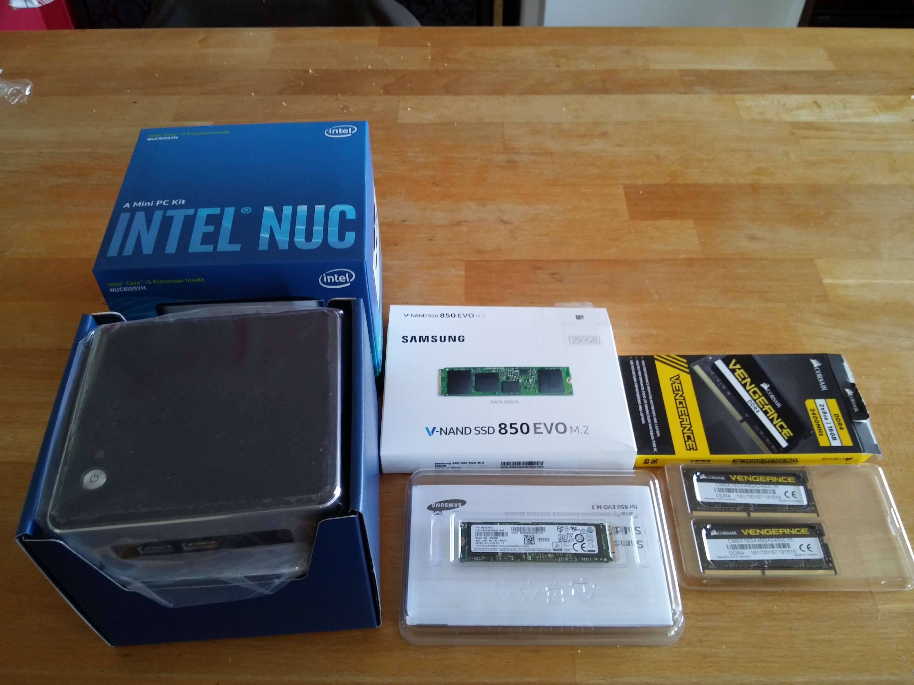
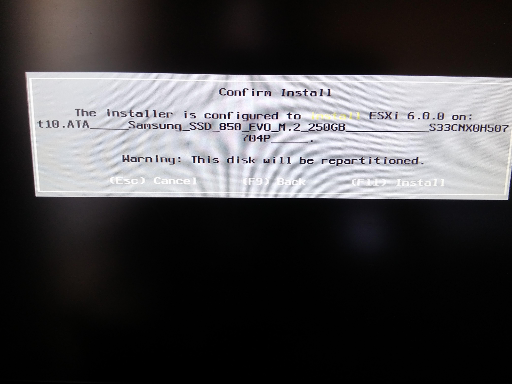

Hier ist ein Tutorial zum Installieren von VMware auf einem  (Gen6). Wir
Ich werde später sehen, wie man Jeedom hinzufügt

Das Material 
===========

 
---------

Der  ist ein kleiner PC, nicht der leistungsstärkste, aber sehr sparsam
Energie und kleine Dimensionen. Dies macht es zu einem perfekten kleinen Kellner
Virtualisierung basierend auf VMware.

Derzeit gibt es 2 NUCs der 6. Generation (die anderen arbeiten
auch für VMware, erfordern aber zusätzliche Treiber auf dem
VMware-Kernel):

-   .3 GHz - - 4 Threads - Cache 3 MB -
    

-   ..9 GHz - 4 Threads -
    Cache 4 MB)

Der i5 ist deutlich leistungsfähiger, da er etwas mehr Cache-Speicher hat
und vor allem ein Turbomodus, der es ihm ermöglicht, viel höher zu klettern
Frequenz.

Darüber hinaus gibt es zwei Arten von Fällen :

-   Ein dünnes Gehäuse, das nur eine M2-Disc enthalten kann

-   Ein dickeres Gehäuse, das eine Scheibe vom Typ M2 und a enthalten kann
    Scheibe 2.5 Zoll

Das sind 4 Referenzen :

-    : [
    NUC6I3SYK] (http://www.ldlc.com/fiche/PB00203086.html) 320 €

-   .5 Zoll : [
    NUC6I3SYH] (http://www.ldlc.com/fiche/PB00203148.html) 320 €

-    : [
    NUC6I5SYK] (http://www.ldlc.com/fiche/PB00203084.html) 460 €

-   .5 Zoll : [
    NUC6I5SYH] (http://www.ldlc.com/fiche/PB00202760.html) 430 €

 
---

Sie müssen eine  und einen Speicher hinzufügen.  Level ich dir
empfehlen 240 GB oder mehr, es sei denn, Sie nehmen das Modell mit einem
Standort 2.5 Zoll (wodurch Sie zusätzliche Festplatte setzen können)
oder um ein Synology NAS zu haben, um die iSCSI-LUN zu erstellen. Vergiss nicht
Fügen Sie hinzu, dass eine Basis-VM (kein Speicher) zwischen 20 und 40 GB groß ist
Diese 40 GB für VMware selbst füllen sich schnell.

> **Wichtig**
>
> VMware unterstützt das Hinzufügen von USB-Datenträgern nicht, daher ist dies schwierig
> um den verfügbaren Platz zu erweitern

-   [LDLC  M.2 2280 F6 PLUS 120
    GB] (http://www.ldlc.com/fiche/PB00203635.html) 55 €

-   [Samsung  850 EVO 120 Go
    M.2] (http://www.ldlc.com/fiche/PB00185923.html) 100 €

-   [LDLC  M.2 2280 F6 PLUS 240
    GB] (http://www.ldlc.com/fiche/PB00203636.html) 105 €

-   [Samsung  850 EVO 250 Go
    M.2] (http://www.ldlc.com/fiche/PB00185924.html) 120 €

-   [LDLC  M.2 2280 F6 PLUS 480
    GB] (http://www.ldlc.com/fiche/PB00207301.html) 190 €

Speicher 
-------

Achtung für den Speicher ist DDR4 in So-DIMM 260 unbedingt erforderlich
Pins, Sie benötigen mindestens 4 GB für VMware, aber aus Erfahrung sage ich Ihnen
raten Sie mindestens 8 GB (persönlich habe ich sogar bis zu 16 GB montiert,
NUC unterstützt maximal 32 GB). Dort wird kein Speicher empfohlen, der
billiger läuft sehr gut (Vorsicht, ich nehme immer 2er-Packs
Balken, dies verbessert die Leistung) :

-   [Crucial SO-DIMM DDR4 8 Go (2 x 4 Go) 2133 MHz CL15 SR
    X8] (http://www.ldlc.com/fiche/PB00204134.html) 35 €

-   [Crucial SO-DIMM DDR4 16 Go (2 x 8 Go) 2133 MHz CL15 DR
    X8] (http://www.ldlc.com/fiche/PB00204135.html) 65 €

-   [Crucial SO-DIMM DDR4 32 Go (2 x 16 Go) 2133 MHz CL15 DR
    X8] (http://www.ldlc.com/fiche/PB00204136.html) 120 €

Installationsvorbereitung 
=============================

Bevor wir die Installation selbst starten, müssen wir zuerst
Stellen Sie VMware wieder her und stecken Sie es auf einen USB-Stick.

VMware-Download 
------------------------

> **Wichtig**
>
> Wenn Sie VMware 6 setzen.5 gibt es ein Problem mit der neuen Verwaltung
> USB- und Zwave-Schlüssel, damit dies funktioniert, müssen Sie dies anwenden
> [KB](https:?language = en_US & cmd = displayKC & externalId = 2147650). Achtung, diese Manipulation ist in VMware 6.7 nicht mehr durchzuführen

Ich denke, es ist das Schwierigste, dein Leben zu vereinfachen
:

-   mach weiter
    [ici](https://my.vmware.com/en/web/vmware/evalcenter?p=free-esxi6)
    und registrieren

-   Warten Sie, bis die E-Mail die Registrierung bestätigt hat

-   zurück
    [ici](https://my.vmware.com/en/web/vmware/evalcenter?p=free-esxi6)
    und melden Sie sich an (möglicherweise werden Sie aufgefordert, das zu akzeptieren
    Bedingungen müssen Sie validieren)

-   dann geh
    [là](https://my.vmware.com/fr/web/vmware/details?productId=491&downloadGroup=ESXI60U2)
    und fügen Sie Ihrem Konto "ESXi ISO-Image (einschließlich VMware Tools) hinzu""

-   endlich zurück
    [ici](https://my.vmware.com/en/web/vmware/evalcenter?p=free-esxi6)
    und dort müssen Sie in "Downlaod Packages" ein "ESXi-Paket" haben
    ISO-Image (einschließlich VMware Tools) ", das Sie herunterladen müssen

Direkt darüber haben Sie auch Ihren Lizenzschlüssel
Nutzen Sie den Vorteil, um es wiederherzustellen.

Rufus herunterladen 
-----------------------

Dort ist es viel einfacher, nur zu klicken
[la](http://rufus.akeo.ie/downloads/rufus-2.9.exe). Il vous faut ensuite
Starten Sie die EXE-Datei

Erstellung des bootfähigen USB-Sticks 
--------------------------------

Auch hier ist es einfach, rufus so zu konfigurieren :

Alles was Sie tun müssen, ist auf Start zu klicken und zu warten.

Auspacken und Zusammenbauen des NUC 
==============================

Dies sind die 3 Komponenten für meinen NUC :

-   

-   

-   CORSAIR VENGEANCE SO-DIMM DDR4 16 GB (2 x 8 GB) 2400 MHz CL16

Die NUC-Box :

Eröffnung davon :

Komponenten aus der Box :

Öffnen Sie den NUC, dort ist es sehr einfach, stellen Sie ihn auf den Kopf, schrauben Sie ihn ab
Die 4 Schrauben unter den Füßen (sie kommen nicht vollständig heraus, es ist normal, dass
Lösen Sie sie einfach) und ziehen Sie dann leicht an den Schrauben, um sie zu öffnen
der NUC:

Die installierte  (links), die Endschraube zum Blockieren ist a
schwer zurückzustellen, zum Glück machen wir das nur einmal

Speicherinstallation (rechts) :

Und da bist du, du kannst schließen (es sei denn natürlich du hast eine genommen
.5 Zoll, die in diesem Fall in die Abdeckung eingesetzt werden müssen).

VMware-Installation 
======================

Dort ist es sehr einfach, einfach den USB-Stick an einen der Ports zu stecken
NUC USB, stecken Sie einen Bildschirm in den HDMI-Anschluss, eine Tastatur und
Essen. Wenn Sie den NUC einschalten, wird die Installation gestartet
allein :

> **Notiz**
>
> Ich habe vergessen, die Lizenzvalidierung zu erfassen
> stimme einfach zu, den Anweisungen zu folgen

Wählen Sie hier die der  entsprechende Festplatte aus (Sie können
entweder nach Name oder nach Größe identifizieren)

Wählen Sie "Französisch" :

Geben Sie ein Passwort ein, am Anfang rate ich Ihnen, eine einfache Sache zu setzen
wie "oooo" (wir werden es später ändern) :

Bestätigen Sie mit F11 :

Die Installation dauert 10 bis 20 Minuten, dann müssen Sie sie entfernen
den USB-Stick und warten Sie auf den Neustart des Systems

Sobald der Neustart abgeschlossen ist, sollten Sie haben :

Hier wird VMware installiert (außerdem ist es schön, dass Sie die IP erhalten). ,
mehr als nur spielen !!!

Für den Rest ist hier ein
[tutoriel](https://jeedom.github.io/documentation/howto/de_DE/doc-howto-vmware.creer_une_vm.html)
für die Erstellung Ihrer ersten VM. Und du wirst finden
[ici](https://jeedom.github.io/documentation/howto/de_DE/doc-howto-vmware.trucs_et_astuces.html)
Ein Tutorial mit Tipps und Tricks (zum Beispiel, um Ihre Lizenz zu platzieren

