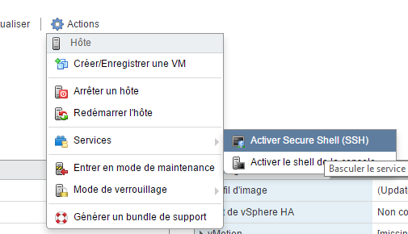

. 
,
.

.  :

-   

-   . 
    
    

. 

> **Note**
>
> 
> 
> .. 
> 

 
=========================

.

> **Note**
>
> 
> .. 
> .

 
================

 
====================================

> **Note**
>
> 
> 
> 

.
 :

    
    
    
    
    
    
    
    
    
    
    
    
    
    
    
    
    
    
    
    
    
    
    
    
    
    =
    =

 :

-   **** 

-   **** 

> **Note**
>
> 
> [hier](https://communities.vmware.com/docs/DOC-8760) 
> 

> **Important**
>
> 
> 

 
==============

. .
Kehren Sie in SSH zum ESXi zurück (stellen Sie gegebenenfalls die Verbindung wieder her) und tun Sie dies :

    /vmfs/volumes/Backup/ghettoVCB.sh -a -g /vmfs/volumes/Backup/ghettoVCB.conf

Dies startet eine Sicherung aller Ihrer VMs (und kann daher viel Zeit in Anspruch nehmen
Zeit). Am Ende sollten Sie in Ihrem Backup-Datenspeicher a haben
Ordner nach VM und in jedem VM-Ordner ein Unterordner nach Datum
mit 4 Dateien :

-   \* - flach.vmdk ⇒ die virtuelle Festplatte Ihres Computers

-   \.*.vmdk ⇒ der Deskriptor der Disc

-   \.*.vmx ⇒ die Datei, die die Konfiguration Ihres Computers enthält

-   STATUS.ok ⇒ zeigt an, dass das Backup in Ordnung ist

Hier ist eine weitere Möglichkeit für die Befehlszeile :

-   Backup-Simulation :

<!-- -->

    /vmfs/volumes/Backup/ghettoVCB.sh -d dryrun -a -g /vmfs/volumes/Backup/ghettoVCB.conf

-   Starten Sie im Debug-Modus :

<!-- -->

    /vmfs/volumes/Backup/ghettoVCB.sh -d debug -a -g /vmfs/volumes/Backup/ghettoVCB.conf

-   Sichern Sie nur die VM "toto"

<!-- -->

    /vmfs/volumes/Backup/ghettoVCB.sh -m toto -a -g /vmfs/volumes/Backup/ghettoVCB.conf

Automatischer Start von Backups 
=================================

Sie müssen die Befehlszeile zur crontab hinzufügen, aber unter VMware die
crontab ist etwas Besonderes und wird bei jedem Start meistens überschrieben. Für
Vermeiden Sie dies, damit Sie ein kleines Skript hinzufügen müssen, das das aktualisiert
crontab beim Booten (keine Sorge, es ist ziemlich einfach und schnell),
SSH auf dem ESXi tun :

    vi /etc/rc.local.d/local.sh

Und vor "exit 0" fügen Sie die folgenden Zeilen hinzu :

    / bin / kill $ (cat /var/run/crond.pid)
    / bin / echo "0 0 1 * * /vmfs/volumes/Backup/ghettoVCB.sh -a -g /vmfs/volumes/Backup/ghettoVCB.conf >/dev/null 2>&1" >> /var/spool/cron/crontabs/root
    / usr / lib / vmware / Busybox / Bin / Busybox Crond

> **Note**
>
> Hier fordere ich jeden 1. des Monats ein Backup an, das Sie ändern können
> dies durch Ändern : 0 0 1 \* \.*

> **Note**
>
> Hier mache ich ein Backup aller VMs, Sie können dies anpassen, indem Sie
> Ersetzen Sie -a durch -m ma\_vm. Seien Sie vorsichtig, wenn Sie setzen möchten
> Bei mehreren VMs müssen Sie die Zeile "/ bin / echo" 0 0 1 \ duplizieren* \.*
> / vmfs / volume / Backup / ghettoVCB.sh -a -g
> /vmfs/volumes/Backup/ghettoVCB.conf &gt;/dev/null 2&gt;&1" &gt;&gt;
> / var / spool / cron / crontabs / root "und legen Sie eine pro VM für die Sicherung ab

> **Important**
>
> Vergessen Sie nicht, den Pfad an die Konfigurationsdatei von anzupassen
> ghettoVCB entsprechend Ihrer Konfiguration :
> /vmfs/volumes/Backup/ghettoVCB.conf

Letzter Schritt: Sie müssen Ihr ESXi neu starten, damit der Cron genommen werden kann
In Anbetracht dessen können Sie das Ergebnis sehen, indem Sie (immer in SSH) :

    cat / var / spool / cron / crontabs / root

Hier müssen Sie eine Linie haben :

    0 0 1 * * /vmfs/volumes/Backup/ghettoVCB.sh -a -g /vmfs/volumes/Backup/ghettoVCB.conf >/dev/null 2>&1
