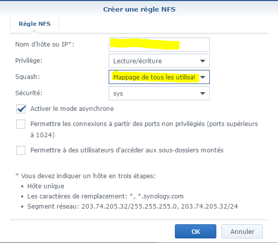
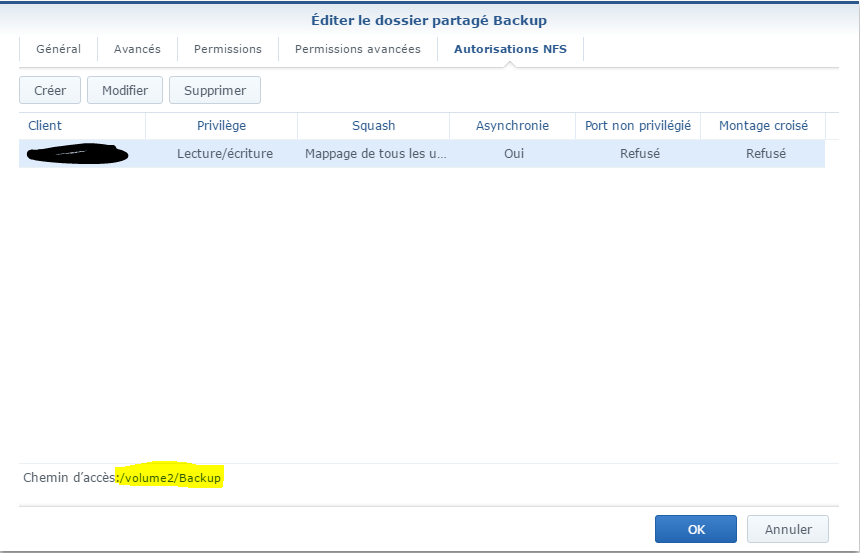
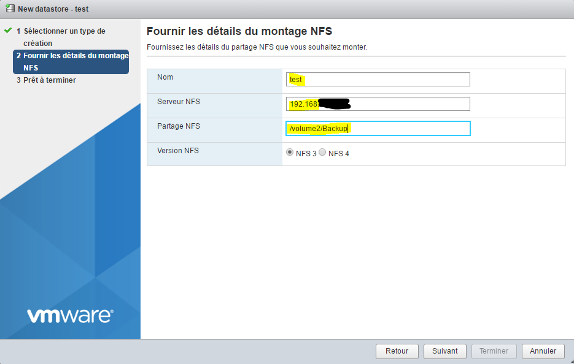
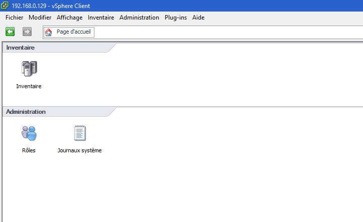

Pas vraiment un howto ici mais plus un recueil de trucs et astuces sur
VMware

Ajouter sa licence 
==================

Une fois connecté sur l'interface web (IP\_ESXI/ui) il faut aller sur
"verwalten" :

Puis sur "Attribution de licence" et cliquer sur "Attribuer une licence"

Et rentrer votre clef de licence

> **Notiz**
>
> Pour rappel, si vous ne le faites pas votre ESXi risque de ne plus
> fonctionner au bout de 60 jours

Monter un datastore NFS avec un Synology 
========================================

On va voir ici comment monter un partage NFS depuis un Synology sur
VMware. Cela permet par exemple de mettre les machines virtuelles sur le
Synology (qui peut avoir plus de place que l'ESXi) ou d'envoyer les
backups des machines sur le Synology

Configuration du Synology 
-------------------------

Il faut aller sur le panneau de Konfiguration puis "Services de
fichiers" et cocher la case "Activer NFS" :

Ensuite il faut cliquer sur "Dossier partagé", puis choisir le dossier à
partager (ici Backup), cliquer sur modifier puis "Autorisation NFS" et
enfin sur créer (ici j'en ai déja une, votre liste à vous devrait être
vide) :

Ensuite vous mettez l'IP de votre ESXi et dans "Squash" vous mettez
"Mappage de tous les utilisateurs sur admin" puis vous validez :

Il faut ensuite recupérer le chemin du partage (ici /volume2/Backup) :

Voilà c'est fini du coté Synology, on va maintenant passer coté ESXi

Configuration de l'ESXi 
-----------------------

Il faut aller sur "Stockage" :

Puis cliquer sur "Nouvelle banque de données" :

Là vous selectionnez "Monter une banque de données NFS" puis faites
folgende :

Entrez le nom du datastore à créer (attention à éviter les espaces et
caractères spéciaux), mettez l'IP de notre Synology et mettez le chemin
du partage (voir au-dessus) et enfin validez :

Cliquez sur terminer :

Et voilà votre nouveau datastore devrait apparaitre (sinon cliquez sur
"Actualiser").

Ajout du plugin VAAI Synology pour montage NFS 
==============================================

L'ajout de ce plugin permet d'activer l'accélération matérielle sur les
montages NFS (pour explication voir
[ici](http://www.virtual-sddc.ovh/exploiter-les-vaai-nfs-avec-un-nas-synology/))

Pour voir si vous l'avez, il faut se connecter avec le client lourd
(j'ai pas trouvé l'info sur le client web) et aller dans Konfiguration →
stockage :

La mise en place est assez simple, d'abord il faut activer le service
SSH de l'ESXi (sur l'interface web il faut aller dans action ⇒ services
⇒ Activer Secure Shell), puis se connecter en SSH dessus (les
identifiants sont les mêmes que pour accéder à l'interface). Ensuite il
vous suffit de faire :

    esxcli software vib install -v https://global.download.synology.com/download/Tools/NFSVAAIPlugin/1.0-0001/VMware_ESXi/esx-nfsplugin.vib -f

Vous devez avoir :

Il faut ensuite redemarrer l'ESXi, pour vérifier que c'est ok il faut
ensuite retourner avec le client lourd dans Konfiguration → stockage :

Installer/Mettre à jour l'ESXi Embedded Host Client 
===================================================

ESXi Embedded Host Client est une interface web (en HTML5) de l'ESXi qui
permet dans 95% des cas de se passer du client lourd. Elle est présente
par défaut dans la version 6.0 update 2, mais en version 1.0, il est
vivement conseillé de la mettre à jour.

Vous trouverez toutes les information
[ici](https://labs.vmware.com/flings/esxi-embedded-host-client)

Pour voir si vous disposez de l'interface web, il suffit d'aller avec
votre navigateur sur IP\_ESXI/ui si vous n'avez rien il faut
l'installer, il faut d'abord se connecter en SSH sur l'ESXI puis faire :

    esxcli software vib install -v http://download3.vmware.com/software/vmw-tools/esxui/esxui-signed-latest.vib

Si vous l'avez déjà, pour la mettre à jour il faut faire :

    esxcli software vib update -v http://download3.vmware.com/software/vmw-tools/esxui/esxui-signed-latest.vib

Installation du client lourd 
============================

Cette partie est facultative si vous n'avez pas besoin de gérer l'USB.

Il vous faut aller, avec votre navigateur internet, sur l'IP de l'ESXi
puis cliquer sur le lien "Download vSphere Client for Windows" :

Une fois téléchargé il vous suffit de lancer l'installation (je passe
volontairement sur cette partie car il suffit de tout valider).

Ensuite lancez VMware vSphere Client, vous devez avoir :

Vous avez juste à rentrer l'IP de votre ESXi, le nom d'utilisateur et le
mot de passe et vous voila connecté dessus :

Mise à jour de l'ESXi 
=====================

La procédure est assez facile, il faut tout d'abord recupérer le patch
en allant [ici](https://my.vmware.com/group/vmware/patch#search) (il
vous faudra sûrement vous connecter avec votre compte VMware). Sur la
liste "Select a Product" mettez "ESXi (Embedded and Installable)", en
face laisser la dernière version de VMware et faites "Search". Puis
télécharger le patch voulu (en général le dernier). Le build number (le
premier numéro pas celui commencant par KB) vous donne la version du
patch que vous pouvez comparer avec votre build number.

Ensuite transférez le zip sur un de vos datastores et faites :

    esxcli software vib update -d /vmfs/volumes/576c8ab3-fdf64d2f-091b-b8aeedeb87fb/ESXi600-201605001.zip

> **Notiz**
>
> Remplacer bien le chemin et le nom du zip en fonction de votre
> Konfiguration

> **wichtig**
>
> Attention à bien mettre le chemin complet vers le zip sinon ça ne
> marche pas

La commande au-dessus ne met à jour que les vib qui en ont besoin mais
vous pouvez forcer l'installation de tous les vib du package (donc
attention cela peux faire un downgrade) en faisant :

    esxcli software vib install -d /vmfs/volumes/576c8ab3-fdf64d2f-091b-b8aeedeb87fb/ESXi600-201605001.zip

Configuration du NTP 
====================

Par défaut l'ESXi n'utilise pas le NTP ce qui fait qu'il n'est pas à
l'heure et que les VMs ne sont pas à l'heure, pour corriger c'est très
simple. Il faut aller à partir de la version web sur verwalten → Système →
Date et heure, là vous cliquez sur "Modifier les paramètres" :

Et dans la case "Serveur NTP" il faut mettre : 0.debian.pool.n,
1.debian.pool.n, 2.debian.pool.n, 3.debian.pool.n, time.nist.gov

Ensuite dans Actions → Service NTP → Strategie cliquez sur "Démarrer et
arrêter avec l'hôte" :

Toujours dans Actions → Service NTP cliquez sur "Démarrer"

Voilà votre ESXi devrait prendre la bonne heure tout seul maintenant.

Accès extérieur à l'ESXi 
========================

Pour accéder à l'ESXi de l'extérieur il vous faut :

-   ouvrir le port 443 vers le 443 de l'ESXi

-   ouvrir le port 902 vers le 902 de l'ESXi

Et voilà c'est tout. Petite astuce si vous avez un NAS Synology vous
pouvez faire (attention à bien suivre) :

-   ouvrir le 443 vers le 5001 du NAS Synology

-   ouvrir le 80 vers le 80 du NAS (utile juste pour générer les
    certificats let's encrypt)

-   ouvrir le port 902 vers le 902 de l'ESXi

Ensuite sur le NAS dans le panneau de Konfiguration puis portail
d'application et proxy inversé (attention il faut absolument DSM 6) :

Cliquez sur créer et mettre :

Dans "Nom d'hôte" (au niveau de la source) il faut mettre le DNS voulu
(par exemple monesxi.mondsn.synology.me) et dans "Nom d'hôte" (au niveau
de la destination) il faut mettre l'IP de l'ESXi

> **Notiz**
>
> Vous pouvez faire aussi la même chose pour accéder à jeedom mais en
> mettant cette fois l'IP de jeedom (de la vm si vous êtes en
> virtualisé) et le port 80

> **Notiz**
>
> Une fois que vous avez fait cela et si votre DNS pointe correctement
> sur le NAS vous pouvez générer un certificat SSL valide gratuitement
> avec Let's encrypt, en allant dans Sécruité ⇒ certificat et en faisant
> hinzufügen. Ensuite n'oubliez pas de cliquer sur configurer pour
> l'affecter à votre proxy inversé

Ensuite pour accéder à votre ESXi il vous suffit avec votre navigateur
d'aller sur votre DNS ou IP externe en ajoutant /ui à la fin et c'est
bon.

> **wichtig**
>
> Si vous passez par le reverse proxy du NAS la console en mode web des
> VMs ne fonctionne pas (car cela passe par du websocket), en revanche
> si vous passez par VMware Remote Console tout devrait être ok (cela
> passe par le port 902)

> **Notiz**
>
> Il existe aussi une application Vmware Watchlist sur Android pour
> avoir accès à l'ESXi ainsi qu'aux consoles des VMs

Certificat SSL 
==============

Il est possible d'importer les certificats de vmware directement dans
votre pc pour ne plus avoir l'alerte.

Dans l'ordre il faut :

-   avoir une url (dns) d'accès a votre esxi, ici on va prendre
    esxi1.lan

-   configurer le nom de votre esxi, en ssh dessus faire :

<!-- -->

    esxcli system hostname set --host=esxi1

-   configurer le fqdn :

<!-- -->

    esxcli system hostname set --fqdn=esxi1.lan

-   Récuperer le certificat racine de l'esxi, il est dans
    /etc/vmware/ssl/castore.pem

Sur poste faite clic droit puis installer le certificat , le mettre dans
"Autorité de certification racines de confiance"
