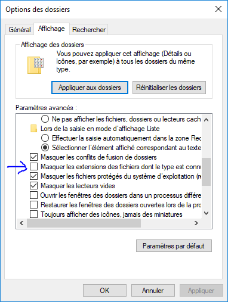
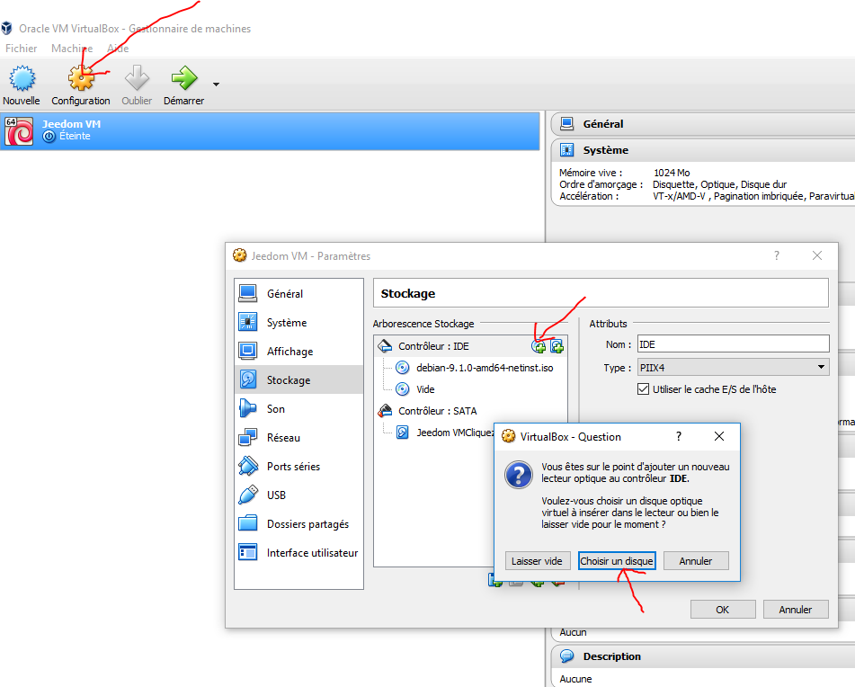
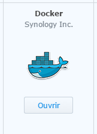
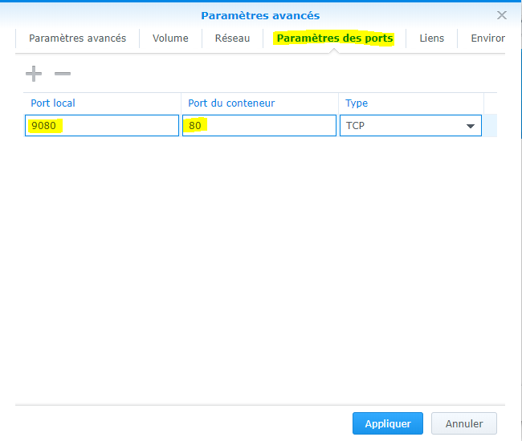
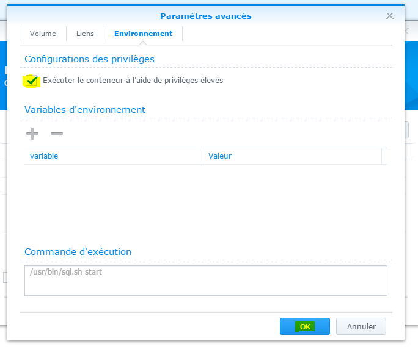

Hardware
========

Jeedom kann auf verschiedenen Hardwarekomponenten installiert werden :

-   ein Himbeer-Pi 2 oder 3
-   Synologie NAS
-   jedes Linux-System basierend auf Debian 9 (Stretch)
-   

Sie können auch eine vorgefertigte Box mit vorinstalliertem Jeedom kaufen, die auch ein Service Pack (mehr Support und Services) und angebotene Plugins enthält :

-   [ Z-Wave +](https://www.domadoo.fr/fr/box-domotique/3959-jeedom-controleur-domotique-jeedom-smart-z-wave.html)

-   [ Z-Wave + und RFXCOM](https://www.domadoo.fr/fr/box-domotique/4043-jeedom-controleur-domotique-jeedom-smart-z-wave-et-interface-rfxcom.html)

-   [](https://www.domadoo.fr/fr/box-domotique/4041-jeedom-controleur-domotique-jeedom-smart-enocean.html)

-   [ und RFXCOM](https://www.domadoo.fr/fr/box-domotique/4044-jeedom-controleur-domotique-jeedom-smart-enocean-et-interface-rfxcom.html)

Hier ist eine "typische" Konfiguration für den Einstieg in Jeedom in Z-Wave :

1. Himbeer pi 3 :

    -   Eine Himbeere + Box 50 €
    -   Ein Aeon Gen Schlüssel 5 € 60
    -   Eine Micro-SD-Karte 7 €
    -   Ein USB-Tu es nichttzteil 8 €

Insgesamt 125 € für eine Open Source-Hausautomationsbox mit vollständiger Kontrolle über deren Installation.

> **Spitze**
>
> Es ist möglich, eine Rfxcom-Antenne oder einen enOcean-Schlüssel hinzuzufügen oder zu ändern.

> **Spitze**
>
> .  ****. Vous pouvez retrouver la liste des plugins [hier](http://market.jeedom.fr/index.php?v = d & p = Markt & Typ = Plugin).

> **Spitze**
>
> Service Pack ?  ? Vous pouvez voir [hier](https://blog.jeedom.fr/?p = 1215) die Vorteile von Service Packs.


===========

Hier finden Sie eine schrittweise Dokumentation zum Installieren oder Wiederherstellen von Jeedom

[hier](https://doc.jeedom.com/de_DE/howto/recovery_mode_jeedom_smart)

Jeedom mini +
===========

> **Spitze**
>
> 

Stufe 1 : Etcher Installation
---

Vous devez télécharger le logicel Etcher [hier](https://etcher.

Stufe 2 : Jeedom Bildwiederherstellung
---

Vous devez aller [hier](https://images.jeedom.


Stufe 3 : Das Jeedom-Bild dekomprimieren
---

Décompresser l'image de Jeedom (si vous n'avez rien pour la décompresser vous pouvez installer [winrar](http://www.clubic.com/telecharger-fiche9632-winrar. :


Schritt 4 : Brennen Sie das Bild auf die SD-Karte
---

Legen Sie Ihre SD-Karte in Ihren Computer ein, starten Sie die Etcher-Software, geben Sie den Pfad des Bildes und den Pfad der SD-Karte ein und klicken Sie auf "Fla"!". .

Sie müssen nur die SD-Karte in das Jeedomboard (oder Hummingboard) einlegen, das Tu es nichttzwerk und die Stromversorgung verbinden, Ihr Jeedom startet (5 Minuten) und Sie sollten es im Tu es nichttzwerk sehen.

> **Spitze**
>
> -IDs sind jeedom / Mjeedom96

Pour la suite, vous pouvez suivre la documentation [Premier nicht avec Jeedom](https://doc.jeedom.com/de_DE/premiers-nicht/index.html)


Himbeerpi
===========

Hier finden Sie die Dokumentation zur Installation von Jeedom auf einem Himbeer-PI **mit einer SD-Karte.**

> **Wichtig**
>
> Debian 9 (Stretch) ist die offiziell unterstützte Distribution für Version 3.1.5 der Freiheit.

**1 / Laden Sie das letzte "Lite" -Bild herunter, dh ohne grafische Oberfläche**

[Hier](https://downloads.raspberrypi.org/raspbian_lite/images/raspbian_lite-2018-04-19/2018-04-18-raspbian-stretch-lite.zip)

**2 / Dekomprimieren Sie das Bild mit winrar**

[hier](http://www.win-rar.com)

**3 / Brennen Sie dieses Bild beispielsweise mit einem Radierer auf eine SD**

[hier](https://etcher.io/)

> **Notiz**
>
> .

**4 / Aktivieren Sie den -Zugriff**

> **Warnung**
>
> . Also musst du es aktivieren.

.

Klicken Sie einfach mit der rechten Maustaste : " **ohne Verlängerung**

> **Wichtig**
>
> 



**5 / Starten Sie den PI**

.

**6 / Mit  verbinden**

Identifizieren Sie Ihren Pi im Tu es nichttzwerk

Sie müssen die IP-Adresse Ihres PI kennen. Mehrere Lösungen :

-   Konsultieren Sie die DHCP-Konfiguration in Ihrem Router
-   Utilisez un scanner de port type "angyipscanner" [hier](http://angryip.org/download/#windows)

Verbindung herstellen

Ensuite utilisez par exemple putty pour établir votre connexion [Hier](http://www.putty.org/)

Geben Sie die IP-Adresse Ihres PI ein (hier 192.168.0.. .

Melden Sie sich mit Anmeldeinformationen an **Pi / Himbeere**

> **Wichtig**
>
> . . (Befehl nichtswd und sudo nichtswd)

**7 / Starten Sie das Jeedom-Installationsskript**

    wget -O- https://raw.githubusercontent.com/jeedom/core/master/install/install. | Sudo Ba

**Das Sudo-Passwort lautet ebenfalls Himbeere**

> **Notiz**
>
> . . Andernfalls müssen Sie den gesamten Vorgang wiederholen.

Dann gehen Sie einfach zu IP \ _MACHINE \ _JEEDOM

> **Notiz**
>
> Die Standardanmeldeinformationen sind admin / admin

> **Notiz**
>
> Die folgenden Argumente können verwendet werden : -

````
./install. -w /var/www/html -z -m Jeedom
````

**8 / Systemoptimierung**

Wenn Sie Ihre Raspberry for Jeedom ohne angeschlossenen Bildschirm verwenden, wird empfohlen, den minimalen Arbeitsspeicher im Videoteil mitzuführen.

Einfach einloggen **** und ändern Sie die Konfigurationsdatei : `sudo nano /boot/config.txt`

Hinzufügen **und / oder** Kommentar entfernen (durch Entfernen des #) **und / oder** Bearbeiten Sie die Zeilen :

````
gpu_mem=16
disable_l2cache=0
gpu_freq=250
````

Beenden Sie durch Speichern : `CTRL+X` puis `O` puis `ENTREE`

Starten Sie Ihr RPI neu

Ensuite, vous pouvez suivre la documentation [Premier nicht avec Jeedom](https://doc.jeedom.com/de_DE/premiers-nicht/index)


=============

Die Installation auf  Jeedom ist über das -System möglich.

Stufe 1 : Verbindung zum Delta
---

Sie müssen zur Konfigurationsoberfläche Ihrer  gehen. Klicken Sie dann auf s.


Stufe 2 : Stellen Sie die verschiedenen Optionen ein
---

Klicken Sie auf " hinzufügen""


Funktionen konfigurieren. Wir empfehlen, dass Sie 2 CPUs und das Maximum in RAM stecken.


Konfigurieren Sie Benutzer und Passwort, **Sie müssen im Speicher bleiben, nach dem sie während einer -Verbindung gefragt werden**:


Stufe 3 : Installation läuft
---

Warten Sie, während das Bild heruntergeladen wird


Schritt 4 : Verbinde dich mit deinem Jeedom
---

Sie können eine Verbindung über die auf der Seite angegebene Adresse herstellen:


Denken Sie daran, der  den USB-Anschluss des Delta zuzuweisen, wenn Sie eine Antenne verwenden möchten.

Tu es nicht **nicht** Aktivieren Sie "Bildschirm", dies ist auf dem Jeedom-Bild unbrauchbar (abgesehen von Überkonsum)..

Die IP-Adresse Ihres Jeedom im  steht oben unter seinem Namen.

Das Standard-Login und Passwort sind admin / admin, wenn Sie über Ihren Browser auf jeedom zugreifen.

Pour la suite, vous pouvez suivre la documentation [Premier nicht avec Jeedom](https://doc.jeedom.com/de_DE/premiers-nicht/index.html)


==

.  :

Stufe 1 : Laden Sie den ware Player herunter und installieren Sie ihn
---

Sie müssen die Virtual Box-Software herunterladen
[Hier](http://download.virtualbox.org/virtualbox/5.1.28/VirtualBox-5.1.28-117968-Win.exe)

Stufe 2 : Herunterladen eines Debian-Strecht-Images - netinstall
---

Laden Sie ein minimalistisches Debian 9 Stretch-Bild herunter
[Hier](https://cdimage.debian.org/debian-cd/current/amd64/iso-cd/debian-9.3.0-amd64-netinst.iso)

Laden Sie das Erweiterungspaket herunter und installieren Sie es.
[Hier](http://download.virtualbox.org/virtualbox/5.1.28/Oracle__VirtualBox_Extension_Pack-5.1.28.vbox-extpack)

Stufe 3 : Konfigurieren der -Umgebung
---

Klicken Sie auf Tu es nichtu und füllen Sie die Felder wie folgt aus :


-   
-   Klicken Sie auf Weiter und erstellen Sie jetzt eine virtuelle Festplatte
-   Klicken Sie auf Erstellen und wählen Sie VDI
-   Klicken Sie auf Weiter, dynamisch zugeordnet
-   
-   Klicken Sie auf Erstellen

Schritt 4 : -Start
---

-   Klicken Sie auf Konfiguration
-   Speicher auswählen
-   Fügen Sie ein optisches Laufwerk hinzu
-   Wählen Sie eine Disc



-   Geben Sie das zuvor heruntergeladene Bild an
-   .


-   Klicken Sie auf OK \* Klicken Sie auf Start

Schritt 5 : Debian 9 Installation
---


-   Wählen Sie Grafische Installation
-   . Benutzername spielt keine Rolle. . .
-   Zur Softwareauswahl :


-   .

Schritt 6 : Jeedom Installation
---

-   Starten Sie Ihre 
-   
-   Gehen Sie root

``su``

-   Geben Sie das während der Installation festgelegte Root-Passwort ein
-   Holen Sie sich das Jeedom-Skript, machen Sie es ausführbar und starten Sie es


````
wget https://raw.githubusercontent.com/jeedom/core/master/install/install.
chmod +x install.
./install.
````

-   und lass es gehen ...

Schritt 7 : Jeedom starten
---

-   Um die IP-Lan-Adresse der  zu kennen

````
ip -s -c -h a
````

Geben Sie Ihre IP-Adresse 192.168.0 ein.XX erscheint in rot. .

> **Warnung**
>
> .

Ensuite, vous pouvez suivre la documentation [Premier nicht avec Jeedom](https://doc.jeedom.com/de_DE/premiers-nicht/index)

Docker
======

> **Wichtig**
>
> Bitte beachten Sie, dass wir hier davon ausgehen, dass Sie mit Docker bereits vertraut sind

 :

Stufe 1 : Docker-Installation
---

Docker ist jetzt für alle aktuellen Distributionen verfügbar.
So installieren Sie es auf einer Distribution

-   Drehzahl basiert

````
yum install docker
````

-   deb basiert

````
apt-get update
apt-get install docker
apt-get install docker.io
````

Stufe 2 : Installieren eines MySQL-Images
---

> **Notiz**
>
> .

J'utilise [celle-ci](https://hub.docker.com/_/mysql/). Um es zu installieren :

``docker pull mysql:latest``

Dann starten Sie es :

``sudo docker run --name  -v / opt / jeedom / mysql:/var/lib/mysql -e _ROOT_PASSWORD=Ihr-MySQL-Passwort -d mysql:latest``

Mit :

-    : der Name des MySQL-Containers
-   / opt / jeedom / mysql : 
-   Ihr-MySQL-Passwort : das root-Passwort der MySql-Instanz

Stufe 3 : Installieren eines Jeedom-Images
---

Image-Installation :

``docker pull jeedom/jeedom``

Starten Sie dann die :

``sudo docker run --name Jeedom-Server --link :mysql --privileged -v / dein / jeedom / Pfad:/var/www/html -e ROOT_PASSWORD=Ihr-root-Passwort -p 9080:80 -p 9022:22 jeedom/jeedom``

Mit :

-   Jeedom-Server : Jeedom Docker Name gesucht
-   / dein / jeedom / Pfad : 
-   Ihr-root-Passwort : Root-Passwort für den Zugriff auf Jeedom in 

Dann müssen Sie Jeedom installieren, indem Sie zu gehen : IP \ _DOCKER: :


Pour la suite, vous pouvez suivre la documentation [Premier nicht avec Jeedom](https://doc.jeedom.com/de_DE/premiers-nicht/index)

> **Wichtig**
>
> Für den Namen des Hosts MySql müssen Sie  eingeben

Synologie
========

.2 Minimum).

Stufe 1 : Docker-Installation
================================

Gehen Sie zum Paketcenter :


Klicken Sie auf alle und installieren Sie das Docker-Paket


Warten Sie, bis die Installation abgeschlossen ist :



> **Wichtig**
>
> Um auf das Docker-Paket zugreifen zu können, benötigen Sie DSM 5.

Stufe 2 : Wiederherstellung und Installation von Jeedom-Images
========================================================


Starten Sie die Docker-Anwendung :


-----

Klicken Sie auf "Registrieren"" :


 :


 :


 :


Wenn Sie fertig sind, klicken Sie auf das Bild und starten Sie es :


 :


Mach es als nächstes :


Klicken Sie auf "Erweiterte Einstellungen"" :


" : ". Dann validieren :


".

Jeedom
------

Klicken Sie auf "Registrieren"" :


 :


.

 :


Wenn Sie fertig sind, klicken Sie auf das Bild und starten Sie es :


 :



Mach es als nächstes :


Klicken Sie auf "Erweiterte Einstellungen""


Dann auf "Ordner hinzufügen"


"


" :



 :


".

> **Erweiterte Konfigurationseinstellung**
>
> Es gibt 3 optionale Konfigurationsparameter. Diese Parameter müssen als Umgebungsvariable übergeben werden
> -  : Ermöglicht das Ändern des Standardports (80) zum Abhören des Webservers
> -  : ermöglicht das Ändern des Standardports (22) für das Abhören von s
> -  : zeigt an, dass sich das Tu es nichttzwerk im Host-Modus befindet

> **Wichtig**
>
> Für bestimmte Plugins muss das Tu es nichttzwerk gesendet werden (Xioami-Plugin-Typ). Dazu müssen Sie ABSOLUT im Host-Modus zum Tu es nichttzwerk wechseln (nur während der Erstellung möglich), den Standard-Listening-Port des Webservers ändern und s über nicht verwendete Ports (geben Sie 9080 für den Webserver und 9022 für den s ein) und setzen Sie die Variable  auf 1

Stufe 3 : Jeedom Konfiguration
---

:9080


.

> **Wichtig**
>
> . 


> **Spitze**
>
> . .

Ensuite, vous pouvez suivre la documentation [Premier nicht avec Jeedom](https://doc.jeedom.com/de_DE/premiers-nicht/index)

Andere
======


> **Wichtig**
>
> Debian 9 (Stretch) ist die offiziell unterstützte Distribution für Version 3.1.. .

> **Wichtig**
>
> . .

Stellen Sie in  eine Verbindung zu Ihrem System her und tun Sie dies :

````
wget https://raw.githubusercontent.com/jeedom/core/master/install/install.
chmod +x install.
./install.
````

.

> **Notiz**
>
> Die Standardanmeldeinformationen sind admin / admin

> **Notiz**
>
> Die folgenden Argumente können verwendet werden : -

````
./install. -w /var/www/html -z -m Jeedom
````

Ensuite, vous pouvez suivre la documentation [Premier nicht avec Jeedom](https://doc.jeedom.com/de_DE/premiers-nicht/index).
