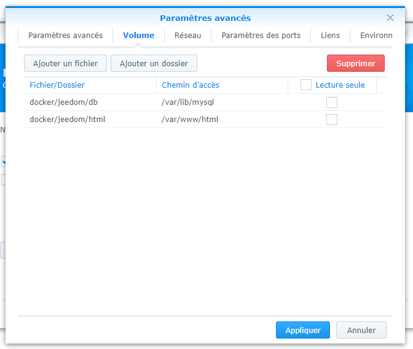

# Installation auf Synology

Hier finden Sie Schritt für Schritt die Dokumentation zur Installation von Jeedom auf einer Synology (DSM 5).2 Minimum).

## Docker-Installation

Gehen Sie zum Paketcenter :

Klicken Sie auf alle und installieren Sie das Docker-Paket

Warten Sie, bis die Installation abgeschlossen ist :

> **Wichtig**
>
> Um auf das Docker-Paket zugreifen zu können, benötigen Sie DSM 5.2 und ein kompatibles NAS

## Wiederherstellung und Installation von Jeedom-Images

Starten Sie die Docker-Anwendung :

Klicken Sie auf "Registrieren"" :

Geben Sie im Suchfeld "jeedom" ein, wählen Sie jeedom / jeedom und klicken Sie auf Download :

Überprüfen Sie dann die Versionsanforderung. Am besten nehmen Sie die letzte.

Klicken Sie dann auf das Bild. Hier können Sie den Fortschritt des Downloads verfolgen (kann einige zehn Minuten dauern) :

Wenn Sie fertig sind, klicken Sie auf das Bild und starten Sie es :

Geben Sie Ihrem Jeedom einen Namen sowie einen lokalen Port, der auf Port 80 (hier 9080) umgeleitet wird, und führen Sie dann die folgenden Schritte aus :

Mach es als nächstes :

Klicken Sie auf "Erweiterte Einstellungen""

Dann auf "Ordner hinzufügen"

Wählen Sie einen Ordner in Ihrer Synology (in diesem Ordner befinden sich alle Jeedom-Dateien). Deaktivieren Sie das Kontrollkästchen "Schreibgeschützt""

Geben Sie im Pfad / var / www / html ein und klicken Sie auf "Umgebung"" :

Wiederholen Sie diesen Vorgang für den Ordner / var / lib / mysql

Aktivieren Sie "Container mit erhöhten Berechtigungen ausführen" und überprüfen Sie alles :

Aktivieren Sie "Diesen Container ausführen, wenn der Assistent fertig ist" und klicken Sie auf "Übernehmen"".

> **Erweiterte Konfigurationseinstellung**
>
> Es gibt 3 optionale Konfigurationsparameter. Diese Parameter müssen als Umgebungsvariable übergeben werden
> - APACHE_PORT : Ermöglicht das Ändern des Standardports (80) zum Abhören des Webservers
> - MODE_HOST : zeigt an, dass sich das Netzwerk im Host-Modus befindet

> **Wichtig**
>
> Für bestimmte Plugins muss das Netzwerk gesendet werden (Xioami-Plugin-Typ). Dazu müssen Sie ABSOLUT im Host-Modus zum Netzwerk wechseln (nur während der Erstellung möglich), den Standard-Listening-Port des Webservers ändern und ssh über nicht verwendete Ports (geben Sie 9080 für den Webserver und 9022 für den ssh ein) und setzen Sie die Variable MODE_HOST auf 1

Jetzt müssen Sie Jeedom installieren, es ist sehr einfach, gehen Sie zu IP \ _NAS:9080

Dann können Sie der Dokumentation folgen [Erster Schritt mit Jeedom](https://doc.jeedom.com/de_DE/premiers-pas/index)
