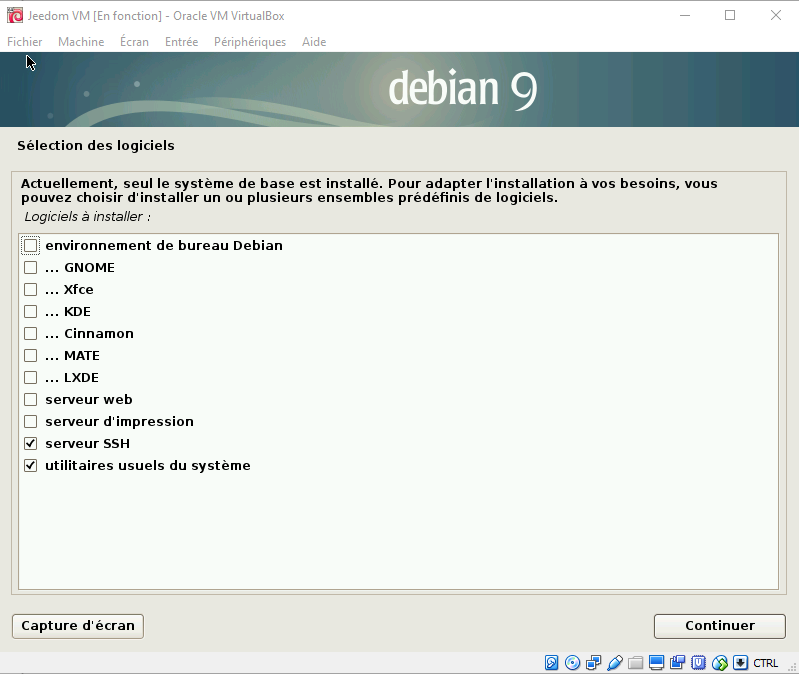

# Installation auf einer VM

Wenn Sie Jeedom ohne Risiko entdecken möchten, können Sie es auch auf Ihrem PC virtualisieren. Gehen Sie wie folgt vor. Sie gehen in einer VM kein Risiko ein, die Integrität Ihres PCs ist geschützt :

## Laden Sie den VMware Player herunter und installieren Sie ihn

Sie müssen die Virtual Box-Software herunterladen [Hier](https://download.virtualbox.org/virtualbox/6.1.6/VirtualBox-6.1.6-137129-Win.exe)

## Herunterladen eines Debian-Strecht-Images - netinstall

Laden Sie ein minimalistisches Debian 9 Stretch-Bild herunter [Hier](https://cdimage.debian.org/debian-cd/current/amd64/bt-cd/debian-10.3.0-amd64-netinst.iso.torrent)

## Konfigurieren der VM-Umgebung

Klicken Sie auf Neu und füllen Sie die Felder wie folgt aus :


-   Klicken Sie auf Weiter und passen Sie die Speichergröße an Ihr System an (1024 sind ausreichend)
-   Klicken Sie auf Weiter und erstellen Sie jetzt eine virtuelle Festplatte
-   Klicken Sie auf Erstellen und wählen Sie VDI
-   Klicken Sie auf Weiter, dynamisch zugeordnet
-   Klicken Sie auf Weiter. Wählen Sie eine Größe für den Speicherplatz (4 GB sind ausreichend)
-   Klicken Sie auf Erstellen

## VM-Start

-   Klicken Sie auf Konfiguration
-   Speicher auswählen
-   Fügen Sie ein optisches Laufwerk hinzu
-   Wählen Sie eine Disc

-   Geben Sie das zuvor heruntergeladene Bild an
-   Wählen Sie dann Netzwerk und im Netzwerkzugriffsmodus "Bridge-Zugriff".


-   Klicken Sie auf OK \* Klicken Sie auf Start

## Debian 9 Installation

Es ist klassisch


-   Wählen Sie Grafische Installation
-   Installieren Sie den Debian vorzugsweise ohne grafische Oberfläche, da er unbrauchbar ist. Benutzername spielt keine Rolle. In den meisten Bildschirmen müssen Sie nur die Standardauswahl überprüfen. Sie können leere Felder lassen, es wird nicht blockiert.
-   Zur Softwareauswahl :

-   Machen Sie sich für Grub keine Sorgen, der Bootsektor ist der der VM, nicht der Ihres PCs. Keine Gefahr, etwas zu zerbrechen.

## Jeedom Installation

-   Starten Sie Ihre VM
-   Identifizieren Sie sich mit dem Benutzer und dem Kennwort, die Sie während der Installation ausgewählt haben
-   Gehen Sie root

``su -``

-   Geben Sie das während der Installation festgelegte Root-Passwort ein
-   Holen Sie sich das Jeedom-Skript, machen Sie es ausführbar und starten Sie es

````
wget https://raw.githubusercontent.com/jeedom/core/master/install/install.sh
chmod +x install.sh
./install.sh
````

-   und lass es gehen

## Jeedom starten

-   Um die IP-Lan-Adresse der VM zu kennen

````
ip -s -c -h a
````

Geben Sie Ihre IP-Adresse 192.168.0 ein.XX erscheint in rot. Geben Sie es einfach in Ihren Browser ein.

> **Warnung**
>
> Wenn dies nicht funktioniert, haben Sie Ihre Netzwerkkarte nicht wie zu Beginn angegeben als Netzwerkbrücke konfiguriert.

Dann können Sie der Dokumentation folgen [Erster Schritt mit Jeedom](https://doc.jeedom.com/de_DE/premiers-pas/index)
