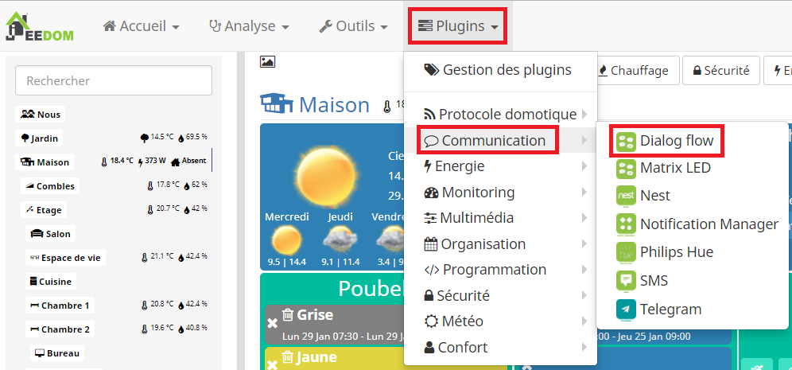
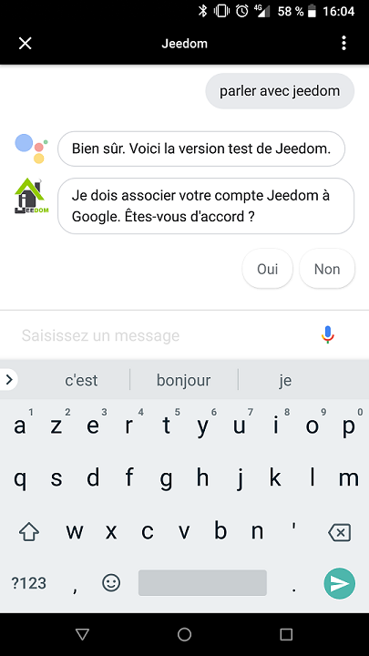

# Dialogflow

Das Dialogflow-Plugin ermöglicht die Verbindung von Jeedom mit Google Home / Assistant über eine native Anwendung und Interaktionen

> **NOTE**
>
> Es gibt auch das Google Smarthome-Plugin, mit dem Sie Jeedom mit Google Home / Assistant verbinden können. Diesmal werden jedoch für die Smarthome-Integration von Google keine Interaktionen verwendet.

> **Important**
>
> Das Plugin erfordert ein Abonnement für Sprachdienste. Sie können Ihr Abonnement verwalten [hier](https://market.jeedom.com/index.php?v=d&p=profils#services)

# Configuration

Installieren Sie das Plugin und aktivieren Sie es. Klicken Sie dann immer auf der Plugin-Konfigurationsseite auf "Senden", um Ihre Konfiguration an den Markt zu senden.

> **IMPORTANT**
>
> Sie müssen keine Ausrüstung für dieses Plugin erstellen. Folgen Sie einfach den Anweisungen unten.

Auf dem Markt müssen Sie "Google Smarthome" auf der Registerkarte "Meine Dienste" aktivieren".

> **IMPORTANT**
>
> Die Zugangs-URL Ihres Jeedom muss unbedingt in https sein

> **NOTE**
>
> Sie können nur ein Jeedom pro Marktkonto mit Google verbinden

Wenn Sie auf einem Telefon mit Google Assistant "Mit Jeedom sprechen" sagen, werden Sie von Google aufgefordert, Ihr Jeedom-Konto zu verknüpfen, und Google klickt auf "Ja" :

Geben Sie Ihre Marktkennungen an :

Google teilt Ihnen mit, dass die Konfiguration erfolgreich erstellt / aktualisiert wurde :

Hier wird die Verbindung zwischen Ihrem Jeedom und Google Home / Assistant hergestellt.

Sie können jetzt mit Ihrem Jeedom sprechen und alle Interaktionen Ihres Jeedom direkt von Ihrem Google-Startseite / Assistenten aus nutzen.
Sagen Sie in Ihrem Google-Startseite / Assistenten einfach "Mit Jeedom sprechen", "Jeedom fragen" oder sogar "Mit Jeedom sagen", um die Interaktion mit Jeedom zu starten, und "Danke", wenn Sie mit dem Beenden des Gesprächs fertig sind.

# FAQ

>**Ich habe den Fehler ESOCKETTIMEDOUT**
>
>Ist das Ihre auf dem Markt konfigurierte URL oder API-Schlüssel nicht gut. Beachten Sie auch die in den Interaktionen definierte Antwortzeit. Google legt eine Antwortzeit vor dem Timeout von 4 Sekunden fest.

>**Fehler, dass Ihr Jeedom den ETIMEDOUT-Code nicht richtig beantwortet hat. Noch etwas**
>
>Dies kommt von Ihrem Jeedom, das nicht innerhalb der von Google auferlegten Frist geantwortet hat.. Dies kann auf zwei Dinge zurückzuführen sein: eine langsame Internetverbindung oder zu lange Aktionen..
