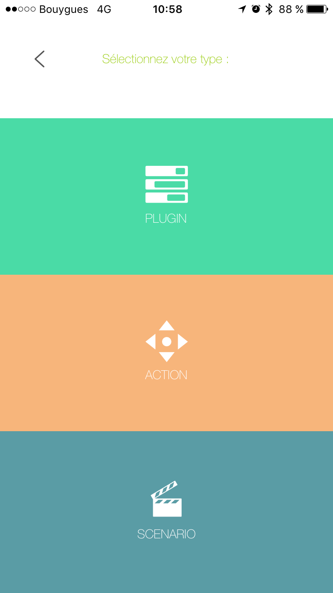
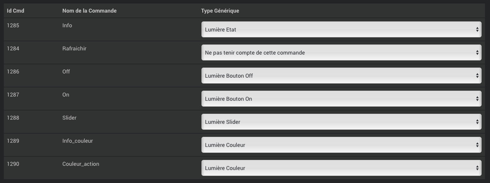

Plugin zur Verwendung der Jeedom Handy-Anwendung.

Die mobile Jeedom-Anwendung erfordert die Installation dieses Plugins, um
Die Box kann mit der mobilen Anwendung kommunizieren.

Konfiguration des mobilen Plugins 
==============================

Nach der Installation des Plugins müssen Sie es nur noch aktivieren :

**Konfiguration**

Um das Plugin zu konfigurieren, müssen Sie die Telefone hinzufügen, die
wird in der Lage sein, auf Jeedom zuzugreifen.

So fügen Sie ein Telefon hinzu : **Plugins** → **Kommunikation** → **App
Handy** → **Hinzufügen**

Hier sind die einzugebenden Parameter :

-   **Name der mobilen Ausrüstung** : Telefonname

-   **Aktivieren** : Aktivieren des Zugriffs für dieses Mobiltelefon

-   **Handyr Typ** : Auswahl des Telefonbetriebssystems (iOS, Android)

-   **Benutzer** : Benutzer, der diesem Zugriff zugeordnet ist

> **Spitze**
>
> Die Wahl des Benutzers ist wichtig, da sie die bestimmt
> Geräte, zu denen dieser gemäß seinen Rechten Zugang hat.

Nach dem Speichern erhalten Sie einen QRCode
die Anwendung, um sich selbst zu konfigurieren.

Konfiguration der von der App empfangenen Plugins und Befehle 
=======================================================

Nach der Initialisierung des Handy Plugins haben Sie die Möglichkeit
Überarbeiten Sie generische Arten von Steuerelementen, Plugins und Teilen.

Durch Klicken auf ein Plugin können Sie es zum Chatten autorisieren oder nicht
mit der mobilen App und konfigurieren Sie jeden der generischen Typen
mit seinen Befehlen verbunden.

Durch Klicken auf ein Teil können Sie es autorisieren oder nicht
in der mobilen Anwendung vorhanden, und konfigurieren Sie jeden der Typen
Generika im Zusammenhang mit seinen Bestellungen.

Konfiguration der mobilen App 
=====================================

Sie finden die Anwendungen auf den mobilen Jalousien :

**Android Google Play**

**Apple App Store**

Erster Start der App 
--------------------------

Beim ersten Start der mobilen Anwendung wird ein Tutorial angeboten
um Sie bei der Konfiguration zu unterstützen.

Nach dem Herunterladen und Installieren Ihrer Jeedom Handy App,
Starten Sie die Anwendung auf Ihrem Smartphone.

Sie gelangen dann in ein Konfigurations-Tutorial, das wir
raten zu folgen. Einige Schritte wurden zuvor ausgeführt.

Sie haben dann die Wahl zwischen einer manuellen Konfiguration oder
automatisch per QRcode. Wenn Sie die Konfiguration per QRcode wählen,
Flashen Sie einfach den QR-Code im Handy App-Plugin
zuvor erstellte Smartphone-Geräte. In diesem Fall wird die Anwendung
Rufen Sie automatisch die gesamte Konfiguration Ihres Jeedom und ab
automatisch verbinden. Wenn es über WLAN mit Ihrem Zuhause verbunden ist,
Die Anwendung verwendet automatisch die Jeedom-Ethernet-Adresse
intern in Ihrem Netzwerk. Wenn Sie in 4G oder 3G verbunden sind, dort
verwendet Ihre externe Adresse, um eine Verbindung zu Ihrem Jeedom herzustellen (von
Beispiel über den Jeedom DNS-Dienst, wenn Sie ihn verwenden). Wenn Sie möchten
Für die manuelle Konfiguration müssen Sie in diesem Fall die eingeben
Geben Sie die internen und externen IP-Adressen Ihres Jeedom weiter. Diese Option
ist einer informierten Öffentlichkeit vorbehalten.

Die Anwendung wird synchronisiert und Sie gelangen auf die Startseite
(vorangestellt von einem Mini-Präsentationsleitfaden).

Die mobile Jeedom-App ist jetzt betriebsbereit.

Favoriten 
-----------

In der Anwendung können Sie Favoriten (Verknüpfungen von
Befehle, Plugins, Szenarien).

Hier ist das Verfahren zum Erstellen :

Klicken Sie auf einem der + auf dem Startbildschirm der Anwendung :

Sie gelangen auf die Auswahlseite für den Verknüpfungstyp :

Zum Beispiel werden wir Maßnahmen ergreifen, also bietet es uns
Räume / Objekte :

Sie müssen nur die gewünschte Aktion auswählen
Verknüpfung :

Es ist dann möglich, die Farbe anzupassen (für die
drei Farben sind verfügbar) :

Sowie die beiden dazugehörigen Texte :

 ![mobile
Dashboard 7] (../ images / mobile_dashboard_7.PNG)

Hier haben Sie jetzt eine Verknüpfung Ihrer Bestellung (in der
Version 1.1 Es wird erwartet, dass Ein / Aus-Befehle auf dem angezeigt werden
gleicher Schlüssel).

So konfigurieren Sie generische Typen richtig 
============================================

Generische Typen im Handy Plugin 
------------------------------------------

Besser als Worte, hier ist ein Beispiel für typische Generika für a
Licht mit all seinen Bedienelementen (siehe auch Tabelle Light plus
unten) :

Anwendungsvorlagentabellen 
---------------------------------------

### Die Lichter #

Bild                           | Typ Gattung               | Dev Plugin Teil            | Beschreibung          |
:-----------------------------: | :--------------------------- | :--------------------------- | :------------------: |
 | `Lumière Bouton On` `Lumière Bouton Off` | `LIGHT_ON` `LIGHT_OFF`| présence de deux boutons "ON" et "Off" pas de retour d'état. |
 | `Lumière Bouton On` `Lumière Bouton Off` `Lumière Etat` | `LIGHT_ON` `LIGHT_OFF` `LIGHT_STATE` | Retour d'état présent, le bouton de gauche permet de switcher entre On et Off |
 | `Lumière Bouton Toggle` `Lumière Etat` | `LIGHT_TOGGLE` `LIGHT_STATE` | Retour d'état présent, le bouton de gauche permet de switcher entre On et Off |
 | `Lumière Bouton On` `Lumière Bouton Off` `Lumière Etat` `Lumière Slider` | `LIGHT_ON` `LIGHT_OFF` `LIGHT_STATE` `LIGHT_SLIDER` | Retour d'état présent, le bouton de gauche permet de switcher entre On et Off et le slider permet de contrôler l'intensité |
 | `Lumière Bouton On` `Lumière Bouton Off` `Lumière Etat` `Lumière Slider` `Lumière Couleur (info)` `Lumière Couleur (action)` `Lumière Mode` (optionnel, il sert à avoir des mode de lumière,par exemple arc-en-ciel sur les philips Hue) | `LIGHT_ON` `LIGHT_OFF` `LIGHT_STATE` `LIGHT_SLIDER` `LIGHT_COLOR` `LIGHT_SET_COLOR` `LIGHT_MODE` | Retour d'état présent, le bouton de gauche permet de switcher entre On et Off et le slider permet de contrôler l'intensité. Dans le cercle la couleur de la lampe est présente et lors d'un cloc dans celui-ci vous pouvez changer la couleur et activer un mode |

### Die Steckdosen #

Bild                           | Typ Gattung               | Dev Plugin Teil            | Beschreibung          |
:-----------------------------: | :--------------------------- | :--------------------------- | :------------------: |
 | `Prise Bouton On` `Prise Bouton Off`| `ENERGY_ON` `ENERGY_OFF`| présence de deux boutons "ON" et "Off" pas de retour d'état. |
 | `Prise Bouton On` `Prise Bouton Off` `Prise Etat` | `ENERGY_ON` `ENERGY_OFF` `ENERGY_STATE` | Retour d'état présent, le bouton de gauche permet de switcher entre On et Off |
 | `Prise Bouton On` `Prise Bouton Off` `Prise Etat` `Prise Slider` | `ENERGY_ON` `ENERGY_OFF` `ENERGY_STATE` `ENERGY_SLIDER` | Retour d'état présent, le bouton de gauche permet de switcher entre On et Off et le slider permet de contrôler l'intensité |

### Die Fensterläden #

Bild                           | Typ Gattung               | Dev Plugin Teil            | Beschreibung          |
:-----------------------------: | :--------------------------- | :--------------------------- | :------------------: |
   | `Volet Bouton Monter` `Volet Bouton Descendre` `Volet Bouton Stop` `Volet Etat`(optionnel) | `FLAP_UP` `FLAP_DOWN` `FLAP_STOP` `FLAP_STATE`(optionnel) | Präsenz de trois boutons "Monter", "Descendre", "Stop", retour d'état optionnel. |
   | `Volet Bouton Monter` `Volet Bouton Descendre` `Volet Bouton Stop` `Volet Etat` `Volet Bouton Slider` | `FLAP_UP` `FLAP_DOWN` `FLAP_STOP` `FLAP_STATE` `FLAP_SLIDER` | Präsenz d'un slider, avec un bouton Monter/Descendre en Toggle (avec icône d'état) |

### Hochwasser #

Bild                           | Typ Gattung               | Dev Plugin Teil            | Beschreibung          |
:-----------------------------: | :--------------------------- | :--------------------------- | :------------------: |
   | `Innondation` `Temperatur`(optionnel) `Humidité`(optionnel) `Sabotage`(optionnel)|`FLOOD` `TEMPERATURE`(optionnel) `HUMIDITY`(optionnel) `HUMIDITY`(optionnel) | Permet d'avoir son capteur d'inondation complet sur une seule ligne.

### Sperren #

Bild                         | Typ Gattung               | Dev Plugin Teil            | Beschreibung          |
:---------------------------: | :--------------------------- | :--------------------------- | :------------------: |
   | `Sperren Etat` `Sperren Bouton Ouvrir` `Sperren Bouton Fermer` | `LOCK_STATE` `LOCK_OPEN` `LOCK_CLOSE` | Retour d'état présent, le bouton de gauche permet de switcher entre on et off |

### Meerjungfrau #

Bild                         | Typ Gattung               | Dev Plugin Teil            | Beschreibung          |
:---------------------------: | :--------------------------- | :--------------------------- | :------------------: |
   | `Meerjungfrau Etat` `Meerjungfrau Bouton On` `Meerjungfrau Bouton Off` | `SIREN_STATE` `SIREN_ON` `SIREN_OFF` | Retour d'état présent, le bouton de gauche permet de switcher entre on et off |

### Rauch #

Bild                           | Typ Gattung               | Dev Plugin Teil            | Beschreibung          |
:-----------------------------: | :--------------------------- | :--------------------------- | :------------------: |
   | `Rauch` `Temperatur`(optionnel)|`SMOKE` `TEMPERATURE`(optionnel) | Permet d'avoir son capteur de fumée complet sur une seule ligne.

### Temperatur #

Bild                                       | Typ Gattung               | Dev Plugin Teil            | Beschreibung          |
:-----------------------------------------: | :--------------------------- | :--------------------------- | :------------------: |
   | `Temperatur` `Humidité`(optionnel)|`TEMPERATURE` `HUMIDITY`(optionnel) | Voir Bild.

### Präsenz #

Bild                                 | Typ Gattung               | Dev Plugin Teil            | Beschreibung          |
:-----------------------------------: | :--------------------------- | :--------------------------- | :------------------: |
   | `Präsenz` `Temperatur`(optionnel) `Luminosité`(optionnel) `Humidité`(optionnel) `UV`(optionnel) `Sabotage`(optionnel)|`PRESENCE` `TEMPERATURE`(optionnel) `BRIGHTNESS`(optionnel) `HUMIDITY`(optionnel) `UV`(optionnel) `SABOTAGE`(optionnel) | Voir image.

### Öffnen #

Bild                                       | Typ Gattung               | Dev Plugin Teil            | Beschreibung          |
:-----------------------------------------: | :--------------------------- | :--------------------------- | :------------------: |
   | `Porte / Fenêtre` `Temperatur`(optionnel)|`OPENING / OPENING_WINDOW` `TEMPERATURE`(optionnel) | Voir Bild (à savoir que vous pouvez choisir entre fenêtre et porte).

### Pilotdraht #

Bild                               | Typ Gattung               | Dev Plugin Teil            | Beschreibung          |
:---------------------------------: | :--------------------------- | :--------------------------- | :------------------: |
   | `Chauffage fil pilote Bouton ON` `Chauffage fil pilote bouton OFF` `Chauffage fil pilote Etat` `Chauffage fil pilote bouton`(optionnel) | `HEATING_ON` `HEATING_OFF` `HEATING_STATE` `HEATING_OTHER`|Les boutons ON/OFF et Etat permette de créer le bouton tout à gauche du template et les `chauffage fil pilote Bouton`sont là pour rajouter des boutons (5 max)

DIE JOKERS 
----------

### Allgemeine Aktion #

Bild                             | Typ Gattung               | Dev Plugin Teil            | Beschreibung          |
:-------------------------------: | :--------------------------- | :--------------------------- | :------------------: |
   | `Action Générique`           | `GENERIC_ACTION`             | Le bouton prend la forme du type de l'action. Par défaut c'est un toggle, si c'est un message alors vous avez une enveloppe, si slider vous avez un slider etc...

### Allgemeine Informationen #

Bild                         | Typ Gattung               | Dev Plugin Teil            | Beschreibung          |
:---------------------------: | :--------------------------- | :--------------------------- | :------------------: |
   | `Information Générique`           | `GENERIC_INFO`             | Le bouton prend la forme du type de l'info.

Fehlerbehebung 
===============

Handy Hilfe 
-----------

**→ Ich bin auf Android-Version der App (1.0.1 oder 1,0.0) Ich kann nicht
Kein Zugriff auf meine Zimmer oder gar auf die Konfiguration der App.**

> **Kaution**
>
> Sie hatten ein Popup, das Sie vor Bedenken hinsichtlich der Parameter warnte
> Zugänglichkeit, müssen Sie nur zum gehen
> Eingabehilfeneinstellungen Ihres Mobiltelefons und deaktivieren Sie diese
> Anwendungen, die diese Option verwenden. (Eine Korrektur wird vorgenommen
> bald auf der App)

**→ Ich habe eine Nachricht in einer der Zeilen meiner Module, die mir dies mitteilt
Fehlen eines generischen Typs !**

> **Spitze**
>
> Wenn Sie diese Nachricht lesen, erfahren Sie, für welchen generischen Typ sie fehlt
> Erstellen Sie eine kompatible Vorlage. Wenden Sie es einfach an.
> Siehe [Dokument Kapitel Typ
> Generisch] (https://www.jeedom.com/doc/documentation/plugins/mobile/fr_FR/mobile#_configuration_des_plugins_et_commandes_que_reçoit_l_app).

**→ Ich habe ein Problem mit einem der sogenannten voll integrierten Plugins (Wetter,
Thermostat, Alarm, Kamera) !**

> **Spitze**
>
> Zögern Sie nicht, auf Ihr Modul zuzugreifen und auf zu klicken
> Speichern Sie erneut, um die Typen wieder einzuschließen
> Credits für das Modul.

**→ Es ist unmöglich, Informationen zur Begrüßung der App zu veröffentlichen !**

> **Spitze**
>
> Dies ist normal und wird in Version 1.1 verfügbar sein.

**→ Ich habe die Anwendung, die viel Speicherplatz in meinem beansprucht
Telefon !**

> **Spitze**
>
> In Version 1.0 ist ein Fehler aufgetreten.0 und 1,0.1 auf dem Spiel
> Kamera. Das Problem wird mit 1.0 nicht wieder auftreten.2, zu löschen
> Verstecke es, ohne die App zu überteuern. Gehe einfach zur Konfiguration
> Klicken Sie in Ihrer mobilen App auf "Cache löschen"".

**→ Ich habe Bedenken hinsichtlich der ersten Synchronisierung in der App oder von SQL im mobilen Plugin !**

> **Spitze**
>
> Sie müssen generische Typen eingeben und das Plugin zum Senden von Generika autorisieren. Sehen Sie sich das Dokument etwas höher an.
