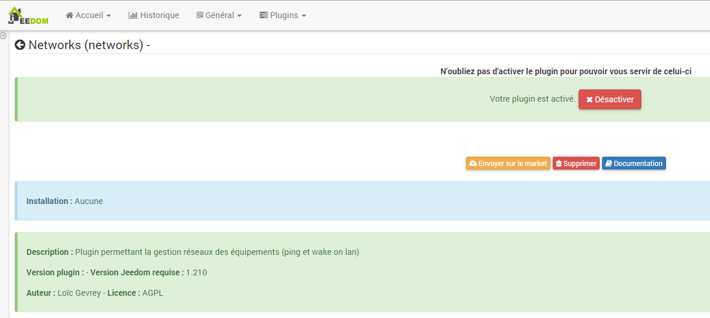
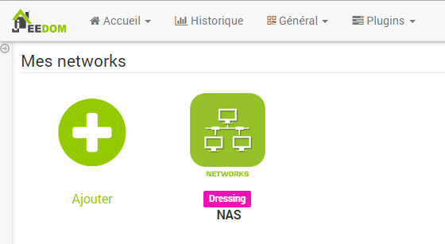

Netzwerk.

Plugin Konfiguration 
=======================

Nach dem Herunterladen des Plugins müssen Sie es nur noch aktivieren,
Auf dieser Ebene gibt es keine Konfiguration.

Gerätekonfiguration 
=============================

Plugin-Menü :

Ausrüstung) :

> **Spitze**
>
> 
> 
> .

 :

Hier finden Sie die gesamte Konfiguration Ihrer Geräte :

-   **** : ,

-   **Übergeordnetes Objekt** : Gibt das übergeordnete Objekt an, zu dem das Gerät gehört,

-   **Kategorie** : ,

-   **Aktivieren** : macht Ihre Ausrüstung aktiv,

-   **Sichtbar** : macht Ihre Ausrüstung auf dem Armaturenbrett sichtbar,

-   **IP-Adresse** : ,

-   **** : ,

-   **** : ,

-   **** :  : 
    
-   **** :  : 
    - 0 : 
    - 1 : 
    - 32 : 
    - 64 : 
    - 128 : 
    - 256 : 
. . .

-   **Hafen** : 

-   **Selbstaktualisierung (cron)** : .

Nachfolgend finden Sie die Liste der Bestellungen :

-   **Name** : Der im Dashboard angezeigte Name,

-   **Anzeige** : ermöglicht die Anzeige der Daten im Dashboard,

-   **Test** : Wird zum Testen des Befehls verwendet.

> **Notiz**
>
> .

> **Wichtig**
>
> 
> .

> **Notiz**
>
>  : ::56:::15.

Widgets 
=======

 :

 :

Changelog detailliert :
<https://github.com/jeedom/plugin-networks/commits/stable>
