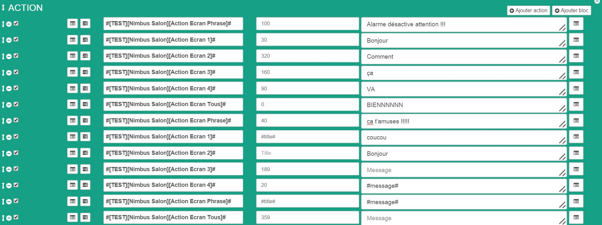
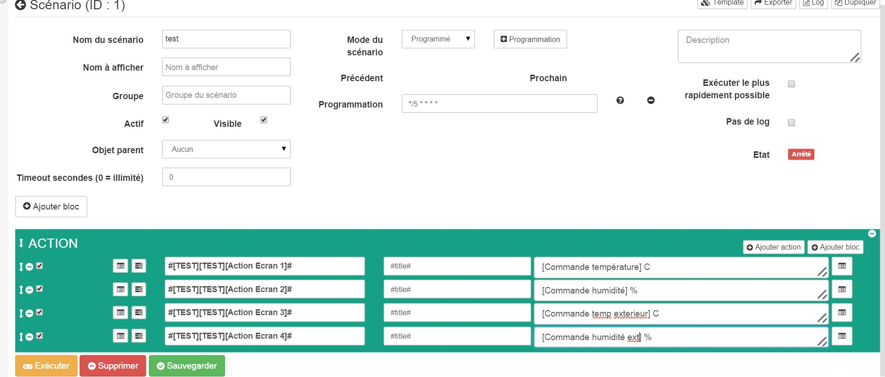

Nimbus 
======

Beschreibung 
-----------

Dieses Plugin ermöglicht es, alle Informationen von ihm oder ihr zu steuern und zu haben
Nimbus.

 ![Nimbus
Screenshot2] (../ images / Nimbus_screenshot2.jpg) ![Nimbus
Screenshot3] (../ images / Nimbus_screenshot3.jpg)

Konfiguration 
-------------

### Jeedom Plugin Konfiguration : 

a. Installation / Erstellung

Um das Plugin nutzen zu können, müssen Sie herunterladen und installieren
aktiviere es wie jedes Jeedom Plugin.

Danach müssen Sie Ihre Anmeldeinformationen eingeben (Augenzwinkern + Konto
api):

Gehen Sie zum Menü Plugins / Kommunikation, **Sie finden die
Nimbus Plugin :**

Sie gelangen auf die Seite, auf der Ihre Ausrüstung aufgelistet ist (Sie können
haben mehrere Nimbus) und mit denen Sie sie erstellen können

**Klicken Sie auf die Schaltfläche Hinzufügen :**

Sie gelangen dann auf die Konfigurationsseite Ihres Nimbus :

Auf dieser Seite finden Sie mehrere Abschnitte :

-   **Allgemein**

In diesem Abschnitt finden Sie alle Jeedom-Konfigurationen. A.
Kennen Sie den Namen Ihrer Ausrüstung, das gewünschte Objekt
Ordnen Sie es der Kategorie (vorzugsweise Multimedia) zu, wenn Sie möchten
Das Gerät ist aktiv oder nicht, und schließlich, wenn Sie es möchten
sichtbar auf dem Armaturenbrett.

-   **Konfiguration**

Dieser Abschnitt ist genau dann nützlich, wenn Sie mehrere haben
Nimbus. Sie müssen die Gerätenummer eingeben (1, 2 oder 3 von
Beispiel). Sie können dieses Feld leer lassen, wenn Sie nur eines haben
Nimbus, der sicherlich Ihr Fall sein wird.

-   **Design**

In diesem Abschnitt können Sie die Anzeige Ihres Nimbus anpassen
auf dem Armaturenbrett. Sie können zwischen mehreren Fonds wählen. Sie
Sie können auch die Farbe der Nadel und die Farbe des Textes auswählen.

-   **Information**

Dieser Abschnitt wird sich selbst ausfüllen, wenn Sie Ihre speichern
Ausrüstung. In Ihrem Nimbus finden Sie Informationen zu Immobilien
(Seriennummer, Mac-Adresse, Name, ID)

-   **Befehle**

In diesem Abschnitt haben Sie nichts zu tun. Bestellungen werden erstellt
automatisch.

-   Aktualisieren: Schaltfläche, um das Widget bei Bedarf zu aktualisieren

-   Bildschirm 1 : Auf Bildschirm 1 angezeigte Informationen

-   Bildschirm 2 : Auf Bildschirm 2 angezeigte Informationen

-   Bildschirm 3 : Auf dem Bildschirm angezeigte Informationen 3

-   Bildschirm 4 : Auf dem Bildschirm angezeigte Informationen 4

-   Position 1 : Angaben zur Position des
    Bildschirm 1

-   Position 2 : Angaben zur Position des
    Bildschirm 2

-   Position 3 : Angaben zur Position des
    Bildschirm 3

-   Position 4 : Angaben zur Position des
    Bildschirm 4

-   Bildschirmaktion 1 : Aktionsbefehl, der in einem Szenario von erlaubt
    Wählen Sie die Position und / oder den Text des Bildschirms 1

-   Bildschirmaktion 2 : Aktionsbefehl, der in einem Szenario von erlaubt
    Wählen Sie die Position und / oder den Text des Bildschirms 2

-   Bildschirmaktion 3 : Aktionsbefehl, der in einem Szenario von erlaubt
    Wählen Sie die Position und / oder den Text des Bildschirms 3

-   Bildschirmaktion 4 : Aktionsbefehl, der in einem Szenario von erlaubt
    Wählen Sie die Position und / oder den Text des Bildschirms 1

-   Bildschirmaktion Alle : Aktionsbefehl, der in einem Szenario von erlaubt
    Wählen Sie die Position und / oder den Text aller Bildschirme

-   Satz Screen Action : Aktionsbefehl, der in einem Szenario von erlaubt
    Wählen Sie die Position und / oder den Text aller Bildschirme (ein Satz von
    Maximal 4 Wörter auf den 4 Bildschirmen)

-   Demo : Aktion zum Starten einer technischen Demo auf Ihrem
    Nimbus

…

Informationen 
----------------

### Informationen auf dem Dashboard : 

Das Widget ist in 4 Wählscheiben unterteilt, die die 4 Wählscheiben von Ihnen darstellen
Nimbus.

-   Die Nadel zeigt die Position der Bildschirmnadel an
    Korrespondent Ihres Nimbus

-   Der Text ist der Text, der auf Ihrem Nimbus angezeigt wird. Dieser Text ist
    klickbar, um zu diesem Bildschirm zu gelangen :

In diesem Bildschirm können Sie den Text und die Position von manuell ändern
die Nadel oder beides. Hier können Sie sehen, wann Sie den Wert ändern
bereits angezeigt.

…

Aktionen 
-----------

### Aktionen, auf die über das Szenario zugegriffen werden kann : 

Über das Szenario sind mehrere Aktionen zugänglich :

Die Demo-Aktion ist unabhängig und startet die technische Demo.

Alle anderen Aktionen funktionieren nach dem Prinzip auf die gleiche Weise.

**Dies ist ein Nachrichtenbefehl, mit dem Sie zwei Parameter übergeben können:**

-   Titel : eine Zahl zwischen 0 und 360 entsprechend der Position von
    die Nadel

-   Nachricht : die anzuzeigende Nachricht

**Die beiden sind trennbar, das heißt, Sie können :**

-   Senden Sie eine Position, indem Sie das Nachrichtenfeld leer lassen oder von
    * Nachricht hinterlassen*

-   Senden Sie eine Nachricht, indem Sie das Titelfeld leer lassen oder verlassen
    *Titel*

-   Senden Sie eine Position und eine Nachricht, indem Sie beide ausfüllen

**Es gibt eine Bestellung pro Bildschirm, eine Bestellung für alle, eine Bestellung
Satz :**

-   Bildschirm : ermöglicht es, auf dem entsprechenden Bildschirm zu handeln

-   Alle : Machen wir dasselbe auf allen Bildschirmen

-   Satz : Spezialbefehl, der die Nachricht in 4 Wörter aufteilt
    Dies wird auf jedem Bildschirm angezeigt (wenn ein Wort 8 überschreitet
    Zeichen wird es geschnitten, wenn der Satz mehr als 4 Wörter enthält
    wird geschnitten)

**WIE KANN ICH DAUERHAFT INFORMATIONEN VON MEINEN ZEIGEN?
Automatisierung**

Wenn Sie kontinuierlich Informationen aus Ihrer Hausautomation anzeigen möchten.
Erstellen Sie alle 5 Minuten ein geplantes Szenario (zum Beispiel)..

In diesem Beispiel müssen Sie nur das ersetzen, was sich zwischen den Haken befindet
durch Ihre Bestellungen. Und alle 5 Minuten werden Ihre Bildschirme aktualisiert
mit den richtigen Werten

…

Faq 
---

Das System ruft stündlich Informationen ab. Du kannst
Klicken Sie auf den Befehl Aktualisieren, um manuell zu aktualisieren.

Stellen Sie sicher, dass Sie die Konfigurationsdatei erstellt haben, indem Sie Ihre Daten in speichern
die allgemeine Konfiguration des Plugins.
