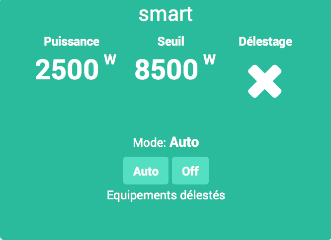
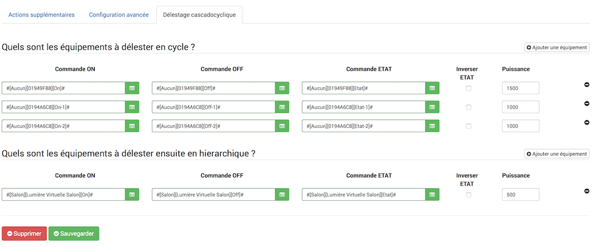
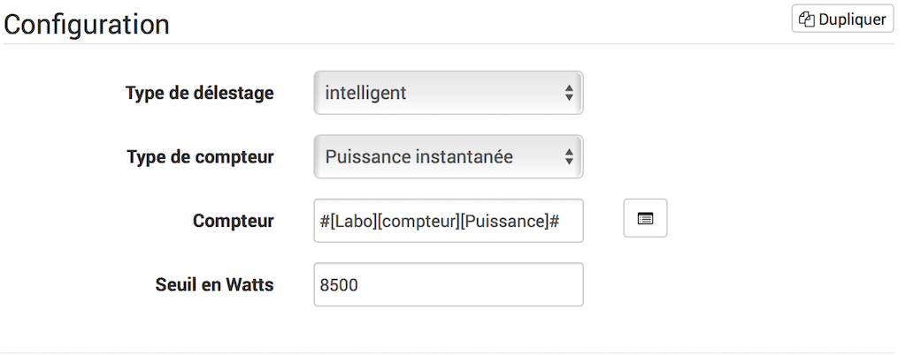
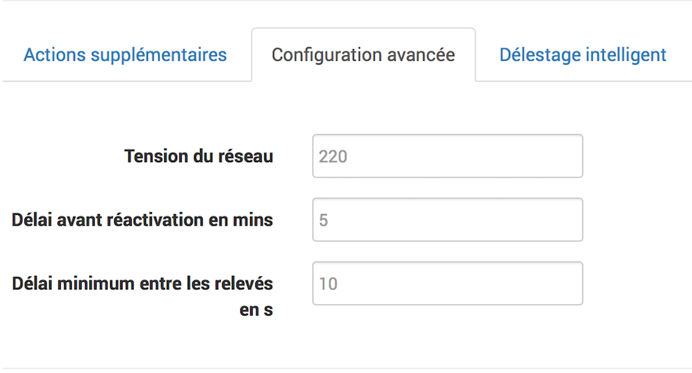

# Load Shedding Plugin 

# Beschreibung 

Plugin zur Verwaltung des elektrischen Lastabwurfs. Das Plugin verwaltet 3 Arten des Lastabwurfs :

-   Intelligentes Verschütten".
-   Hierarchischer Lastabwurf.
-   Kaskadenzyklischer Lastabwurf.

# Funktionieren 

## Intelligenter Lastabwurf. 

Für den intelligenten Lastabwurf muss das Thermostat-Plugin funktionieren.

Das Plugin klassifiziert die Thermostate nach ihren tatsächlichen Temperaturen nach den eingestellten Temperaturen.

Das Verschütten hat daher Vorrang vor den Teilen mit der geringsten Abweichung. Das Gen für die Insassen wird weniger wichtig sein.

## Hierarchischer Lastabwurf 

Der Lastabwurf wird im hierarchischen Modus an den x-Aktuatoren ausgeführt.
Der Aktuator 1 wird vorrangig entlastet, dann die 2, 3…

Die Aktuatoren werden in umgekehrter Reihenfolge des Lastabwurfs zurückgesetzt

### Kaskadozyklischer Lastabwurf 

Der Lastabwurf wird im Rotationsmodus an den für den zyklischen Modus definierten Aktuatoren durchgeführt, und wenn die Leistung immer noch größer als der Schwellenwert ist, im hierarchischen Modus bei den anderen.

# Konfiguration 

## Allgemeine Konfiguration 

Hier sind die Parameter, die im Plugin konfiguriert werden müssen :

-   Lastabwurfart : intelligent, hierarchisch oder kaskadozyklisch
-   Zählertyp : Momentane Leistung oder momentane Stromstärke
-   Zähler : Wählen Sie hier den Befehl aus, der entweder die Leistung oder die Stromstärke zurückgibt (in diesem Fall muss die Netzwerkspannung konfiguriert werden)
-   Schwelle in Watt : Schwellenwert, ab dem das Löschen ausgelöst wird

### Zusätzliche Aktionen 

Es ist möglich, zusätzlich zu Lastabwurfaktionen zusätzliche Aktionen zu definieren.

Es ist beispielsweise möglich, eine SMS zu senden, um vor dem Beginn und dem Ende des Lastabwurfs zu warnen.

### Erweiterte Konfiguration 

Die folgenden Parameter können eingestellt werden:

-   Netzwerkspannung in Volt (standardmäßig 220 V)
-   Verzögerung vor Reaktivierung in Minuten (standardmäßig 5 Minuten) : Verzögerung, vor der das Gerät nicht reaktiviert wird (um ein zu wiederholtes Ein- und Ausschalten zu vermeiden)
-   Mindestzeit zwischen den Ablesungen in s (standardmäßig 10 s) : Zeitaufwand zwischen 2 Aussagen

# Faq 

Derzeit wird nur das offizielle Thermostat-Plugin durch intelligenten Lastabwurf verwaltet. Es ist jedoch möglich, die anderen 2 Lastabwurfmodi mit den anderen Thermostaten zu verwenden.

# Fehlerbehebung 

Achten Sie darauf, den "Auto" -Modus im Widget zu aktivieren, um den Lastabwurf zu aktivieren.
