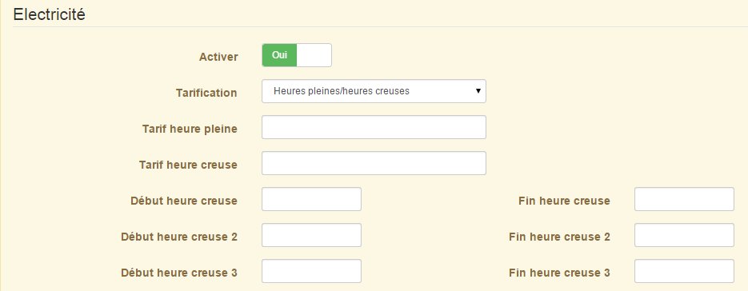
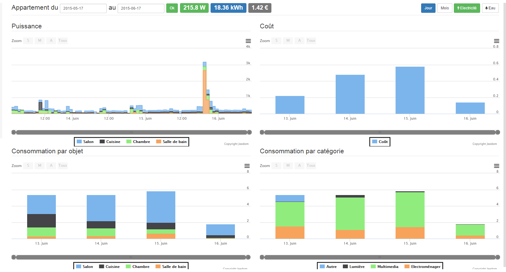

# Energie-Plugin

Mit diesem Plugin können Sie eine Energiebilanz Ihres Hauses erstellen, indem Sie ein Panel mit den Verbrauchsartikeln bereitstellen

# Plugin Konfiguration 

Nachdem Sie das Plugin heruntergeladen haben, müssen Sie es aktivieren. Sie haben dann Zugriff auf die Grundkonfiguration des Plugins :

Hier finden Sie die Grundkonfiguration :

-   **Preisgestaltung** : In diesem Teil können Sie die Preisparameter konfigurieren
    -   **Währung** : Mit dieser Option können Sie Ihre Währung konfigurieren (standardmäßig €)
-   **Wasser** : Wassermanagement-Konfiguration
    -   **Aktivieren** : Wassermanagement aktivieren oder nicht
    -   **Tarif** : Wasserpreis pro L
-   **Gas** : Konfiguration des Gasmanagements
    -   **Aktivieren** : Gasmanagement aktivieren oder nicht
    -   **Tarif** : Gaspreis pro kWh
-   **Strom** : Elektrizitätsmanagement-Konfiguration
    -   **Aktivieren** : Aktivieren oder nicht das Strommanagement
    -   **Preisgestaltung** : Wahl des Preismodus, feste oder Spitzen- / Nebenzeiten
    -   **Tarif** : Strompreis pro kWh

Wenn Sie in Spitzen- / Nebenzeiten sind :

Hier können Sie den Tarif in Spitzen- und Nebenzeiten sowie in den Umschaltzeiten (maximal 3 Zonen) eingeben).

> **Spitze**
>
> Im Festpreismodus können Berechnungsformeln eingegeben werden, z. B. 0.05 + 0.05 \* \#\.[ma\.]\.[commande\.]\.[mode\.]\.#, also wenn \#\.[ma\.]\.[commande\.]\.[mode\.]\.# Wert 1, dann ist der Preis 0.1 sonst 0,05. Auf diese Weise können Sie alle Fälle verwalten, wenn Sie über aktuelle Preisinformationen verfügen.

# Gerätekonfiguration 

Die Konfiguration der "Energie" -Ausrüstung ist über das Plugin-Menü zugänglich :

So sieht die Energie-Plugin-Seite aus (hier mit bereits 5 Ausrüstungen) :

Sobald Sie auf eines der Geräte klicken, erhalten Sie :

Hier finden Sie die gesamte Konfiguration Ihrer Geräte :

-   **Name der Ausrüstung** : Name Ihrer Energieausrüstung
-   **Übergeordnetes Objekt** : Gibt das übergeordnete Objekt an, zu dem das Gerät gehört
-   **Aktivieren** : macht Ihre Ausrüstung aktiv
-   **Sichtbar** : macht es auf dem Dashboard sichtbar
-   **Typ** : ermöglicht die Auswahl des "Energie" -Typs (Strom, Wasser oder Gas))
-   **Dieser Zähler ergibt eine Summe** : teilt jeedom mit, dass dieses Gerät den Gesamtverbrauch für das betroffene Objekt angibt. Wenn Sie beispielsweise einen Teleinfo-Zähler oder einen Wasserzähler haben, der Ihnen den Gesamtverbrauch Ihres Hauses anzeigt, aktivieren Sie dieses Kontrollkästchen und weisen den Zähler dem Objekt zu, das das Haus darstellt (und daher sicherlich das übergeordnete Objekt von allen) Andere).
-   **Chronik** : Mit dieser Option können Sie den Verlauf Ihres Zählers vollständig löschen. Es wird empfohlen, dies nach der Konfiguration des Geräts zu tun, um zu vermeiden, dass die Verbrauchshistorie der Module verlassen wird und der erste Tag daher völlig verzerrt ist.

> **Wichtig**
>
> Achtung, wenn ein Energiegerät insgesamt vorhanden ist, erscheint es nur auf dem Objekt, zu dem es gehört, und nicht auf seinen Eltern

Auf der rechten Seite finden Sie auch Selektoren, mit denen Sie auswählen können, was im Widget angezeigt werden soll.

Nachfolgend finden Sie die Konfiguration der Geräte. Über eine Schaltfläche rechts können Sie weitere hinzufügen :

-   **Kategorie** : Geräteverbrauchskategorie (Kategorien sind fest, Sie können keine hinzufügen). Im Gesamtzählermodus ist nur die Kategorie Andere möglich.
-   **Macht** : wie man die Kraft dieses Geräts hat ? Hier können Sie den Verbrauch simulieren. Zum Beispiel gibt es hier \#\.[Chambre\.]\.[Lumière\.]\.[Etat\.]\.# \.* 0.6 : Der Zustand meines Lichts variiert von 0 bis 100, also wenn meine Lampe leuchtet, habe ich 100 \* 0,6 = 60 oder eine Leistung von 60 Watt, was der Leistung meiner Glühbirne entspricht.
-   **Verbrauch** : Befehl, der den Verbrauch des Geräts angibt. Wenn Sie das Gerät leer lassen und das Stromfeld gefüllt ist, berechnet das Plugin automatisch den Verbrauch.
-   **Löschen** (kleiner Minusknopf) : um die Zeile zu löschen.

# Wasser- oder Gaszähler 

Zwei Möglichkeiten :

-   Entweder haben Sie eine Bestellung, die den Verbrauch angibt, und dort müssen Sie nur den Verbrauch angeben.
-   oder es ist auch möglich, die Indizes von Hand anzugeben und dann zu speichern.

# Teleinfo 

Für teleinfo müssen Sie nur die verschiedenen Indizes Ihres teleinfo in das Verbrauchsfeld des Geräts einfügen (entweder alle im selben Feld mit + in der Mitte oder ein Feld pro Index erstellen).

# Platte 

Sobald Ihre verschiedenen Energieausrüstungen konfiguriert wurden, steht Ihnen über das Startmenü ein Bedienfeld zur Verfügung :

Das ist das Ergebnis :

Hier können Sie den Anzeigezeitraum des Panels, die Gruppierung der Daten (Tag oder Monat) und die Art der Energie auswählen, die Sie anzeigen möchten (abhängig von den aktiven Daten oder nicht).

Das Panel ist auch mobil über Plugins → Energie zugänglich :

Einmal drauf bekommst du :

# Faq 

**Meine Zähler scheinen nicht in Echtzeit zu sein.**

Das Energie-Plugin ist nicht in Echtzeit verfügbar, es wird alle 15 Minuten abgelesen. Also im Fall der Simulation von
Beim Verbrauch dauert es 15 Minuten, bis eine Zustandsänderung berücksichtigt wird, wenn Ihre Lampe nur 10 Minuten lang eingeschaltet bleibt
Verbrauch wird daher nicht berücksichtigt.

**Meine Zähler bewegen sich nicht mehr.**

Während der Berechnung prüft das Plugin, ob der neue Wert viel höher als der alte ist. Wenn dies nicht der Fall ist, ignoriert es den neuen Wert. Um diesen Wert auf 0 zurückzusetzen, klicken Sie in der Gerätekonfiguration auf "Verlauf löschen"

