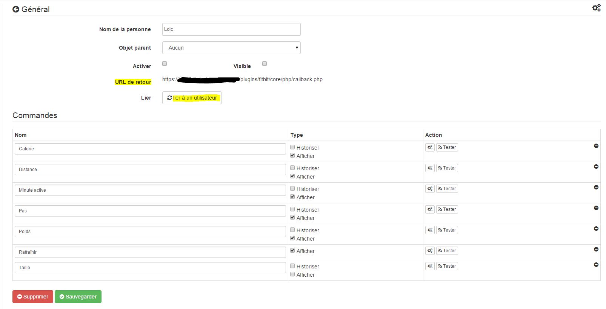
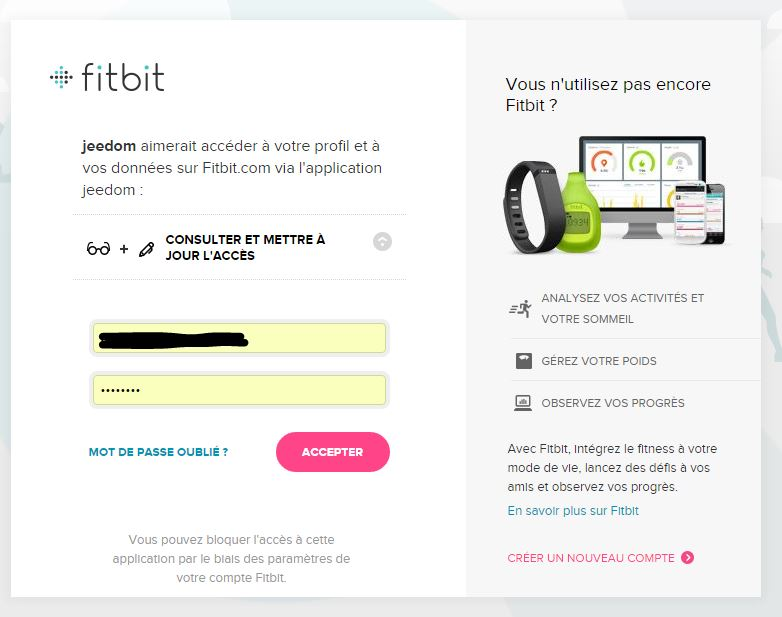

# Fitbit Plugin

Plugin für den Zugriff auf Informationen zu Fitbit-Geräten (Anzahl der Schritte, Kalorien, Entfernung usw.)

# Konfiguration 

Sobald das Fitbit-Plugin installiert ist, gehen Sie zu :

## Geräteerstellung und Zuordnung zum Fitbit-Konto 

Klicken Sie auf Person hinzufügen, um jemanden hinzuzufügen :

Geben Sie dieser Person (diesem Gerät) einen Namen und validieren Sie :

Sie sollten dann diese Seite haben :

> **Wichtig**
>
> Das erste, was überprüft werden muss, ist "URL zurückgeben"". Dies muss von außen validiert und zugänglich sein, da Sie Jeedom sonst nicht mit Ihrem Fitbit-Konto verknüpfen können. Ist dies nicht der Fall, aktualisieren Sie Ihre Netzwerkkonfigurationsparameter unter Allgemein → Administration → Konfiguration und dann unter "Netzwerke" (siehe "Netzwerke") [hier](https://www.jeedom.fr/doc/documentation/core/de_DE/doc-core-administration.html.html#administration)

> **Notiz**
>
> Es wird empfohlen, bei der Verbindung zwischen Jeedom und Fitbit über die externe IP-Adresse eine Verbindung zu Jeedom herzustellen

Um Ihr Fitbit-Konto mit Jeedom zu verknüpfen, erstellen Sie zunächst ein Entwicklerkonto bei Fitbit [hier](https://dev.fitbit.com/fr), Dann müssen Sie sich anmelden und dann tun : "Registrieren Sie eine App". Dann geben Sie die Informationen ein :

-   Anwendungsname : Jeedom
-   Beschreibung : Jeedom
-   Application Website : <https://jeedom.com>
-   Organisation : jeedom
-   Organisation Website : <https://jeedom.com>
-   OAuth 2.0 Anwendungstyp : Server
-   Rückruf-URL : Sie müssen diejenige angeben, die Jeedom Ihnen beim Erstellen einer Fitbit-Ausrüstung zur Verfügung stellt. Seien Sie vorsichtig, wenn Sie nicht die richtige einsetzen, kann die Verbindung nicht hergestellt werden
-   Standardzugriffstyp : Lesen & Schreiben

Sie können auch ein Abonnement hinzufügen. Dadurch kann Fitbit ein Update direkt in Jeedom übertragen (anstatt darauf zu warten, dass Jeedom die Informationen aktualisiert) :

-   Standard : oui
-   Endpunkt-URL : der von jeedom gegeben
-   Typ : JSON-Körper
-   Teilnehmer-ID : Setzen Sie nichts

Wenn Sie ein Abonnement haben, müssen Sie (alle diese Schritte der Reihe nach ausführen) :

-   Tragen Sie die Abonnementnummer in die Fitbit-Ausrüstung von Jeedom ein
-   Geben Sie den Abonnementcode in die Fitbit-Ausrüstung von Jeedom ein
-   Ausrüstung sichern
-   Starten Sie auf der Fitbit-Website die Überprüfung des Abonnements
-   Dann "Link zu einem Benutzer" der Jeedom-Ausrüstung, wie unten

> **Wichtig**
>
> Derzeit unterstützt Fitbit https nicht gut. Wenn Sie sich also in https befinden, besteht nur eine geringe Wahrscheinlichkeit, dass es funktioniert

Klicken Sie auf "Mit Benutzer verknüpfen", um dieses Gerät mit Ihrem Fitbit-Konto zu verknüpfen :

Geben Sie Ihre Anmeldeinformationen für das Fitbit-Konto ein und validieren Sie die Autorisierungsanforderung :

Wenn Sie eine leere Seite oder einen Fehler erhalten, bedeutet dies, dass Ihre Netzwerkkonfiguration nicht gut ist. Andernfalls müssen Sie zu dieser Seite zurückkehren :

## Konfiguration 

Hier sind die Details der Plugin-Konfiguration :

-   Name der Person : Name der Fitbit-Ausrüstung
-   Übergeordnetes Objekt : Name des Objekts, an das das Gerät angeschlossen werden soll
-   Aktivieren / Sichtbar : Ermöglicht das Aktivieren des Geräts (vergessen Sie nicht, dies zu tun, da Sie sonst keine Daten haben) und das Anzeigen auf dem Dashboard
-   Für jede Bestellung :
    -   Chronik : ermöglicht das Protokollieren des Befehls
    -   Anzeige : ermöglicht es, es im Dashboard sichtbar zu machen oder nicht
    -   Fortgeschrittene (kleine gekerbte Räder) : Zeigt die erweiterte Konfiguration des Befehls an
    -   Test : Ermöglicht das Testen des Befehls, um seinen Wert anzuzeigen
    -   Löschen (Schaltfläche "-") : um die Bestellung zu löschen

## Widget 

Hier ist das Fitbit-Widget :

