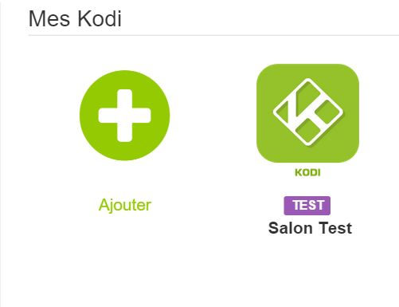

# Kodi Plugin

Mit diesem Plugin können Sie Informationen von Kodi bestellen und erhalten.

# Konfiguration 

## Jeedom Plugin Konfiguration

Um das Plugin verwenden zu können, müssen Sie es wie jedes Jeedom-Plugin herunterladen, installieren und aktivieren.

Danach müssen Sie Ihre Kodi-Ausrüstung erstellen :

Gehen Sie zum Plugins / Multimedia-Menü, dort finden Sie das Kodi-Plugin :

Dann gelangen Sie auf die Seite, auf der Ihre Geräte aufgelistet sind (Sie können mehrere Kodi haben) und auf der Sie auch einige erstellen können

Klicken Sie auf die Schaltfläche Kodi hinzufügen oder auf die Schaltfläche + :

Sie gelangen dann zur Konfigurationsseite Ihres Kodi:

Auf dieser Seite finden Sie mehrere Abschnitte :

### Allgemein

In diesem Abschnitt finden Sie alle Jeedom-Konfigurationen. Nämlich den Namen Ihres Geräts, das Objekt, dem Sie es zuordnen möchten, die Kategorie (vorzugsweise Multimedia), ob das Gerät aktiv sein soll oder nicht und schließlich, ob es im Dashboard sichtbar sein soll.

### Configuration

Dieser Abschnitt ist einer der wichtigsten, die er enthält

-   IP : IP-Adresse Ihres Kodi (es ist wichtig, die IP-Adresse und keinen Hostnamen einzugeben). Wenn sich Kodi auf demselben Computer wie jeedom befindet, geben Sie 127.0.0.1 ein. Dieses Feld ist erforderlich
-   Hafen : der Kommunikationsport des Webservers in Kodi (Sie müssen den Webserver in Kodi aktivieren). Dieses Feld ist erforderlich
-   Benutzername : Der Benutzername, um sich bei Kodi anzumelden, falls Sie einen haben
-   Passwort : Das Kennwort für die Verbindung zu Kodi, falls vorhanden. (Dies geht mit dem Benutzernamen)
-   MAC-Adresse : Die MAC-Adresse des Geräts, das auf LAN aktiviert werden soll
-   Lautstärke + /- : der Schritt der Inkrementierung oder Dekrementierung des Volumens (1 bis 100)

### Commandes

Dieser Teil listet alle verfügbaren Befehle auf :

-   Accueil
-   Jahr
-   Schneller Vorlauf
-   Bas
-   Nächste Songs
-   Droite
-   Eteindre
-   Gauche
-   Genre
-   Haut
-   Endzeit
-   Lecture
-   Filmliste
-   Musikliste
-   Serienliste
-   Länge der Wiedergabeliste
-   Abendmischung
-   Muet
-   Notifications
-   OK
-   OSD
-   Pause
-   Vollbild
-   Position der Wiedergabeliste
-   Früher
-   Neu starten
-   Zusammenfassung
-   Retour
-   Schneller Rücklauf
-   Audio-Scan
-   Video scannen
-   Status
-   Statusmedien
-   Status nb
-   Stop
-   Suivant
-   Thumbnail
-   Titre
-   Medientyp
-   Volume
-   Lautstärkestatus
-   Lautstärke -
-   Lautstärke \ +

## Konfiguration des Kodi Plugins

Um von den Rückmeldungen der verschiedenen Status profitieren zu können, muss ein Addon auf Kodi installiert werden. Sie können dieses Addon auf der allgemeinen Seite des Plugins in Jeedom herunterladen

Sobald die Zip wiederhergestellt ist, müssen Sie sie nur noch in Kodi installieren. Gehen Sie dazu von einer Zip-Datei zu Kodi, parameters / addons / install.

Nach der Installation sollten Sie das Addon in den im Serviceteil aktivierten Addons finden.

Um das Addon zu konfigurieren, klicken Sie auf Konfigurieren. Sie gelangen auf diese Seite :

Hier finden Sie 3 wichtige zu konfigurierende Parameter :

-   IP-Adresse : die IP-Adresse Ihrer Freiheit
-   Kastentyp : mini / mini + oder geben Sie an, ob Ihre Jeedom-Adresse ein / jeedom enthält oder nicht
-   API Schlüssel : Ihren Jeedom-API-Schlüssel, den Sie in den Jeedom-Konfigurationsparametern finden

# Statusinformationen 

Kodi geht viele Statuten hoch :

-   Genre : geht die vollständige Liste der Genres hoch (nur per Skript oder virtuell verwendbar)
-   Endzeit : Geplante Endzeit, aktualisiert beim Starten des Mediums und beim Fortsetzen der Pause
-   Status und Statusnb : Erhöhen Sie den Status (einer im Text, der andere in der Nummer). Dies sind die verschiedenen Werte :
    - 0 gestartet
    - Video in Bearbeitung 1
    - Audio in Bearbeitung 2
    - Video fertig 3
    - Audio komplett 4
    - Video gestoppt 5
    - Audio gestoppt 6
    - Video angehalten 7
    - Audio angehalten 8
    - Videowiederherstellung 9
    - Audio-Lebenslauf 10
    - Stop 18
-   Statusmedien : wird unabhängig vom Medientyp zu einem allgemeineren Status (Wiedergabe, Pause, Stopp, Stopp) zurückkehren
-   Vorschaubild : wird die Abdeckung wieder zusammenbauen (insbesondere den Link, der es erlaubt, sie zu haben)
-   Titel : wird den Titel der aktuellen Medien und Details zur Episode und der Staffel im Fall einer Serie erhöhen
-   Medientyp : wird die Art der Medien (Serien, Audio, Filme) zurückgehen

# Widget-Details 

Hier sind einige Details zum Widget :

-   Bis : zeigt ein Symbol des aktuellen Medientyps an
-   B. : gibt die Endzeit an
-   C. : entfaltet den Fernbedienungsteil

-   D. : Teil 1 des aktuellen Titels
-   E. : Teil 2 des aktuellen Titels
-   F. : Wiedergabebefehle (Wiedergabe nach Stopp usw.)
-   G. : Aktivieren Sie den Lautstärkeregler oder kehren Sie zum Wiedergabemodus zurück

-   H. : Mit dieser Option können Sie den Infobereich erweitern

Im Serien- / Filmmodus finden Sie Jahr, Zusammenfassung, Genre

Im Audiomodus finden Sie Informationen zu Wiedergabeliste, Jahr, Genre und Wiedergabeliste

In beiden Fällen finden Sie unten die Schaltflächen, mit denen Sie einen Audio- / Video-Scan oder einen Audio-Abendmix starten können

