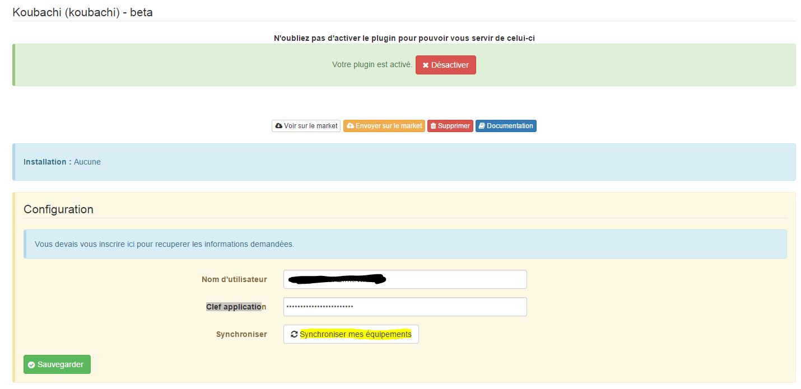
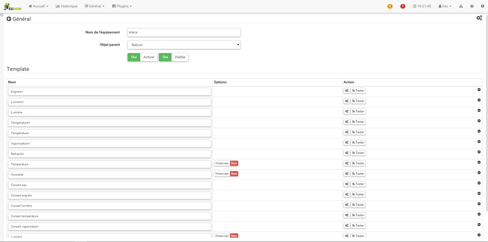

# Koubachi Plugin

Plugin für Koubachi-Geräte. Es ermöglicht das Abrufen von Informationen zu Feuchtigkeit, Temperatur, Helligkeit und Ratschlägen für Ihre Pflanzen. Sie können auch angeben, dass eine Pflanze bewässert, verdampft oder Dünger hinzugefügt wurde

# Plugin Konfiguration 

Sobald das Koubachi-Plugin installiert ist, müssen Sie es mit Ihrem Koubachi-Konto verknüpfen. Gehen Sie dazu zu Ihrem Koubachi-Konto : [hier](https://labs.koubachi.com/login?locale=en)

Geben Sie Ihre Anmeldedaten an und klicken Sie auf Anmelden und dann unten auf der Seite, die Sie haben :

Holen Sie sich den Wert von "user\_credentials" und geben Sie ihn in das Feld "Benutzername" ein". Machen Sie dasselbe mit dem Wert "app\_key" im Feld "Anwendungsschlüssel"" :

Klicken Sie dann auf "Meine Geräte synchronisieren"".

# Gerätekonfiguration 

Die Liste Ihrer Pflanzen finden Sie dann hier :

Sie sollten hier die Liste Ihrer in Koubachi registrierten Pflanzen sehen :

Wenn Sie auf einen von ihnen klicken, erhalten Sie :

-   Pflanzenname : der Name Ihrer Pflanze
-   Übergeordnetes Objekt : das Objekt, an dem die Pflanze befestigt ist
-   Aktivieren / Sichtbar : die Möglichkeit, das Gerät zu aktivieren (vergessen Sie nicht, es beim ersten Mal zu tun) und es sichtbar zu machen
-   Für Bestellungen :
    -   Chronik : ermöglicht das Protokollieren des Befehls
    -   Fortgeschrittene (kleine gekerbte Räder) : Zeigt die erweiterte Konfiguration des Befehls an
    -   Test : Ermöglicht das Testen des Befehls, um seinen Wert anzuzeigen
    -   Löschen (Schaltfläche "-") : um die Bestellung zu löschen

# Widget 

Hier ist das Ergebnis auf dem Dashboard :

Und auf dem Handy :

