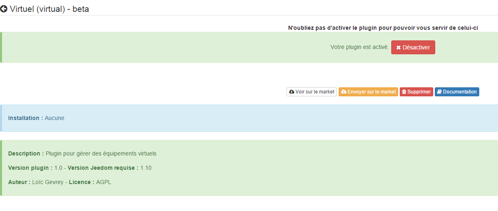
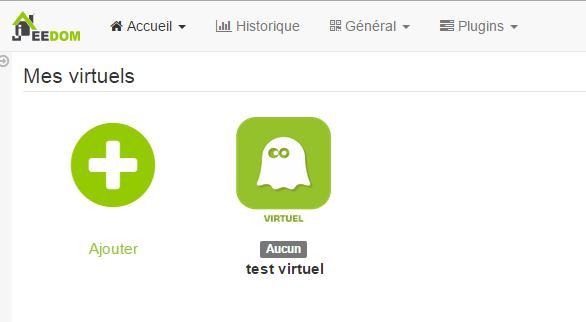
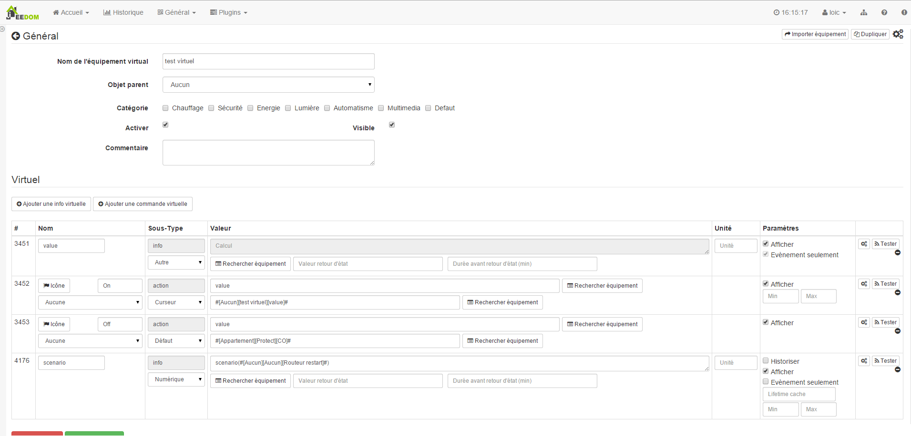

# Virtuelles Plugin

Das virtuelle Plugin ermöglicht die Erstellung virtueller Geräte und ihrer Eigenschaften.

Wir werden ein Gerät benennen, das von diesem Plugin erstellt wurde : virtuelles Gerät.

Ein virtuelles Gerät kann für die folgenden Anforderungen erstellt werden :

-   Konsolidieren von Informationen oder Aktionen von mehreren physischen / virtuellen Geräten zu einem einzigen Gerät;
-   Erstellen Sie ein Peripheriegerät, das von einer Quelle außerhalb von Jeedom (Zibase, IPX800 usw.) gespeist wird
-   doppelte Ausrüstung, um sie beispielsweise in zwei Teile zu teilen;
-   eine Berechnung für mehrere Gerätewerte durchführen;
-   mehrere Aktionen ausführen (Makro).

# Configuration

Das Plugin benötigt keine Konfiguration, Sie müssen es nur aktivieren :

# Gerätekonfiguration

Auf die Konfiguration virtueller Geräte kann über das Plugin-Menü zugegriffen werden :

So sieht die virtuelle Plugin-Seite aus (hier mit bereits vorhandenem Gerät) :

So sieht die Konfigurationsseite eines virtuellen Geräts aus :

> **Spitze**
>
> Wie an vielen Stellen in Jeedom wird durch einfaches Bewegen der Maus ganz links ein Schnellzugriffsmenü angezeigt (Sie können es jederzeit in Ihrem Profil sichtbar lassen).

Hier finden Sie die gesamte Konfiguration Ihrer Geräte :

-   **Name des virtuellen Geräts** : Name Ihrer virtuellen Ausrüstung,
-   **Übergeordnetes Objekt** : Gibt das übergeordnete Objekt an, zu dem das Gerät gehört,
-   **Kategorie** : Gerätekategorien (es kann zu mehreren Kategorien gehören),
-   **Aktivieren** : macht Ihre Ausrüstung aktiv,
-   **Sichtbar** : macht es auf dem Dashboard sichtbar,
-   **Kommentar** : ermöglicht es Ihnen, Geräte zu kommentieren.

Oben rechts haben Sie Zugriff auf 4 Schaltflächen :

-   **Ausdruck** : Der Ausdruckstester ist mit dem der Szenarien identisch, um die Entwicklung einiger virtueller Systeme zu erleichtern
-   **Ausrüstung importieren** : Ermöglicht das automatische Duplizieren eines vorhandenen Geräts in ein virtuelles Gerät (spart Zeit, um ein Gerät beispielsweise in zwei Teile zu teilen),
-   **Duplikat** : dupliziert aktuelle Geräte,
-   **Fortgeschrittene (gekerbte Räder)** : zeigt erweiterte Ausstattungsoptionen an (allen Jeedom-Plugins gemeinsam).

Nachfolgend finden Sie die Liste der Bestellungen :

-   Der im Dashboard angezeigte Name,
-   Typ und Subtyp,
-   der Wert : ermöglicht es, den Wert des Befehls gemäß einem anderen Befehl, einem Schlüssel (wenn wir einen virtuellen Wechsel vornehmen), einer Berechnung usw. anzugeben.
-   "Statusrückmeldungswert "und" Dauer vor Statusrückmeldung" : ermöglicht es Jeedom anzuzeigen, dass nach einer Änderung der Informationen der Wert auf Y, X min nach der Änderung zurückkehren muss. Beispiel : Im Fall eines Anwesenheitsdetektors, der nur während einer Anwesenheitserkennung emittiert, ist es nützlich, beispielsweise 0 im Wert und 4 in der Dauer einzustellen, so dass 4 Minuten nach einer Bewegungserkennung (und s ') Seitdem gab es keine Neuigkeiten.) Jeedom setzt den Wert der Informationen auf 0 zurück (mehr Bewegung erkannt),
-   Unit : Dateneinheit (kann leer sein),
-   Chronik : ermöglicht das Historisieren der Daten,
-   Anzeige : ermöglicht die Anzeige der Daten im Dashboard,
-   Ereignis : Bei RFXcom muss dieses Kontrollkästchen immer aktiviert sein, da Sie ein RFXcom-Modul nicht abfragen können,
-   min / max : Datengrenzen (können leer sein),
-   erweiterte Konfiguration (kleine gekerbte Räder) : Zeigt die erweiterte Konfiguration des Befehls an (Protokollierungsmethode, Widget usw.),
-   "Tester" : Wird zum Testen des Befehls verwendet,
-   löschen (unterschreiben -) : ermöglicht das Löschen des Befehls.

# Tutoriel

## Virtueller Switch

Um einen virtuellen Wechsel vorzunehmen, müssen Sie zwei virtuelle Befehle wie diesen hinzufügen :

Dann speichern Sie und dort fügt Jeedom automatisch den Befehl für virtuelle Informationen hinzu :

Fügen Sie in der Bestellung "Aktion hinzu" ``On`` und ``Off``, Die Bestellung ``Etat`` (Dadurch kann Jeedom die Verknüpfung mit dem Statusbefehl herstellen.).

Um ein schönes Widget zu haben, müssen Sie den Statusbefehl ausblenden :

Weisen Sie den beiden Aktionsbefehlen ein Widget zu, das die Statusrückmeldung verwaltet, z. B. hier das Licht-Widget. Klicken Sie dazu auf das kleine gekerbte Rad vor der Steuerung ``On`` und auf der 2. Registerkarte auswählen ``light`` als Widget :

Speichern Sie und machen Sie dasselbe für die Bestellung ``Off``. Und Sie erhalten ein nettes Widget, das beim Klicken den Status ändert :

## Virtueller Schieberegler

Fügen Sie einen virtuellen Befehl wie diesen hinzu, um einen virtuellen Schieberegler zu erstellen :

Wie zuvor nach der Sicherung erstellt Jeedom automatisch den Befehl info :

Nach wie vor ist es ratsam, die Aktion mit dem Statusbefehl zu verknüpfen und auszublenden.

## Kippschalter

Auf diese Weise können Sie einen Schalter vom Typ umschalten. Dazu müssen Sie einen virtuellen Befehl dieses Typs erstellen :

Anschließend speichern Sie, um den Statusbefehl anzuzeigen :

Hier muss im Wert des Aktionsbefehls gesetzt werden ``not(\#[...][...][Etat]#)`` (durch Ihren eigenen Befehl ersetzen) und verknüpfen Sie den Status mit dem Aktionsbefehl (Vorsicht, diesmal sollten Sie den Statusbefehl nicht ausblenden). Sie müssen den Befehl info auch im binären Subtyp platzieren.

Es ist sehr einfach, eine Berechnung für mehrere Bestellungen durchzuführen ! Erstellen Sie einfach eine virtuelle Informationstypreihenfolge und geben Sie im Wertefeld Ihre Berechnungen ein. Der Ausdruckstester kann Ihnen bei diesem Schritt bei der Validierung helfen. Zum Beispiel, um 2 Temperaturen zu mitteln :

Einige Punkte müssen richtig gemacht werden :

-   Wählen Sie den Subtyp entsprechend der Art der Informationen (hier gemittelt, also numerisch),
-   Setzen Sie Klammern in die Berechnungen ein, damit Sie sicher sein können, dass das Ergebnis der Operation vorliegt,
-   Stellen Sie das Gerät gut auf,
-   Aktivieren Sie das Kontrollkästchen, um bei Bedarf zu protokollieren,

## Mehrfachbestellungen

Wir werden hier sehen, wie man eine Bestellung aufgibt, die 2 Lichter ausschaltet. Nichts könnte einfacher sein, erstellen Sie einfach eine virtuelle Bestellung und setzen Sie die 2 Bestellungen getrennt durch a ``&&`` :

Hier muss der Befehlssubtyp mit den gesteuerten Befehlssubtypen identisch sein, sodass alle Befehle im Wertefeld denselben Subtyp haben müssen (alle "andere" oder alle "Schieberegler) "oder alle Farben).

## Virtuelles Statusfeedback

Bei Verwendung von Geräten ohne Statusrückmeldung und wenn dieses Gerät nur von Jeedom gesteuert wird, ist eine virtuelle Statusrückmeldung möglich. Dies erfordert das Erstellen einer virtuellen Datei, die die Aktionsbefehle ausführt (z: Ein & Aus) des Geräts und mit einem Info-Befehl (Status). Anschließend müssen Sie die Spalte Parameter für jeden Aktionsbefehl ausfüllen, indem Sie den Namen des Infobefehls (Status) auswählen und den Wert angeben, den er annehmen muss.

Wir können uns auch eine virtuelle vorstellen, die mehrere Lampen ein- und ausschaltet (durch && getrennte Aktionsbefehle) und somit den Status dieses allgemeinen Befehls hat.

# Zuweisen eines Werts per API

Es ist möglich, den Wert virtueller Informationen durch a zu ändern
API-Aufruf :

``http://#IP_JEEDOM#/core/api/jeeApi.php?apikey=#APIKEY_VIRTUEL#&type=virtual&type=virtual&id=#ID#&value=#value#``

> **Notiz**
>
> Achten Sie darauf, nach \ ein / jeedom hinzuzufügen#IP\_JEEDOM\# falls erforderlich
