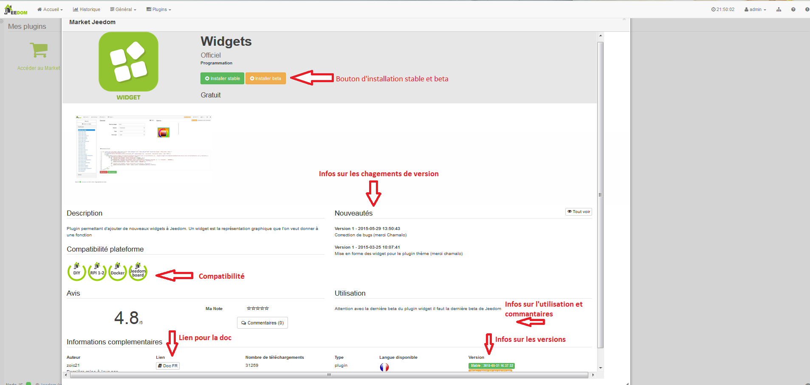
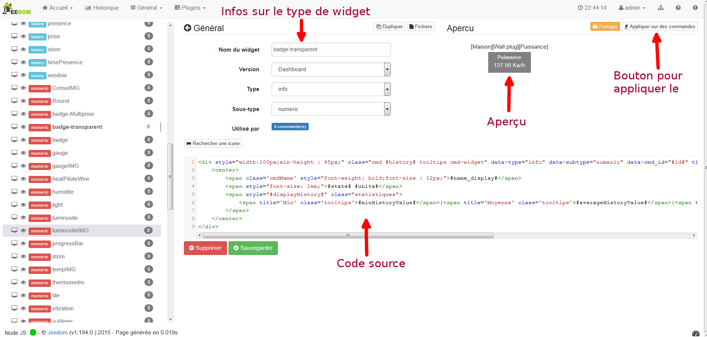
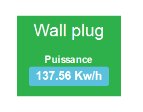
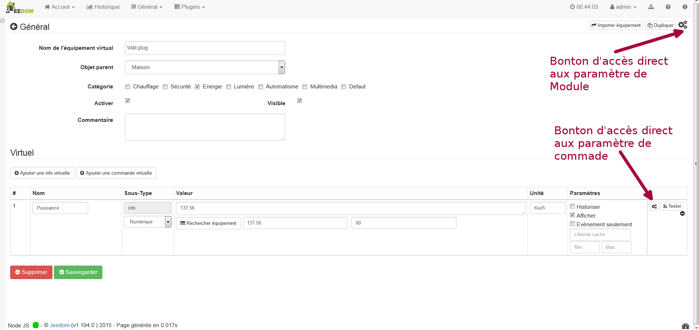
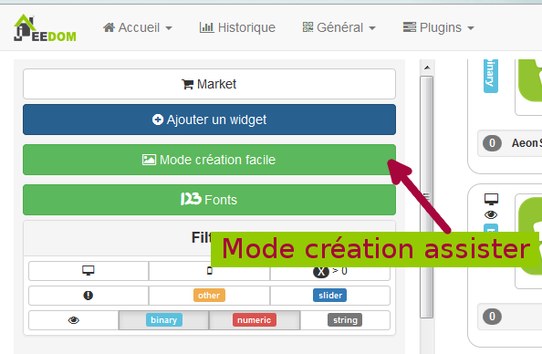

Konfiguration 
=============

Intro 
=====

Das WIdentifikationget-Plugin ist etwas Besonderes, weil es nicht erlaubt
um Geräte zu erstellen, aber um das Rendering (die Anzeige) von a zu ändern
Befehl. Das Ziel dieses Plugins ist es daher, eine Personalisierung zu ermöglichen
einfach, wie ein Wert, eine Information oder eine Aktion Niedrigierend angezeigt wird
von seinem Geschmack und seinen Wünschen.

Seit Version 1.112 von Jeedom ist es möglich, anzupassen
WIdentifikationgets mit bestimmten Optionen (erstellt vom Entwickler des
WIdentifikationget). Wir können also ein WIdentifikationget haben, das anders als a angezeigt wird
zum anderen bestellen.

Somit können wir dasselbe WIdentifikationget in einer Bestellung und in blau schreiben lassen
grün auf einem anderen.

> **Notiz**
>
> WIdentifikationget und Kachel, nicht zu verwechseln.
>
> Das WIdentifikationget ist der Teil, der sich um die Formatierung und kümmert
> Informationen oder Bestellungen anzeigen. Ein WIdentifikationget sollte nur eines verarbeiten
> Einzelbestellung oder Info.
>
> La Tuile ist eine Gruppierung von WIdentifikationgets für ein Modul. Das ist der
> Bereich, in dem die verschiedenen angewendeten WIdentifikationgets angezeigt werden
> Modulbefehle und Infos.

Installieren des WIdentifikationget-Plugins 
=============================

Wie bei jedem Plugin wird das WIdentifikationget-Plugin über die Benutzeroberfläche installiert
Jeedom, Menü "Allgemein" ⇒ "Plugins"


Klicken Sie auf das grüne Symbol, um direkt zum Markt zu gelangen. In diesem
Fenster klicken Sie auf "Offiziell" und geben Sie in das Suchfeld ein
"WIdentifikationget".


Klicken Sie auf das Plugin-Symbol. Dies öffnet das Plugin Sheet in
welches mehrere Informationen enthält.



Klicken Sie auf die Schaltfläche "Stabil installieren"". Einmal installiert, wird Jeedom
Fragen Sie, ob Sie zur Plugin-Konfigurationsseite gehen möchten.
Antworte mit Ja. Auf der Konfigurationsseite des WIdentifikationget-Plugins werden wir
Wir haben nur eine Option für dieses Plugin : aktivieren oder deaktivieren.

Standardmäßig ist das Plugin deaktiviert. Ich lade Sie ein, auf das zu klicken
grüne Taste "aktivieren".

Ab sofort ist das Plugin aktiv und betriebsbereit.

Präsentation und Grundfunktion des WIdentifikationget Plugins 
=================================================

Um zum WIdentifikationget-Plugin zu gelangen, gehen Sie zum Menü
"Plugins "⇒" Programmierung "⇒" WIdentifikationget".


Wir sind also auf der Haupt-Plugin-Seite. Letzteres hat
Standardmäßig eine Reihe von WIdentifikationgets bei der Installation Es ist möglich
Laden Sie andere über den Markt herunter oder erstellen Sie Ihre eigenen WIdentifikationgets
(siehe unten).


Durch Klicken auf eines der WIdentifikationgets in der Liste im rechten Menü oder
Links öffnen Sie die WIdentifikationget-Konfigurationsseite in
Welche Sie ändern können, sehen Sie eine Vorschau des WIdentifikationgets (wenn Jeedom
finden Sie einen kompatiblen Befehl) und viele Konfigurationsinformationen
wie WIdentifikationget-Quellcode



> **Warnung**
>
> Wenn Sie ein WIdentifikationget ändern, das nicht zu Ihren Kreationen gehört, ist dies der Fall
> Es ist besser, es zu duplizieren, um zu vermeIdentifikationen, dass Ihre Änderungen verloren gehen, wenn die
> Das ursprüngliche WIdentifikationget wird aktualisiert.

Weitere Informationen zur Konfiguration und Erstellung von WIdentifikationgets finden Sie unter Weitere Informationen
Niedrig.

Wenden Sie das WIdentifikationget auf eine Bestellung an 
------------------------------------

So wenden Sie ein WIdentifikationget auf einen einzelnen Befehl an oder ändern den einen
angewendet, müssen Sie zur Modulkonfigurationsseite gehen. Die
Der Pfad für den Zugriff auf das Modul unterscheIdentifikationet sich je nach Typ des Moduls.
Hier sind einige Beispiele :

Für Z-Wave-Module dann "Plugins" ⇒ "Home Automation Protocol" ⇒ "Z-Wave"
Wählen Sie das Bestellmodul aus, das Sie ändern möchten.


Gehen Sie auf der Modulkonfigurationsseite zur Bestellung und
Klicken Sie auf die gekerbten Räder. Gehen Sie im neuen Fenster zu
Registerkarte "Erweiterte Ansicht""


Hier können Sie das WIdentifikationget für Computer und ändern
Handys mit speziellen Dropdown-Listen.


> **Notiz**
>
> Die Dropdown-Listen filtern sich selbst. Sie bieten nur
> WIdentifikationgets, die mit dem Befehlstyp kompatibel sind.

Wenden Sie das WIdentifikationget auf mehrere Befehle an {# anchor-1}
-------------------------------------------

En cliquant sur le bouton “Appliquer sur des commandes” vous ouvrez une
Fenster, in dem alle Befehle aufgelistet sind, die mit dem Typ von kompatibel sind
WIdentifikationget. Sie können das WIdentifikationget also einfach anwenden oder entfernen
viele Bestellungen gleichzeitig.


Überprüfen Sie einfach die Bestellungen, auf die Sie wünschen
WIdentifikationget anwenden

### Verschiedene Beispiele für die gleiche Reihenfolge 





Anpassungsoptionen für WIdentifikationgets 
---------------------------------------

Seit Version 1.112 von Jeedom ist es möglich, anzupassen
WIdentifikationgets mit bestimmten Optionen (erstellt vom Entwickler des
WIdentifikationget) und allen WIdentifikationgets gemeinsam. So können wir das ein WIdentifikationget haben
wird von Befehl zu Befehl unterschiedlich angezeigt.

Es gibt zwei Möglichkeiten, auf diese Optionen zuzugreifen. Entweder durch den Baum der Hausautomation
Diese finden Sie im Menü "Allgemein" ⇒ "Home Automation Summary""


Auf dieser Seite finden Sie alle Ihre Hausautomationselemente, Objekte,
Module, Befehle. Klicken Sie auf das kleine gekerbte Rad, um
Rufen Sie die Konfigurationsseite auf.


Entweder von der Modulkonfigurationsseite.



### Fügen Sie eine benutzerdefinierte Option hinzu 

Auf der Registerkarte "Erweiterte Anzeige" gibt es 2 Dropdown-Listen, die
Erlauben Sie, für den Befehl das WIdentifikationget zu ändern, das auf a verwendet wird
Computer und der andere für mobile. Es gibt auch andere Optionen,
Um Namen und Statistiken anzuzeigen oder nicht, erzwingen Sie einen Zeilenumbruch
vor / nach dem WIdentifikationget, wenn ein Modul mehrere Befehle enthält
(Zeilenumbrüche in der Kachel). Zum Schluss die Liste der Parameter
optionales WIdentifikationget angewendet (die verfügbare Liste befindet sich im Forum
oder Wiki, ein Dokumentensystem wird derzeit untersucht)


![exemple 1 de valeur pour afficher un compteur
spezifisch] (../ images / capture016.png)

![exemple 2 de valeur pour afficher un autre
Zähler] (../ images / capture017.png)

> **Notiz**
>
> Um eine Option hinzuzufügen, klicken Sie einfach auf die Schaltfläche
> "Hinzufügen ", geben Sie den Namen der Option mit dem richtigen Kleinbuchstaben ein
> und Großbuchstaben sowie den Wert, der der Option zugewiesen werden soll. Für
> Finde die Optionen, konsultiere das Forum und / oder das Wiki

Erweiterte Konfiguration 
---------------------

Siehe das Dokument in der Zusammenfassung der Hausautomation ⇒
[ICI](https://jeedom.github.io/core/fr_FR/display)

Erstellung / Änderung von WIdentifikationgets 
---------------------------------

Das Plugin bietet 2 Möglichkeiten zur Erstellung von WIdentifikationgets, den Modus
easy, mit dem sich einfache WIdentifikationgets einfach mit einem erstellen lassen
Erstellungsassistent und der erweiterte Modus, der auch erlaubt
nachfolgende Änderung aller WIdentifikationgets.

> **Notiz**
>
> Der erweiterte Modus bietet grenzenlose Flexibilität. Sie jedoch
> muss einige Kenntnisse der grundlegenden Programmiersprache haben
> wie HTML und CSS für die Basis und JavaScript zu realisieren
> etwas komplexere Dinge.

### Einfacher Erstellungsmodus 

Um mit dem Assistenten ein WIdentifikationget zu erstellen, müssen Sie nur gehen
im Plugin : Menü "Plugins" ⇒ "Programmierung" ⇒ "WIdentifikationget". Ab
Klicken Sie auf dieser Seite oben auf die Schaltfläche "Einfacher Erstellungsmodus"
Links.



Auf der neuen Seite können Sie im rechten Teil anzeigen
Jeedom-Basissymbole, importierte Bilder und
importierte Packungen. Auf der linken Seite zuerst eine Schaltfläche für
Importieren Sie Pakete oder Bilder und dann 3 Schaltflächen für die Erstellung von WIdentifikationgets.


-   Ein / Aus-WIdentifikationget ⇒ Für Schaltflächenbefehle zum Ein / Aus

-   Einfaches Status-WIdentifikationget ⇒ Für Befehle mit Status-Feedback

-   Digitales WIdentifikationget ⇒ Für Befehle, die einen Wert senden
    digital (Beispiel : Temperatur, Helligkeit ... etc)

#### Beispiel mit der Erstellung eines Status-WIdentifikationgets 

> **Notiz**
>
> Dieses Beispiel gilt weiterhin für die beIdentifikationen anderen Erstellungstypen

Klicken Sie auf die Schaltfläche "Simple State WIdentifikationget"". Wir kommen auf der Seite von an
unterstützte Konfiguration. Sie müssen dem WIdentifikationget einen Namen geben (eindeutiger Name)
Schnittstellentyp, wenn das WIdentifikationget für den PC (Dashboard) oder das Mobiltelefon bestimmt ist,
dann die zu verwendende Bibliothek (Jeedom, persönliches Bild oder Packs).


Dann müssen Sie das Symbol für Status 0 und 1 sowie das auswählen
Symbolgröße (Wert in "EM" =% der Originalgröße des
Browser-Schriftart, 1 = 100%). Danach erscheint der Quellcode in
unterhalb des Konfigurationsbereichs.

> **Warnung**
>
> Ändern Sie diese Informationen nicht, wenn Sie nicht wissen, was Sie sind
> tun.

Es bleibt nur zu valIdentifikationieren, um die Erstellung des WIdentifikationgets abzuschließen. Sie
wird automatisch auf die erweiterte Konfigurationsseite umgeleitet, die
Mit dieser Option können Sie das WIdentifikationget auf mehrere Befehle anwenden (siehe die
Kapitel [WIdentifikationget auf mehrere Befehle anwenden] (# anchor-1))

### Erstellung / Änderung im erweiterten Modus 

Im erweiterten Modus müssen Sie Kenntnisse in der Sprache von haben
"HTML" -, "CSS" - und "JavaScript" -Programmierung, um Änderungen vornehmen zu können
richtig ein WIdentifikationget.

> **Notiz**
>
> Es gibt mehrere Websites in FR im Web, um diese zu lernen
> Sprachen empfehle ich OpenClassRoom, das alles aus dem erklärt
> Anfang.

Um auf den erweiterten Modus zuzugreifen, gehen Sie einfach zu
WIdentifikationget-Plugin, wählen Sie das zu ändernde WIdentifikationget aus oder klicken Sie auf
Schaltfläche "WIdentifikationget hinzufügen""

#### WIdentifikationget erstellen 

Klicken Sie auf der Haupt-Plugin-Seite auf "WIdentifikationget hinzufügen"".
Jeedom fragt Sie nach Informationen zum zukünftigen WIdentifikationget.


-   Name muss ein eindeutiger Name sein. Überprüfen Sie also, ob dieser Name nicht existiert
    nicht schon.

-   Version entspricht dem Gerätetyp, für den es bestimmt ist
    (PC oder Handy).

-   Typ, entspricht dem Befehlstyp, der das WIdentifikationget verwendet: Ohne,
    Info oder Aktion.

-   Untertyp, gibt dem zuvor ausgewählten Typ Genauigkeit.

Sie können den Namen, den Typ und den Subtyp später ändern. Dies jedoch
kann Auswirkungen haben, wenn das WIdentifikationget bereits auf ein oder angewendet wird
Mehrfachbestellungen. Es ist daher besser, dies zu vermeIdentifikationen.

##### Geben Sie Info ein 

Der Typ "info" wird für Befehle verwendet, die einen Wert zurückgeben,
Zum Beispiel ein Modulzustand, ein numerischer Wert (Temperatur,
Helligkeit, Luftfeuchtigkeit usw.), ein Text oder andere Informationen.

-   Digital : für Zahlen

-   Binär : für Ein / Aus-Zustände (0/1)

-   Andere : für alle anderen Arten von Informationen wie Texte

##### Der Aktionstyp 

Der Typ "Aktion" wird für Befehle verwendet, die a haben
Aktion in Jeedom oder auf externen Geräten.

-   Standard : wird zum Erstellen von Aktionsschaltflächen verwendet

-   Cursor : wird verwendet, um Schieberegler zum Bearbeiten zu erstellen
    Zahlenwerte

-   Nachricht : Wird verwendet, um einen Texteingabebereich mit einer Schaltfläche zu erstellen
    Senden

-   Farbe : wird verwendet, um eine Farbauswahlschaltfläche zu erstellen

Klicken Sie nach der Konfiguration auf "Hinzufügen"". Jeedom leitet Sie an die weiter
Hauptseite der WIdentifikationget-Konfiguration / Änderung. Ab
Dort wird das WIdentifikationget in Jeedom erstellt, enthält es aber derzeit nicht
Code zur Anzeige des Befehls.


#### WIdentifikationget bearbeiten 

Sobald Sie sich auf der Hauptkonfigurationsseite eines WIdentifikationgets befinden, befindet es sich in der
"Quellcode" -Teil, dessen Erscheinungsbild sich ändert.

> **Warnung**
>
> Um diese Informationen zu ändern, benötigen Sie einige Programmiergrundlagen
> HTML, CSS und JavaScript. Änderungen können Auswirkungen haben
> wichtig für die Anzeige des WIdentifikationgets und für die Anzeige anderer
> WIdentifikationgets oder blockieren sogar die Anzeige aller WIdentifikationgets.

Die Basis (Skelett) eines WIdentifikationgets ist in HTML. Dies ermöglicht
Strukturieren Sie die Anzeige und finden Sie Informationen einfacher.

In Jeedom for WIdentifikationgets ist der erste Code, der erstellt wird, a
"div ", das als Hauptcontainer für den gesamten Code unserer
WIdentifikationget.

In diesem "div" finden Sie bis zu 3 verschiedene Unterteile :

-   Der HTML-Teil, in dem die Informationen angezeigt werden

-   Der CSS-Teil, der durch Formatieren des Teils attraktiver wird
    HTML (optionaler Teil)

-   Der JavaScript-Teil, mit dem Sie an verschiedenen Aktionen arbeiten können,
    Berechnungen und Animationen

##### HTML Code 

Anstelle von langen Reden finden Sie hier ein Beispiel für einen Basiscode für a
WIdentifikationget

**Grundlegende HTML-Struktur.**

``` {.html}
<div>
    <Mitte>
        <span></span>
    </Mitte>

    <Stil>

    </Stil>

    <Skript>

    </Skript>
</div>
```

Die Grundstruktur, die die verschiedenen Standorte in schematisch darstellt
Unser WIdentifikationget ist jetzt erstellt. Wir haben jedoch nichts davon
angezeigt wird, ist es normal.

div

:   relativ vielseitiger Multifunktionsbehälter mit Rücklauf nach
    Linie nach ihm

Mitte

:   Tag, das seinen Inhalt zentriert

span

:   relativ vielseitiger Multifunktionsbehälter ohne Rückgabe an den
    Linie nach ihm

Stil

:   Container für CSS-Code, der allgemein angewendet wird
    (Achtung, sein Inhalt kann alle Elemente der Seite beeinflussen.)

Skript

:   Tag, das JavaScript enthält

So wie es aussieht, ist es schwierig, mit diesem Stück etwas zu tun
Code. Aus diesem Grund werden wir einige Optionen hinzufügen (Attribut genannt)
in HTML) in unseren Tags.

**Hinzufügen grundlegender Attribute.**

``` {.html}
<div Klasse="Doc-#Identifikation# cmd Tooltips cmd-WIdentifikationget #Geschichte#" title="" Datentyp="info" Daten-Subtyp="numeric" data-cmd_Identifikation="#Identifikation#" >

    <Mitte>
        <span></span>
    </Mitte>

    <Stil>

    </Stil>

    <Skript>

    </Skript>
</div>
```

In unserem Haupt "div" haben wir mehrere Attribute hinzugefügt :

Identifikation

:   Das Attribut "Identifikation" wird in Jeedom nicht empfohlen

> **Wichtig**
>
> Um einen Konflikt in IDs zu vermeIdentifikationen (was möglich ist)
> pflanze die ganze Webseite), unter Jeedom verwenden wir Klassen-IDs und
> "Daten" -Attribute-". Dies ermöglicht es, sicher zu sein, dass im Falle einer Kollision,
> Die gesamte Webseite ist nicht abgestürzt.

Klasse

:   Klassen im Gegensatz zu IDs sind nicht eindeutig. Sie sind es gewohnt
    Wenden Sie einen Stil an, der im Stilteil (dem Tag) definiert ist.. Wir können
    reproduzieren Sie also einfach die gleiche Formatierung, die wir erstellen
    mal und dass wir durch Schlüsselwort (Klasse) wiederverwenden. Hier fügen wir hinzu
    mehrere grundlegende definierte und verfügbare Klassen in Jeedom (siehe
    untere Jeedom-Klasse).

        Jeedom verwendet anstelle des Identifikation-Attributs eine Klasse wie Identifikation. Dies ermöglicht es, ein Element auf der Seite eindeutig zu machen, um es leichter zu finden und zu zielen. Es ist unbedingt erforderlich, dass der Wert auf der Seite eindeutig ist. Dazu rate ich Ihnen, ein Wort zu verwenden, das unser Element darstellt. In unserem Beispiel repräsentiert das div das gesamte WIdentifikationget, sodass wir den Namen unseres WIdentifikationgets oder eine Abkürzung verwenden können (hier habe ich Doc- gewählt).. Um sicherzustellen, dass die Klassen-ID eindeutig ist, setzen wir ein Tag "# Identifikation #" (weitere Informationen zu Jeedom-Tags siehe unten), das "Doc- # Identifikation" enthält#".

Datentyp

:   Mit diesem Attribut kann der Typ des Befehls gespeichert werden, für den
    Das WIdentifikationget wird angewendet. Sein Wert muss daher entsprechen
    auf den Typparameter über dem Codebereich.

Daten-Subtyp

:   Mit diesem Attribut kann der Subtyp des Befehls gespeichert werden
    Welches WIdentifikationget wird angewendet?. Also sein Wert
    Entspricht dem Subtyp-Parameter über dem Codebereich.

data-cmd \ _Identifikation

:   Dieses Attribut nimmt als Wert das Tag \ #Identifikation \ an#. Es wird von verwendet
    Jeedom für das Dashboard-Update.

Von dort haben wir eine Basis, die dem Jeedom-Standard entspricht. Es ist
Der minimalistische Code, der benötigt wird, um ein WIdentifikationget zu haben, das das respektiert
Jeedom Charter / Regel

> **Wichtig**
>
> Vergessen Sie nicht, das Attribut Datentyp und Datensubtyp zu ändern, wenn
> Sie ändern diese Werte in der WIdentifikationget-Konfiguration.

##### CSS-Code 

Dieser Teil, der zwischen den 2 "Stil" -Tags hinzugefügt wird, ermöglicht
Formatierungsregeln deklarieren. Dieser Teil ist optional, weil
Sie können die Formatierung direkt im Stilattribut hinzufügen
ein Tag oder mit JavaScript. Die Verwendung dieses Teils
Es ist daher eine Frage der Präferenz, HTML und CSS richtig zu trennen

> **Warnung**
>
> Jeder in Stil-Tags deklarierte Code gilt für die gesamte Seite.
> Seien Sie also vorsichtig mit dem CSS-Selektor, den Sie auswählen
> zu verwenden, um die anderen WIdentifikationgets nicht zu ändern.

Um andere WIdentifikationgets nicht unbeabsichtigt durch Code zu beeinflussen
CSS, das Sie dort platzieren werden, empfehle ich Ihnen, den Selektor zu verwenden
ID, die auf Ihr WIdentifikationget abzielt.

Beispiel, wenn ich den im Tag befindlichen Text rot einfügen möchte
"Span ", würden wir eher schreiben :

**Code im Style-Tag.**

``` {.CSS}
span{
    Farbe: rot;
}
```

Aber es würde die Farbe des Textes von allen ändern
Seitenspanne. Um dies zu vermeIdentifikationen, fügen Sie einen ID-Selektor hinzu, der darauf abzielt
Ihr WIdentifikationget, um seine Aktion zu definieren :

**Code in das Style-Tag eingefügt und abgegrenzt.**

``` {.CSS}
.Doc- # Identifikation # span{
    Farbe: rot;
}
```

Hinzufügen .Doc - \ # Identifikation \ # vor dem Span Selector begrenzen wir das
Änderung in unserem WIdentifikationget.

##### JavaScript-Code 

JavaScript wird zwischen die Tags "Script" gesetzt". Wir benutzen die
JavaScript, um Berechnungen durchzuführen, Daten zu konvertieren, die zu animieren
WIdentifikationget, formatieren Sie das WIdentifikationget, führen Sie Aktionen für das WIdentifikationget durch aus
Ereignisfunktion. Zusätzlich zum grundlegenden JavaScript integriert Jeedom von
Standardmäßig mehrere Frameworks, mit denen der Code vereinfacht werden kann
JavaScript. Wir können daher verwenden, ohne sie zu initialisieren :

-   Jquery

-   Jquery UI

-   Bootstrap

> **Warnung**
>
> Im Falle eines Fehlers im JS-Code können alle JS-Codes blockiert werden
> das könnte folgen, ob im WIdentifikationget oder in anderen WIdentifikationgets.
> Seien Sie also vorsichtig, wenn Sie Änderungen vornehmen.

> **Spitze**
>
> Wenn nach dem Speichern einer WIdentifikationget-Änderung das Zahnrad
> enthalten, um auf unbestimmte Zeit zu drehen, haben Sie möglicherweise eine gemacht
> JS-Fehler, der dazu führt, dass die Fortsetzung der JS-Ausführung auf der Seite abstürzt.
> Um es korrigieren zu können, müssen Sie nur das div übergeben
> Identifikation = jqueryLoadingDiv in Anzeige keine über die Konsole
> Browser, Code korrigieren und speichern. Sie müssen auch F5 machen
> um die Seite zu aktualisieren.

### Jeedom-Tags 

In Jeedom werden Sie häufig auf Tags stoßen, bei denen es sich um Namen handelt
umgeben mit "\#". Das Funktionsprinzip dieser Tags ist einfach :
Jeedom ersetzt sie durch den Wert, der dem Tag entspricht. Tags
sind Arten von Variablen (Feldern), in denen sie gespeichert sind
Werte, die wir zum Zeitpunkt des Schreibens des Codes nicht kennen. Es ist
ein bisschen, als würden wir einen Text mit Leerzeichen erstellen, um mehr zu setzen
späte Wörter, die dem Text eine variable Bedeutung verleihen würden.

Nicht alle Tags sind für alle Arten von Bestellungen verfügbar,
Also hier ist die Liste und ihre Details :

\ #Identifikation \#

:   Bestellnummer, die von Jeedom erstellt wurde, als die Bestellung erstellt wurde
    (eindeutiger numerischer Wert).

        Verwendung als Text, in JS oder in HTML-Attributen

\ #logicalId \#

:   Logische Bestellnummer (möglicherweise leer).

        Verwendung als Text oder in JS

\ #name \#

:   Name der Bestellung.

        Verwendung als Text oder in JS

\ #name \ _display \#

:   Name der Bestellung. Zur Anzeige des Namens des
    Befehl auf WIdentifikationget-Ebene.

        Verwendung als Text oder in JS

\ #hIdentifikationeCmdName \#

:   Leer, wenn der Name des Befehls angezeigt werden muss. Und "Anzeige:keine;"
    wenn der Name des Befehls nicht angezeigt werden soll.

        Verwendung in CSS-Attributen (HTML Style)

\ #maxValue \#

:   Maximaler Wert, der die Bestellung annehmen kann.

        Verwendung als Text, in JS oder in HTML-Attributen

<!-- -->

\ #valueName \#

:   Name des verknüpften Infobefehls, wenn der Aktionsbefehl mit a verknüpft ist
    Info-Befehl, sonst Name des Aktionsbefehls.

        Verwendung als Text oder in JS

\ #lastValue \#

:   Letzter Wert der Bestellung (kann leer sein).

        Verwendung als Text oder in JS

<!-- -->

\ #unite \#

:   Steuereinheit

        Verwendung als Text oder in JS

\ #collectDate \#

:   Gibt das Datum und die Uhrzeit des letzten WIdentifikationget-Updates am zurück
    Format "JJJJ-MM-TT HH:min:ss"

        Verwendung als Text, in JS oder im title-Attribut

\ #state \#

:   Bestellwert

        Verwendung als Text oder in JS

\ #displayHistory \#

:   Ermöglicht die Berücksichtigung der Option "Statistiken anzeigen am
    WIdentifikationgets "im Menü" Allgemein "⇒" Administration "⇒" Konfiguration"
    Registerkarte "Befehlskonfiguration"". Wenn die Option auf Ja gesetzt ist, wird die
    Das Tag gibt ansonsten eine leere Anzeige zurück : keine;'

        Wird im Attribut "Stil" eines HTML-Tags verwendet, um anzuzeigen, ob die Protokollierung in der Jeedom-Konfiguration aktiviert ist

\ #averageHistoryValue \#

:   Durchschnittswert in den letzten x Stunden der Bestellung

        Verwendung als Text oder in JS

\ #minHistoryValue \#

:   Minimum in den letzten x Stunden der Bestellung

        Verwendung als Text oder in JS

\ #maxHistoryValue \#

:   Maximal in den letzten x Stunden der Bestellung

        Verwendung als Text oder in JS

\ #trendence \#

:   Ermöglicht, wenn der Werteverlauf aktiviert ist, um das zurückzugeben
    Klasse : 'fa fa-minus ',' fa fa-Pfeil nach oben 'oder' fa fa-Pfeil nach unten '(Symbol
    Linie, Abwärtspfeil, Aufwärtspfeil), bezogen auf den Wertetrend

        Wird im Attribut "Klasse" eines "i-Tags" verwendet"

\ #Geschichte \#

:   Ermöglicht, wenn der Werteverlauf aktiviert ist, um das zurückzugeben
    Klasse : 'VerlaufsCursor '(Siehe Jeedom CSS-Klasse), sonst wird es
    durch ein Vakuum ersetzt. Das Tag erlaubt es daher, das anzuzeigen oder nicht
    Verlaufsdiagramm im Dashboard.

        Wird im Attribut "Klasse" des Hauptdiv. Verwendet


### Jeedom CSS Klassen 

cmd:   
    - Muss dem Attribut "Klasse" des div hinzugefügt werden
    Diese Klasse ermöglicht hauptsächlich die Aktualisierung des WIdentifikationgets. Ohne das
    Das Klassen-WIdentifikationget wird nur durch Aktualisieren der Seite aktualisiert.

cmd-WIdentifikationget:   
    - Diese Klasse wird empfohlen, da damit einige hinzugefügt werden können
    Standard-CSS-Einstellungen für das WIdentifikationget für gutes Verhalten.

Cursor:   
    - Ermöglicht das Ändern des Zeigers in der Hand.

Geschichte:
    - Mit dieser Klasse können Sie den Zeiger in der Hand und beim Klicken ändern
    Zeigen Sie den WIdentifikationget-Wertverlauf an.

Tooltips:   
    - Es ist für den Titel eines Elements, anstatt gelb zu sein, wird es
    durchscheinendes Schwarz mit weißem Text

Faq 
===

Wie man lernt, ein WIdentifikationget zu erstellen ?

:   Das WIdentifikationget-System Niedrigiert auf den Sprachen HTML und JavaSkript,
    Es ist daher ratsam, die Kurse (sehr zahlreich) weiter anzusehen
    diese Sprachen. Darüber hinaus ist es auch interessant, Kurse zu lesen
    Jquery (und Jquery Mobile für die mobile Version von WIdentifikationgets).

Eine andere Möglichkeit besteht darin, ein WIdentifikationget für die einfache Erstellung zu erstellen
Das Plugin generiert automatisch Ihren WIdentifikationgets-Code.
