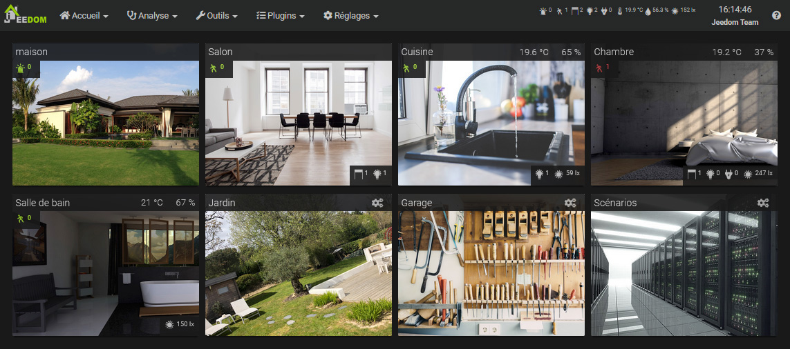

# Präsentation

Jeedom ist eine Open Source und * Cloudless * Hausautomationslösung (ohne Server in der Cloud). Es funktioniert ohne Abonnement, was das Funktionieren Ihrer Hausautomation ohne Internet sowie die Sicherheit Ihrer Daten garantiert.. Es ist außerdem extrem offen, multiprotokollierbar, anpassbar und hoch skalierbar.

Jeedom bietet einen Kern, den Kern, der die Struktur und die zentralen Funktionen einbettet.

Anders [Plugins](https://market.jeedom.com) kann dann neue Funktionen vorschlagen.

Der Kern enthält:

## Dashboard / Zusammenfassung

*Geräte, einschließlich Aktuatoren oder Sensoren, sind nach Objekten organisiert. Objekte können beispielsweise physische Teile darstellen*.

## Widget-Erstellung

*Jeedom bietet eine Widget-Erstellungs-Engine für Gerätekacheln. Auf diese Weise können Sie zusätzlich zu den grundlegenden Widgets Ihre eigenen Widgets erstellen. Widgets können für fortgeschrittene Benutzer auch direkt aus Code erstellt werden.*

## Historisch

*Alle Informationen können gespeichert werden (Temperaturkurve, Verbrauch, Türöffnungen usw.) und sind unter Analyse → Verlauf oder über die Dashboard-Kacheln zugänglich.*

## Szenarien

*Mithilfe von Szenarien können Sie Ihre Geräte ganz oder teilweise automatisieren. Sie sind mit verschiedenen Blöcken gebaut. Bedingte Blöcke (wenn dann, sonst), Aktionen, Programmierung (IN x Minuten oder A hhmm), Schleife, Kommentar oder PHP-Code. Alle Blöcke sind ineinander verschachtelbar und bieten endlose Möglichkeiten.*

## Interaktion

*Mit dem Interaktionssystem in Jeedom können Sie Aktionen über Text- oder Sprachbefehle ausführen.*

## Update Center

*Mit dem Update Center können Sie alle Funktionen von Jeedom aktualisieren, einschließlich der Kernsoftware und ihrer Plugins. Andere Erweiterungsverwaltungsfunktionen sind verfügbar (Löschen, Neuinstallieren, Überprüfen usw.).*

# Markt

Um diesen Kern herum befinden sich Plugins, die aller Art sein können :

-   Hausautomationsprotokoll (Z-Wave, RFXcom, EnOcean…),
-   IP-Protokoll (KNX, xPL…),
-   Kommunizierendes Objekt (Nest, Netatmo…),
-   Hoher Pegel (Alarm, Thermostat ...),
-   Schnittstelle (Widget),
-   Organisation (Kalender, Google Kalender),
-   Entwicklung (Skript).

Diese Plugins können vom Markt installiert werden und ermöglichen es Ihnen, die Möglichkeiten von Jeedom zu erweitern.

Jeedom ermöglicht es jedem Plugin, standardisiert mit einem anderen zu chatten. Dies ermöglicht zum Beispiel die Verwendung des Thermostats oder der Alarm-Plugins mit einem beliebigen Hausautomationsprotokoll oder sogar einem IP-Plugin oder einem kommunizierenden Objekt ...

