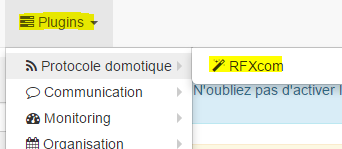

Suchen der Fernbedienungs-ID 
====================================

Gehen Sie zu "Plugins", "Plugins-Verwaltung", "RFX COM"" 
------------------------------------------------------

In "Verwaltung von RFXcom-Protokollen", 
-------------------------------------

Überprüfen Sie Protokoll 8, BlindsT1, Speichern und beenden.

Aktivieren Sie "Im Debug-Modus starten"" 
-------------------------------

Warten Sie, bis sich das Fenster öffnet, und drücken Sie dann die Taste Öffnen
Ihre Ematronic-Fernbedienung.

    MainThread - rfxcmd:2765 - DEBUG - Testnachricht: 09 19 03 01 1F 84 B9 01 01 60
    MainThread - rfxcmd:2805 - DEBUG - Meldung OK
    MainThread - rfxcmd:328 - DEBUG - Verifiziert OK
    MainThread - rfxcmd:334 - DEBUG - PacketType: 19
    MainThread - rfxcmd:338 - DEBUG - SubType: 03
    MainThread - rfxcmd:342 - DEBUG - SeqNbr: 01
    MainThread - rfxcmd:346 - DEBUG - Id1: 1F
    MainThread - rfxcmd:350 - DEBUG - Id2: 84
    MainThread - rfxcmd:359 - DEBUG - Überprüfen Sie die korrekte Paketlänge
    MainThread - rfxcmd:556 - DEBUG - Paket in log_msgfile speichern

Suchen Sie nach der Fernbedienungs-ID 
-------------------------------------

Remarque: Ematronic-Fernbedienungen beginnen immer mit : 09 19 03
Der Bereich, der uns interessiert, beginnt also mit "Testnachricht"" : 09 19 03.

Spot : Id1 und Id2 und fügen Sie das folgende Hexadezimal hinzu : in meinem Beispiel
Id1 = 1F und Id2 = 84. Sie sollten sie also in der Zeile "Test
message "und extrahiere Id3, hier Id3 = B9, Unsere Fernbedienung hat
als ID ⇒ 1F84B9.

Stoppen Sie den Debug-Modus mit der Schaltfläche "Stop / Restart the Daemon"" 
-----------------------------------------------------------------

Erstellung der Fernbedienung unter JeeDom 
=======================================

Gehen Sie zu Plugins, Home Protocol, RFXcom.

Klicken Sie auf "Hinzufügen" und geben Sie einen Namen für Ihre Fernbedienung ein
virtuelle.

Wählen Sie die Vorlage aus der Liste der Geräte : "Ematronischer Verschluss -
Standard".

Ersetzen Sie die automatische ID durch die zuvor extrahierte
und aktivieren Sie "Aktivieren" und "Sichtbar"" :

Klicken Sie auf "Speichern", um Ihre Konfiguration zu speichern und
Laden Sie die Vorlage "Ematronic-Komponente - Standard".

Hier ist Ihre Fernbedienung fertig, sie sollte so aussehen :

Verknüpfen Sie Ihre virtuell JeeDom-Fernbedienung mit Ihrer Ematronic-Engine: 
======================================================================

Motor zurückgesetzt: 
---------------------------

-   Den Motor elektrisch abklemmen.

-   Lassen Sie auf der Originalfernbedienung die Taste "Auf" 3 oder 4 gedrückt
    Sekunden leuchtet die LED rot.

-   Den Motor elektrisch anschließen.

-   Lassen Sie die Taste auf der Fernbedienung los.

-   Der Motor piept 5 Mal.

-   Drücken Sie schnell den "Mikroknopf" mit einer Büroklammer a
    die Rückseite der Fernbedienung.

-   Der Motor piept dreimal.

Zuordnung der virtuellen JeeDom-Fernbedienung zum Ematronic-Motor: 
====================================================================

-   Den Motor elektrisch abklemmen.

-   Lassen Sie auf der Originalfernbedienung die Taste "Auf" gedrückt. Drücken Sie 3 oder 4
    Sekunden leuchtet die LED rot.

-   Den Motor elektrisch anschließen.

-   Lassen Sie die Taste auf der Fernbedienung los.

-   Der Motor piept 5 Mal.

-   Drücken Sie den Befehl "Mount" auf der virtuellen Fernbedienung von
    JeeDom. Bild::images / shutter.ematronic / image09.png \ [\]

-   Die Engine piept dreimal, um anzuzeigen, dass Ihr JeeDoom zugeordnet ist
    !!

