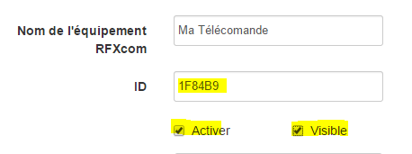

# Ematronics-Bereich

## Suchen der Fernbedienungs-ID

### Gehen Sie zu "Plugins", "Plugins-Verwaltung", "RFX COM""


### In "Verwaltung von RFXcom-Protokollen"


Überprüfen Sie Protokoll 8, BlindsT1, Speichern und beenden.


### Aktivieren Sie "Im Debug-Modus starten""


Warten Sie, bis sich das Fenster öffnet, und drücken Sie dann die Taste Öffnen auf Ihrer Ematronic-Fernbedienung.

````
MainThread - rfxcmd:2765 - DEBUG - Test message: 09 19 03 01 1F 84 B9 01 01 60
MainThread - rfxcmd:2805 - DEBUG - Message OK
MainThread - rfxcmd:328 - DEBUG - Verified OK
MainThread - rfxcmd:334 - DEBUG - PacketType: 19
MainThread - rfxcmd:338 - DEBUG - SubType: 03
MainThread - rfxcmd:342 - DEBUG - SeqNbr: 01
MainThread - rfxcmd:346 - DEBUG - Id1: 1F
MainThread - rfxcmd:350 - DEBUG - Id2: 84
MainThread - rfxcmd:359 - DEBUG - Verify correct packet length
MainThread - rfxcmd:556 - DEBUG - Save packet to log_msgfile
````

### Suchen Sie nach der Fernbedienungs-ID

Remarque: Ematronic-Fernbedienungen beginnen immer mit : 09 19 03 Die Zone, die uns interessiert, beginnt also mit "Testnachricht"" : 09 19 03.

Spot : Id1 und Id2 und fügen Sie das folgende Hexadezimal hinzu : in meinem Beispiel Id1 = 1F und Id2 = 84. Sie müssen sie daher in der Zeile "Testnachricht" suchen und die ID3 extrahieren, hier Id3 = B9. Unsere Fernbedienung hat daher die ID ⇒ 1F84B9.

### Stoppen Sie den Debug-Modus mit der Schaltfläche "Stop / Restart the Daemon""


## Erstellung der Fernbedienung unter JeeDom

Gehen Sie zu Plugins, Home Protocol, RFXcom.


Klicken Sie auf "Hinzufügen" und geben Sie einen Namen für Ihre virtuelle Fernbedienung ein.


Wählen Sie die Vorlage aus der Liste der Geräte : "Ematronic Shutter - Fehler".

Ersetzen Sie die automatische ID durch die zuvor extrahierte und aktivieren Sie "Aktivieren" und "Sichtbar"" :



Klicken Sie auf "Speichern", um Ihre Konfiguration zu speichern und die Vorlage "Ematronic Pane - Default" zu laden".


Hier ist Ihre Fernbedienung fertig, sie sollte so aussehen :


## Verknüpfen Sie Ihre virtuelle JeeDom-Fernbedienung mit Ihrer Ematronic-Engine

### Motor zurückgesetzt

-   Den Motor elektrisch abklemmen.
-   Lassen Sie auf der Originalfernbedienung die Taste "Auf" 3 oder 4 Sekunden lang gedrückt. Die LED leuchtet rot.
-   Den Motor elektrisch anschließen.
-   Lassen Sie die Taste auf der Fernbedienung los.
-   Der Motor piept 5 Mal.
-   Drücken Sie mit einer Büroklammer schnell die "Mikrotaste" auf der Rückseite der Fernbedienung.
-   Der Motor piept dreimal.

## Zuordnung der virtuellen JeeDom-Fernbedienung zum Ematronic-Motor

-   Den Motor elektrisch abklemmen.
-   Lassen Sie auf der Originalfernbedienung die Taste "Auf" gedrückt. Drücken Sie 3 oder 4 Sekunden, die LED leuchtet rot.
-   Den Motor elektrisch anschließen.
-   Lassen Sie die Taste auf der Fernbedienung los.
-   Der Motor piept 5 Mal.
-   Drücken Sie den Befehl "Mount" auf der virtuellen JeeDom-Fernbedienung.
[Bild](images/volet.ematronic/image09.png)
-   Die Engine piept dreimal, um anzuzeigen, dass Ihr JeeDoom zugeordnet ist !!
