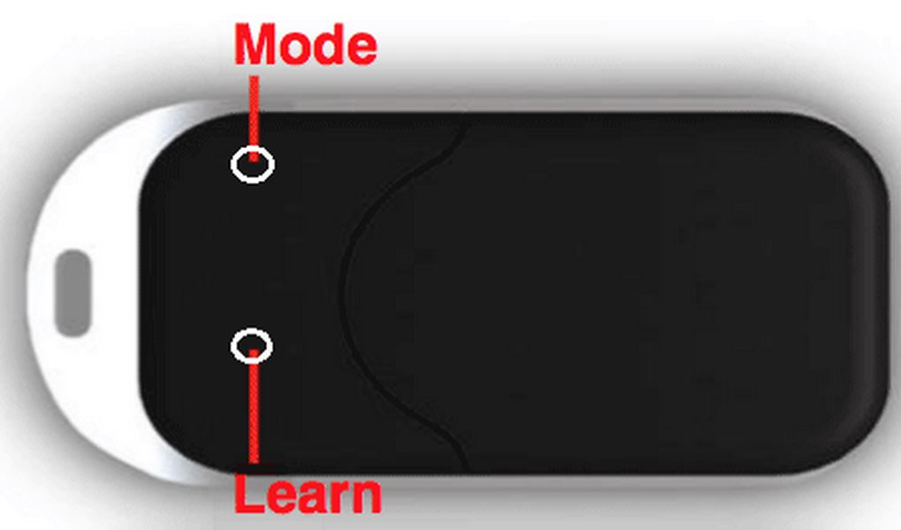

# Aeotec Keyfob

**Das Modul**

**Das Jeedom Visual**

## Zusammenfassung

Die Aeon Labs-Schlüsselbundfernbedienung mit modernem und ansprechendem Design verfügt über 4 Tasten, mit denen Sie alle Arten von Z-Wave-Geräten wie Lampen, Jalousien usw. steuern können

Mit seinen sehr kleinen Abmessungen können Sie es einfach in Ihre Tasche stecken. Es ist einfach zu bedienen und elegant und mit einem Ring zum Befestigen an Schlüsseln ausgestattet, der es beim Verlassen des Hauses oder bei der Rückkehr zu Ihnen nach Hause zur Verfügung stellt.

Mit jeder Taste können Sie dank der Verwaltung von kurzen und langen Drücken zwei Geräte oder Szenen steuern. Diese Fernbedienung kann als primäre oder sekundäre Steuerung verwendet werden.

## Fonctions

-   Schlüsselanhänger Fernbedienung
-   Primärer oder sekundärer Controller
-   Ultra kompakt und ultra Design
-   4 konfigurierbare Tasten
-   Verwaltet bis zu 8 Geräte / Szenen
-   Gleitschutzklappe
-   Benutzerfreundlichkeit und Installation

## Technische Daten

-   Modultyp : Z-Wave Sender
-   Versorgung : 1 Lithium 3V CR2450 Batterie
-   Akkulaufzeit : 1 Jahr
-   Frequenz: 868.42 MHz
-   Übertragungsentfernung : 100m auf freiem Feld
-   Betriebstemperatur : -10 ° C bis 50 ° C
-   Abmessungen : 55 x 30 x 13 mm (L x B x H)

## Moduldaten

-   Machen Sie : Aeotec
-   Name : Schlüsselanhänger
-   Hersteller ID : 134
-   Produkttyp : 1
-   Produkt-ID : 22

# Configuration

Informationen zum Konfigurieren des OpenZwave-Plugins und zum Einfügen von Jeedom finden Sie hier [Dokumentation](https://doc.jeedom.com/de_DE/plugins/automation%20protocol/openzwave/).
> **Wichtig**
>
> Um dieses Modul in den Einschlussmodus zu versetzen, drücken Sie die LEARN-Taste gemäß der Papierdokumentation.
>
>Einmal enthalten, sollten Sie dies erhalten :

### Commandes

Sobald das Modul erkannt wurde, sind die den Modulen zugeordneten Befehle verfügbar.

Hier ist die Liste der Befehle :

-   Tasten : Es ist der Befehl, der den Knopf nach oben drückt
  - 1 : Taste 1 kurz drücken
  - 2 : Taste 1 lange drücken
  - 3 : Taste 2 kurz drücken
  - 4 : Taste 2 lange drücken
  - 5 : Taste 3 kurz drücken
  - 6 : Taste 3 lange drücken
  - 7 : Taste 4 kurz drücken
  - 8 : Taste 4 lange drücken

### Konfiguration des Moduls
> **Wichtig**
>
> Wecken Sie das Modul bei einer ersten Aufnahme immer gleich danach auf
> Einbeziehung.

Wenn Sie das Modul dann entsprechend Ihrer Installation konfigurieren möchten, müssen Sie die Schaltfläche "Konfiguration" des OpenZwave-Plugins von Jeedom aufrufen.

Sie gelangen auf diese Seite (nachdem Sie auf die Registerkarte Einstellungen geklickt haben)

Parameterdetails :
-   250: Betriebsmodus der Fernbedienung (unbedingt Szene als Fernbedienung verwenden)

Alle anderen Parameter sind nur bei direkter Zuordnung zwischen Fernbedienung und Modulen sinnvoll.

### Groupes
Dieses Modul hat eine einzelne Zuordnungsgruppe. Es ist wichtig.

## Gut zu wissen

### Besonderheiten

Gehen Sie wie folgt vor, um dieses Modul als Fernbedienung zu verwenden :

-   1 : Fernbedienung einschließen
-   2 : Wecken Sie die Fernbedienung auf
-   3 : Ändern Sie den Parameter 250 in true (tun Sie dies auch dann, wenn er bereits als wahr erscheint)
-   4 : Wecken Sie die Fernbedienung auf und stellen Sie sicher, dass die Änderung berücksichtigt wurde
-   5 : Ändern Sie die Betriebsart der Fernbedienung, indem Sie die beiden Tasten auf der Rückseite 3 Sekunden lang drücken.

# Wakeup

Um dieses Modul aufzuwecken, gibt es nur einen Weg :

-   Halten Sie die LEARN-Taste 3 Sekunden lang gedrückt

# Faq

Dieses Modul wird aktiviert, indem Sie die LEARN-Taste 3 Sekunden lang gedrückt halten.
Dieses Modul ist ein Batteriemodul. Die neue Konfiguration wird nur berücksichtigt, wenn Sie die Fernbedienung aktivieren.

# Wichtiger Hinweis

Sie müssen das Modul aufwecken : nach seiner Aufnahme, nach einer Änderung der Konfiguration, nach einer Änderung des Aufweckens, nach einer Änderung der Assoziationsgruppen
