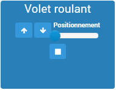

DUWI 05436 "Rollladen" 
==========================

\.

-   **Das Modul**

\.

\.

-   **Das Jeedom Visual**

\.

\.

Zusammenfassung 
------

\.

Das Rollladenmodul DUWI 05436 dient zur Steuerung von Rollläden
in zwei Richtungen rollen.

Seine Hauptmerkmale sind :

-   Die Möglichkeit, ein "Common" zu verwenden, um den Aufstieg zu wechseln
    oder der Abstieg. So ist es möglich, beide zu bestellen
    Richtungen mit jeder Art von Spannung, auch ein Neutralleiter.

-   Die Fähigkeit, ein kontinuierliches Auf / Ab-Signal ohne zu senden
    Zeitlimit.

Attention: Dieses Modul sendet seinen Status nicht an den Z-Wave-Controller, wenn
Der Benutzer drückt die Tasten direkt. Du musst eine machen
'Aktualisieren Sie die Position, um die Umfrage zu aktualisieren, oder passen Sie sie an (siehe
weiter).

\.

Funktionen 
---------

\.

-   Hoch / runter

-   Ein gemeinsamer Draht, der beim Auf- oder Abstieg eingeschaltet wird

-   Zum Betrieb ist Neutral erforderlich

-   Sicherungsschutz

-   Anstiegs- und Abfallzeiten einstellbar durch Einstellen oder durch
    Modul lernen

-   Der Schalter wird mit dem Modul geliefert und ist nicht austauschbar

\.

Technische Daten 
---------------------------

\.

-   Modultyp : Z-Wave Empfänger / Aktor

-   230V, 50Hz Stromversorgung

-   Neutral erforderlich

-   Maximale Belastung : 1800 W (ohmsch), 460 VA (induktiv)

-   Sicherung : T8AH

-   Frequenz : 868,42 MHz

-   Abmessungen : 52 x 52 x 31 mm

-   Temperaturbereich : 0 ° C / + 40 ° C

\.

Moduldaten 
-----------------

\.

-   Machen Sie : Popp / Duwi

-   Name : ZW ESJ Blind Control

-   Hersteller ID : 100

-   Produkttyp : 16385

-   Produkt-ID : 0

\.

Einloggen 
---------

\.

Konfiguration 
-------------

\.

So konfigurieren Sie das OpenZwave-Plugin und wissen, wie Sie Jeedom einsetzen
Aufnahme beziehen sich darauf
[Dokumentation](https://jeedom.fr/doc/documentation/plugins/openzwave/de_DE/openzwave.html).

\.

> **Wichtig**
>
> Drücken Sie dreimal, um das Modul in den Einschlussmodus zu versetzen
> beim Auf- oder Abstieg. Der Ausschluss erfolgt auf die gleiche Weise.

\.

Einmal enthalten, sollten Sie dies erhalten :

\.

\.

### Befehle 

\.

Sobald das Modul erkannt wurde, werden die dem Modul zugeordneten Befehle ausgeführt
disponibles.

\.

\.

Hier ist die Liste der Befehle :

\.

-   Zustand : Dies ist die aktuelle Position des Verschlusses in Prozent von 0 bis 99

-   Geh runter : Befehl, vollständig abzusteigen

-   Geh hoch : Befehl, vollständig zu mounten

-   STOP : Sofortiger Bewegungsstopp

-   Aktualisieren : Aktualisieren Sie den aktuellen Status des Moduls

-   Ebene : Schieberegler zum Positionieren einer Teilöffnung

\.

#### Einstellen der Anstiegs- und Abfallzeiten : 

Der Schalter muss entfernt werden, um auf die beiden Tasten zugreifen zu können
"Aufstieg "und" Abstieg".

Positionieren Sie die Klappe ganz oben, wenn Sie die Einstellung vornehmen möchten
Abstieg und umgekehrt.

Drücken Sie mindestens 2 Sekunden auf beiden Tasten (nach oben und unten)
gleichzeitig. Die LED sollte grün blinken.

Halten Sie dann die Abwärts- oder Aufwärts-Taste gedrückt,
bis zum Erreichen der gewünschten Position. Wenn Sie die Taste loslassen, wird die
Die LED leuchtet einige Sekunden lang grün. Die Zeit wird gespeichert.

Wiederholen Sie den Vorgang in die andere Richtung.

\.

### Konfiguration des Moduls 

\.

Dann, wenn Sie das Modul entsprechend konfigurieren möchten
Ihrer Installation müssen Sie durch die Schaltfläche gehen
"Konfiguration "des OpenZwave-Plugins von Jeedom.

\.

\.

Sie gelangen auf diese Seite (nachdem Sie auf die Registerkarte geklickt haben
Einstellungen)

\.

\.

Parameterdetails :

\.

-   0 : Laufzeit :

Dies sind die Anstiegs- und Abfallzeiten. Sie sollten Ihre finden
apprentissage.

Die Codierung erfolgt durch zwei Bytepaare : der erste für den Aufstieg
und der zweite für den Abstieg.

Die Werte werden im Modul hexadezimal codiert und zurückgesetzt
Dezimal in der Jeedom-Anzeige.

Zum Beispiel : für 4626 ergibt dies hexadezimal : 0x1212. Entweder 0x12
für den Aufstieg und 0x12 für den Abstieg. Oder wieder reingebracht
dezimal : 18s für Auf- und Abstieg.

Hinweis : Wenn Sie für diesen Parameter einen Wert auf Null setzen, bedeutet dies, dass die
Das Modul schaltet den Auf- oder Abstieg ohne zeitliche Begrenzung ein. Es wird dauern
Senden Sie dann einen 'Stop', um zu unterbrechen.

-   1 : Stop-Funktionalität : Aktiviert oder deaktiviert :

Wird verwendet, um anzuzeigen, ob während a in die entgegengesetzte Richtung gedrückt wird
Die Verschiebung stoppt den Verschluss oder bringt ihn sofort in die Richtung zurück
opposé.

\.

### Gruppen 

\.

Dieses Modul hat nur eine Zuordnungsgruppe, in der es sein muss
Finden Sie Ihren Z-Wave-Controller.

\.

\.

Gut zu wissen 
------------

\.

-   Wie zu Beginn angegeben, meldet das Modul keine Änderungen in
    Positionen, die der Benutzer durch direktes Drücken gemacht hat
    auf dem Schalter. Für eine Rückkehr des Staates ist es daher notwendig :

        o Konfigurieren Sie entweder eine Umfrage nach 5 Minuten in der Konfiguration, Registerkarte 'Werte'

    o Erstellen Sie entweder ein Szenario, in dem der Befehl 'Aktualisieren' alle x Minuten (mindestens 1 Minute) gestartet wird

-   Das Einstellen einer Operation ohne zeitliche Begrenzung kann sich als richtig erweisen
    nützlich für VMC-Befehle

\.

### Alternative visuelle 

\.

> **Spitze**
>
> Das Widget "Store\_2\_IMG", das im Infobefehl "Status" verwendet wird. Das hier
> Widget ist schön, weil es "teilweise geöffnete" Zustände anzeigt'.

**@Theduck38**
