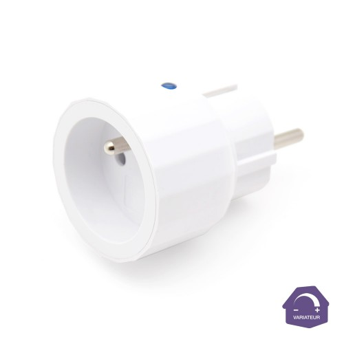

 
====================================

\.

-   **Das Modul**

\.

\.

-   **Das Jeedom Visual**

\.

\.

Zusammenfassung 
------

\.

Ausschalten der Lichter und elektrischen Geräte Ihres

. 
.

welcher Z-Wave-Controller in Ihrem Netzwerk.

\.

Funktionen 
---------

\.

-   

-   Steckermodul direkt zwischen Steckdose und integriert
    die Ladung auf Bestellung

-   EIN / AUS und Dimmerfunktion zur Steuerung der Lampen

-   Lokale Ladesteuerung über integrierte Taste

-   Z-Wave Plus-Technologie

-   Reduzierte Abmessungen bleiben fast unbemerkt

-   Status-LED an der integrierten Taste

-   Z-Wave-Repeater-Funktion

\.

Technische Daten 
---------------------------

\.

-   Modultyp : Z-Wave Empfänger

-   Versorgung : 230 V, 50 Hz

-   Verbrauch : 0,6 W.

-   Maximale Leistung : Widerstandslast : 250W, Glühlampe
    : 250W, LED-Lampe (nicht dimmbar) : 

-   Frequenz : 868,42 MHz

-   Geltungsbereich : bis zu 70 m im Freien, bis zu 30 m in Gebäuden

-   Anzeigen: LED auf der Taste

-   Abmessungen : Länge (Stecker enthalten) : 74mm Durchmesser : 

\.

Moduldaten 
-----------------

\.

-   Machen Sie : 

-   Name : Miniplug Dimmer

-   Hersteller ID : 96

-   Produkttyp : 3

-   Produkt-ID : 3

\.

Konfiguration 
-------------

\.

So konfigurieren Sie das OpenZwave-Plugin und wissen, wie Sie Jeedom einsetzen
Aufnahme beziehen sich darauf
[documentation](https://jeedom.fr/doc/documentation/plugins/openzwave/de_DE/openzwave.html).

\.

> **Wichtig**
>
> Um dieses Modul in den Einschlussmodus zu versetzen, drücken Sie dreimal auf das Modul
> Knopf, entsprechend seiner Papierdokumentation. Es ist wichtig zu
> Beachten Sie, dass dieses Modul direkt in die Aufnahme geht, wenn
> gehört zu keinem Netzwerk und wird mit Strom versorgt

\.

\.

Einmal enthalten, sollten Sie dies erhalten :

\.

\.

### Befehle 

\.

Sobald das Modul erkannt wurde, werden die dem Modul zugeordneten Befehle ausgeführt
verfügbar.

\.

\.

Hier ist die Liste der Befehle :

\.

-   Intensität : Dies ist der Befehl zum Einstellen der Intensität des
    Steckdose

-   Ein : Dies ist der Befehl, der die Steckdose einschaltet

-   Aus : Es ist der Befehl, der es ermöglicht, den Fang zu löschen

-   Zustand : Es ist der Befehl, mit dem der Status des
    Steckdose

\.

Beachten Sie, dass im Dashboard die Informationen Status, EIN / AUS, Intensität angezeigt werden
auf dem gleichen Symbol gefunden.

\.

### Konfiguration des Moduls 

\.

Sie können das Modul entsprechend Ihrer Konfiguration konfigurieren
Installation. Dies erfordert das Durchlaufen der Schaltfläche "Konfiguration" des
Jeedom OpenZwave Plugin.

\.

\.

Sie gelangen auf diese Seite (nachdem Sie auf die Registerkarte geklickt haben
Einstellungen)

\.

\.

Parameterdetails :

\.

-   1 : Dieser Parameter definiert den Statuswertbefehl, dies ist jedoch nicht der Fall
    empfohlen, diesen Wert zu ändern.

-   2 : Dieser Parameter definiert die Verzögerung beim Senden der Statusänderung an
    Gruppe 1 (Wert zwischen 3 und 25 Sekunden)

-   3 : Mit diesem Parameter wird festgelegt, ob der Socket seinen Status wieder aufnehmen soll
    (EIN oder AUS) nach einer Wiederherstellung der Stromversorgung.

-   4 : Mit diesem Parameter können Sie festlegen, ob die Steckdose in Betrieb sein soll
    Variation oder im Ein / Aus-Modus

### Gruppen 

\.

Dieses Modul hat 2 Zuordnungsgruppen.

\.

\.

> **Wichtig**
>
> Jeedom sollte mindestens in Gruppe 1 landen

Gut zu wissen 
------------

\.

### Besonderheiten 

\.

-   Die Statusrückmeldung kann nicht unter 3 konfiguriert werden
    Sekunden. \.

Aufwachen 
------

\.

Keine Vorstellung von Aufwecken auf diesem Modul.

\.

Faq. 
------

\.

Ja, es ist Parameter 2 und kann nicht unter 3 eingestellt werden
Sekunden.

\.

**@sarakha63**
