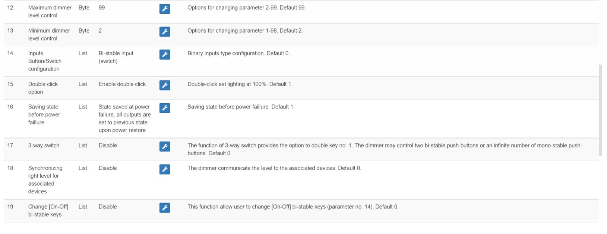

 
=======================

\.

-   **Das Modul**

\.

\.

-   **Das Jeedom Visual**

\.

\.

Zusammenfassung 
------

\.

Lampe oder Deckenleuchte aus der Ferne dank des Z-Wave-Protokolls während
Behalten Sie Ihren vorhandenen Schalter.

Sie können daher die angeschlossene Lampe aktivieren und variieren
Intensität mit dem vorhandenen Schalter, einem Z-Wave-Sender oder
direkt von der Taste am Mikromodul. Er ist

. 

.

.

.

. ,

. 

.

\.

Funktionen 
---------

\.

-   Fernbeleuchtung

-   Wird hinter einem vorhandenen Switch installiert

-   EIN / AUS und Variationsfunktion

-   Verwendung im 2-Draht-Modus (Neutralleiter nicht erforderlich)

-   Automatische Lasterkennung

-   Geschützt gegen Überlastung

-   Klein, diskret und ästhetisch

-   Benutzerfreundlichkeit und Installation

\.

Technische Daten 
---------------------------

\.

-   Modultyp : Z-Wave Empfänger

-   Versorgung : 230 V, 50 Hz

-   Verkabelung : Neutral nicht erforderlich

-   Maximale Belastung : .

-   Kompatibler Lampentyp (dimmbar) : Glühlampe, Fluocompact,
    Halogen (230VAC und 12VDC mit elektronischem Transformator), LED

-   Kompatibler Lampentyp (nicht dimmbar) : Kompaktleuchtstoff, LED

-   Sicherung : 

-   Frequenz : 868,42 MHz

-   Übertragungsentfernung : 50 m freies Feld, 30 m drinnen

-   Abmessungen: 

-   Betriebstemperatur : 0-40 ° C.

-   Temperatur begrenzen : 105 ° C.

-   Standards : 

\.

Moduldaten 
-----------------

\.

-   Machen Sie : Fibar Group

-   Name : Fibaro FGMS-001 \ [Bewegungssensor \]

-   Hersteller ID : 271

-   Produkttyp : 256

-   Produkt-ID : 4106

\.

Konfiguration 
-------------

\.

So konfigurieren Sie das OpenZwave-Plugin und wissen, wie Sie Jeedom einsetzen
Aufnahme beziehen sich darauf
[documentation](https://jeedom.fr/doc/documentation/plugins/openzwave/de_DE/openzwave.html).

\.

> **Wichtig**
>
> Um dieses Modul in den Einschlussmodus zu versetzen, drücken Sie die Taste dreimal
> Einschlussknopf gemäß seiner Papierdokumentation.

\.

\.

> **Spitze**
>
> Wenn Sie Ihr Modul bereits an der Wand integriert haben, können Sie es einbinden
> 
> .

\.

Einmal enthalten, sollten Sie dies erhalten :

\.

\.

### Befehle 

\.

Sobald das Modul erkannt wurde, werden die dem Modul zugeordneten Befehle ausgeführt
verfügbar.

\.

\.

Hier ist die Liste der Befehle :

\.

-   Intensität : Mit diesem Befehl können Sie die Intensität des einstellen
    Licht

-   Ein : Es ist die Steuerung, die das Licht einschaltet

-   Aus : 

-   Zustand : Es ist der Befehl, mit dem der Status des
    Licht

Symbol

\.

### Konfiguration des Moduls 

\.

Sie können das Modul entsprechend Ihrer Konfiguration konfigurieren
Installation. Dies erfordert das Durchlaufen der Schaltfläche "Konfiguration" des
Jeedom OpenZwave Plugin.

\.

\.

Sie gelangen auf diese Seite (nachdem Sie auf die Registerkarte geklickt haben
Einstellungen)

\.

\.

Parameterdetails :

\.

-   1:  : 
    

-   6: 
    

-   7: 
    

-   8: 

-   9: 

-   10: 

-   11: 

-   12: 

-   13: 

-   14:  : 
    

-   15: 
    

-   16: 

-   17: 
    

-   18: 
    

-   19: 
    

-   20: 
    

-   30: 
    

-   39: 

-   41: 

\.

### Gruppen 

\.

Dieses Modul hat drei Assoziationsgruppen, nur die dritte ist
wesentlich.

\.

\.

Gut zu wissen 
------------

\.

### Besonderheiten 

\.

> **Kaution**
>
> 
> . 
> .

\.

\.

### Alternative visuelle 

\.

\.

Aufwachen 
------

\.

Keine Vorstellung von Aufwecken auf diesem Modul.

\.

Faq. 
------

\.

Nein, nein. Dieses Modul kann durch mehrmaliges Drücken ein- oder ausgeschlossen werden
auf dem Schalter.

\.
**@sarakha63**
