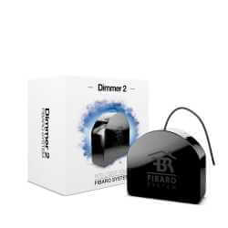
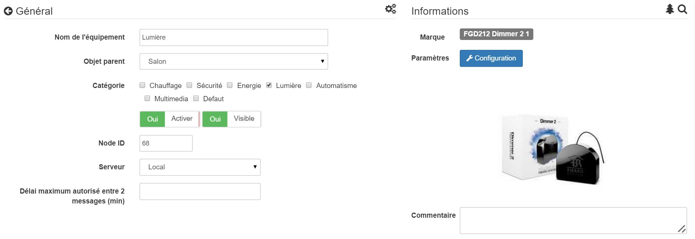
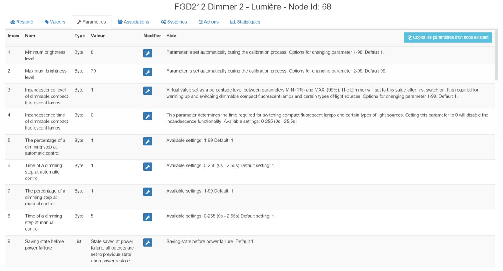
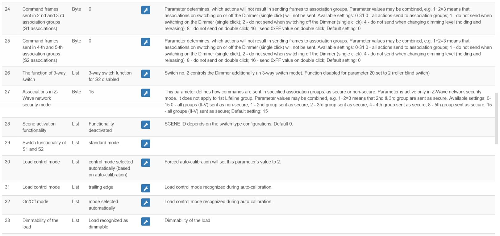

Fibaro Dimmer2 - REA-212 
========================

-   **Das Modul**

-   **Das Jeedom Visual**

Zusammenfassung 
------

Mit dem Dimmermodul FGD-212 können Sie a steuern
Lampe oder Deckenleuchte aus der Ferne dank des Z-Wave-Protokolls während
Behalten Sie Ihren vorhandenen Schalter.

Sie können daher die angeschlossene Lampe aktivieren und variieren
Intensität mit dem vorhandenen Schalter, einem Z-Wave-Sender oder
direkt von der Taste am Mikromodul.

Das neue Fibaro FGD-212-Laufwerk ist mit einem ausgestattet
intelligente Lichtquellenerkennung, die erleichtert
Konfiguration und sorgt für hohe Kompatibilität des Gerätes. Er
hat Selbstschutz gegen Überlastung und die Funktion von
sanfter Start. Bei nicht dimmbaren Lichtquellen,
nur die EIN / AUS-Funktion ist möglich (bei 3-Draht-Verbindung).

Es ist kompatibel mit allen Arten von Lampen, die Variationen oder unterstützen
nein Neben der Variationsfunktion kann dieses Mikromodul auch
Messen Sie den Stromverbrauch der angeschlossenen Last. Die Werte
Momentanverbrauch (in W) und Gesamtstromverbrauch
(in kWh) kann angezeigt werden.

Funktionen 
---------

-   Fernbeleuchtung

-   Wird hinter einem vorhandenen Switch installiert

-   EIN / AUS und Variationsfunktion

-   Verwendung im 2-Draht-Modus (Neutralleiter nicht erforderlich)

-   Integriert den Chip der Z-Wave 500-Serie

-   250% schnellere Kommunikation im Vergleich zu Z-Wave-Geräten
    standard

-   Automatische Lasterkennung

-   Geschützt gegen Überlastung

-   Kompatibel mit allen Z-Wave- und Z-Wave + -Controllern

-   Wirkleistung und Energiemessfunktion

-   Funktioniert mit verschiedenen Arten von Drucktastenschaltern,
    Rocker, Dreiwege usw.

-   Softstart-Funktion

-   LED zur Anzeige des Einschlussstatus, der Kalibrierung und
    MENÜ-Ebenen

-   Integrierter Z-Wave-Bereichstester

-   Erkennt automatisch Verdrahtungsfehler, hohe Temperatur,
    Glühbirne, Überspannungen und Überlastungen durchgebrannt

-   Erweiterte Konfigurationsoptionen

-   Klein, diskret und ästhetisch

-   Benutzerfreundlichkeit und Installation

Technische Daten 
---------------------------

-   Modultyp : Z-Wave Empfänger

-   Versorgung : 230 V +/- 10%, 50 Hz

-   Verbrauch : 1,3W

-   Verkabelung : Neutral nicht erforderlich

-   Maximale Belastung : 50-250 W (ohmsche Last) oder 0,25-1,1A
    (induktive Last)

-   Kompatibler Lampentyp (dimmbar) : Glühlampe, Fluocompact,
    Halogen (230VAC und 12VDC mit elektronischem Transformator), LED

-   Kompatibler Lampentyp (nicht dimmbar) : Kompaktleuchtstoff, LED

-   Frequenz : 868,42 MHz

-   Signalstärke : 1mW

-   Übertragungsentfernung : 50 m freies Feld, 30 m drinnen

-   Abmessungen : 42.5 x 38.25 x 20,3 mm

-   Betriebstemperatur : 0-35 ° C

-   Temperatur begrenzen : 105°C

-   Standards : RoHS 2011/65 / EU, LVD 2006/95 / EG, EMV 2004/108 / EG, R & TTE
    1999/5/EC

Moduldaten 
-----------------

-   Machen Sie : Fibar Group

-   Name : REA-Dimmer 2

-   Hersteller ID : 271

-   Produkttyp : 258

-   Produkt-ID : 4096

Konfiguration 
-------------

So konfigurieren Sie das OpenZwave-Plugin und wissen, wie Sie Jeedom einsetzen
Aufnahme beziehen sich darauf
[Dokumentation](https://doc.jeedom.com/de_DE/plugins/automation%20protocol/openzwave/).

> **Wichtig**
>
> Um dieses Modul in den Einschlussmodus zu versetzen, drücken Sie die Taste dreimal
> Einschlussknopf gemäß seiner Papierdokumentation. Wenn die
> Modul ist nicht bereits enthalten, es wird enthalten sein
> automatisch beim Einschalten.

> **Spitze**
>
> Wenn Sie Ihr Modul bereits an der Wand integriert haben, können Sie es einbinden
> durch viele Rundfahrten auf dem Schalter oder
> viele Drücke, wenn Sie einen Druckknopfschalter haben.

Einmal enthalten, sollten Sie dies erhalten :

### Befehle 

Sobald das Modul erkannt wurde, werden die den Modulen zugeordneten Befehle ausgeführt
disponibles.

Hier ist die Liste der Befehle :

-   Intensität : Mit diesem Befehl können Sie die Intensität des einstellen
    Licht

-   Ein : Es ist die Steuerung, die das Licht einschaltet

-   Aus : Es ist der Befehl, der das Licht ausschaltet

-   Zustand : Es ist der Befehl, mit dem der Status des
    Licht

-   Verbrauch : Es ist der Befehl, der es erlaubt, die
    Modulverbrauch

-   Macht : Es ist der Befehl, mit dem die Leistung erhöht werden kann
    Modul sofort

Beachten Sie, dass sich im Dashboard alle Informationen auf derselben befinden
icone

### Konfiguration des Moduls 

Sie können das Modul entsprechend Ihrer Konfiguration konfigurieren
Installation. Dies erfordert das Durchlaufen der Schaltfläche "Konfiguration" des
Jeedom OpenZwave Plugin.

Sie gelangen auf diese Seite (nachdem Sie auf die Registerkarte geklickt haben
Einstellungen)

Parameterdetails :

ENTWURF SEIN

### Gruppen 

Dieses Modul hat fünf Zuordnungsgruppen, nur die erste ist
indispensable.

Gut zu wissen 
------------

### Besonderheiten 

> **Kaution**
>
> Der wichtigste Parameter der Konfiguration ist 20. Es
> ermöglicht die Auswahl des verwendeten Schaltertyps. Standardtyp
> ist auf monostabil eingestellt.

Wenn Sie das Modul ausschließen / einschließen möchten, ohne es zu zerlegen
Schalter Sie können Ihren Schalter mehrmals drücken
(oder im Falle eines bistabilen Schalters hin und her gehen)

### Alternative visuelle 

Aufwachen 
------

Keine Vorstellung von Aufwecken auf diesem Modul.

Faq. 
------

Nein, nein. Dieses Modul kann durch mehrmaliges Drücken ein- oder ausgeschlossen werden
auf dem Schalter.

**@sarakha63**
