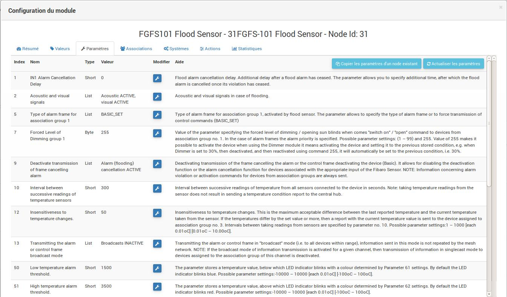
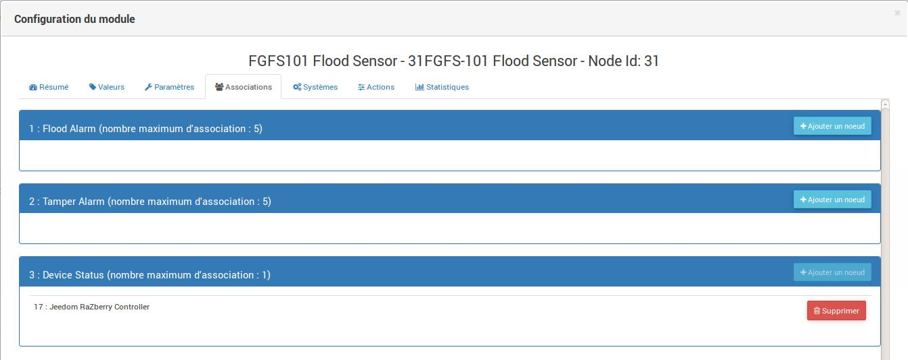

" 
==============================

\.

-   **Das Modul**

\.

\.

-   **Das Jeedom Visual**

\.

\.

Zusammenfassung 
------

\.

.

.

. 

.

. 
.

. 
.

.

\.

Funktionen 
---------

\.

-   

-   

-   

-   

-   

-    ?? 

\.

Technische Daten 
---------------------------

\.

-   Modultyp : Z-Wave Sender

-    : 

-   Batterietyp : 

-   Akkulaufzeit : 2 Jahre

-    : 

-    :

-    : 

-   Frequenz : 868,42 MHz

-   Übertragungsentfernung : 50 m freies Feld, 30 m drinnen

-   Abmessungen : 

-   Betriebstemperatur : 
    

-   Temperaturmessbereich : -20 bis 100 ° C.

-   Messgenauigkeit : 

-   Standards : EMC 2004/108 / EC und R & TTE 199/5 / WE

\.

Moduldaten 
-----------------

\.

-   Machen Sie : Fibar Group

-   Modell : 

-   Hersteller : 

-   Hersteller ID : 271

-   Produkttyp : 2816

-   Produkt-ID : 4097

\.

Konfiguration 
-------------

\.

So konfigurieren Sie das OpenZwave-Plugin und wissen, wie Sie Jeedom einsetzen
Aufnahme beziehen sich darauf
[documentation](https://jeedom.fr/doc/documentation/plugins/openzwave/de_DE/openzwave.html).

\.

> **Wichtig**
>
> Um dieses Modul in den Einschlussmodus zu versetzen, drücken Sie die Taste dreimal
> 
> .

\.

\.

Einmal enthalten, sollten Sie dies erhalten :

\.

\.

### Befehle 

\.

Sobald das Modul erkannt wurde, werden die dem Modul zugeordneten Befehle ausgeführt
verfügbar.

\.

\.

Hier ist die Liste der Befehle :

\.

-   Leck : 
    

-   Temperatur : Es ist der Temperaturmessbefehl

-   Sabotage : Dies ist der Sabotagebefehl. Es signalisiert die Öffnung
    des Falles

-   Batterie : Es ist der Batteriebefehl

\.

### Konfiguration des Moduls 

\.

> **Wichtig**
>
> Wecken Sie das Modul bei einer ersten Aufnahme immer gleich danach auf
> Einbeziehung.

\.

Dann muss das Modul in konfiguriert werden
abhängig von Ihrer Installation. Dies erfordert das Durchgehen der Schaltfläche
"Konfiguration "des OpenZwave-Plugins von Jeedom.

\.

\.

Sie gelangen auf diese Seite (nachdem Sie auf die Registerkarte geklickt haben
Einstellungen)

\.

\.

Parameterdetails :

\.

-   Aufwachen : Dies ist das Modul-Aufweckintervall (Wert
    

-   .  :
    valeur de 0 à 3600 s (0 par défaut/ dès qu‘il n'y a plus de détection il
    

-   . . Wert :

        0 : 
        1 : 
        2 : 
        3 : .

-   .  : 
    . 
    
    Geschwindigkeit ! 

-   .  : 
    = . 
    
    .

-   .  : 
    
    .

-   51. : 
    
    .

-   .  : 
    = 
    

-   .  : ,
    

\.

### Gruppen 

\.

. 
:

\.

\.

Gut zu wissen 
------------

\.

Aufwachen 
------

\.

\.

Faq. 
------

\.

.

\.

.

\.

Wichtiger Hinweis 
---------------

\.

> **Wichtig**
>
> Sie müssen das Modul aufwecken : nach seiner Aufnahme, nach einer Änderung
> der Konfiguration, nach einer Änderung des Aufweckens, nach a
> Änderung der Assoziationsgruppen

\.

\.
 :
<http://blog.domadoo.fr/2014/12/18/jeedom-guide-dutilisation-du-detecteur-dinondation-fibaro-fgfs-001/>
 :
<http://www.fibaro.com/manuals/en/-Flood-Sensor/-Flood-Sensor-en-2.1-2.3.pdf>

\.

