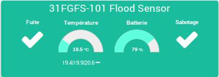
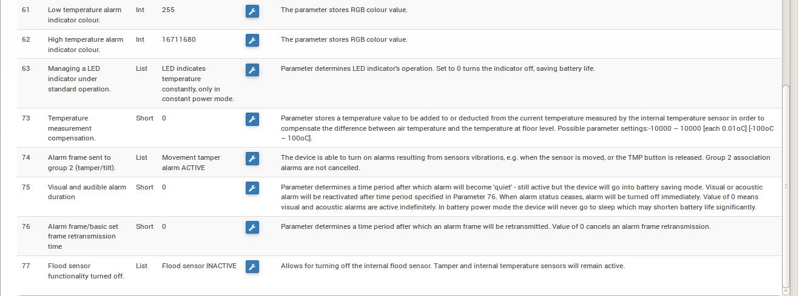

# Fibaro FGFS-101 "Hochwassersensor"

**Das Modul**

**Das Jeedom Visual**

## Zusammenfassung

. .

.

. .

. .

. . .

.

## Fonctions

-   Hochwassermelder (Vorhandensein von Wasser über Kontakte)
-   Temperaturdetektor
-   Neigungsdetektor
-   Akustischer und visueller Alarm
-   Z-Wave-Entfernungsmesser
-   Z-Wave Repeater ?? (siehe Abschnitt "Gut zu wissen")

## Technische Daten

-   Modultyp : Z-Wave Sender
-   Das Modul kann extern mit Strom versorgt werden : 12 - 24 VDC
-   Batterietyp : CR123A
-   Akkulaufzeit : 2 Jahre
-   Verbrauch an externer Stromversorgung : 0,4W
-   Maximal am Ausgang unterstützter Strom (ALARM NC, TAMP NC) :25mA
-   Maximale am Ausgang unterstützte Spannung : 40 V (AC oder DC)
-   Frequenz : 868,42 MHz
-   Übertragungsentfernung : 50 m freies Feld, 30 m drinnen
-   Abmessungen : 72 x 28 mm (Durchmesser x Höhe)
-   Betriebstemperatur : 
-   Temperaturmessbereich : -20 bis 100 ° C.
-   Messgenauigkeit : 0,5 ° C (in einem Bereich von 0 bis 40 ° C)
-   Standards : EMC 2004/108 / EC und R & TTE 199/5 / WE

## Moduldaten

-   Machen Sie : Fibar Group
-   Modell : Hochwassersensor FGFS101
-   Hersteller : FIBARO-System
-   Hersteller ID : 271
-   Produkttyp : 2816
-   Produkt-ID : 4097

## Configuration

Informationen zum Konfigurieren des OpenZwave-Plugins und zum Einfügen von Jeedom finden Sie hier [Dokumentation](https://doc.jeedom.com/de_DE/plugins/automation%20protocol/openzwave/).

> **Wichtig**
>
> .

Einmal enthalten, sollten Sie dies erhalten :

### Commandes

Sobald das Modul erkannt wurde, sind die dem Modul zugeordneten Befehle verfügbar.

Hier ist die Liste der Befehle :

-   Leck : 
-   Temperatur : Es ist der Temperaturmessbefehl
-   Sabotage : Dies ist der Sabotagebefehl. 
-   Batterie : Es ist der Batteriebefehl

### Konfiguration des Moduls

> **Wichtig**
>
> Wecken Sie das Modul bei einer ersten Aufnahme immer unmittelbar nach der Aufnahme auf.

Dann ist es notwendig, das Modul entsprechend Ihrer Installation zu konfigurieren. Gehen Sie dazu auf die Schaltfläche "Konfiguration" des OpenZwave-Plugins von Jeedom.

Sie gelangen auf diese Seite (nachdem Sie auf die Registerkarte Einstellungen geklickt haben)

Parameterdetails :

-   Aufwachen : 
-   1 \. Verzögerung der Alarmstornierung nach Erkennung einer Überschwemmung : valeur de 0 à 3600 s (0 par défaut/ dès qu‘il n'y a plus de détection il s'arrête instantanément)
-   2 \. Wahl des Alarmtyps. Wert :
  - 0 : Akustischer und optischer Alarm deaktiviert
  - 1 : Akustischer Alarm deaktiviert und visueller Alarm aktiviert
  - 2 : Akustischer Alarm ein und visueller Alarm aus
  - 3 : Akustischer und visueller Alarm aktiviert.
-   10 \. Übertragungszeit zwischen zwei Temperaturmesswerten : .  ! (1800 wird empfohlen)
-   12 \. Temperaturunterschied zwischen zwei Berichten : . .
-   50 \. Einstellen des Niedertemperaturalarms : .
-   51.Hochtemperaturalarm einstellen : .
-   73 \. Temperaturkompensation : 
-   75 \. Einstellen der Dauer des Alarms : 

### Groupes

Für einen optimalen Betrieb Ihres Moduls. :

## Gut zu wissen

Verkabelung für externe Stromversorgung.

## Wakeup

Um dieses Modul zu aktivieren, drücken Sie dreimal die zentrale Taste

## Faq.

Dieses Modul wird durch dreimaliges Drücken der Einschlusstaste aktiviert.

.

## Wichtiger Hinweis

> **Wichtig**
>
> Sie müssen das Modul aufwecken : nach seiner Aufnahme, nach einer Änderung der Konfiguration, nach einer Änderung des Aufweckens, nach einer Änderung der Assoziationsgruppen

Verwendungsdetails [hier](http://blog.domadoo.fr/2014/12/18/jeedom-guide-dutilisation-du-detecteur-dinondation-fibaro-fgfs-001/)
 [Englisch](http://www.fibaro.com/manuals/en/FGFS-101-Flood-Sensor/FGFS-101-Flood-Sensor-en-2.1-2.3.pdf)
