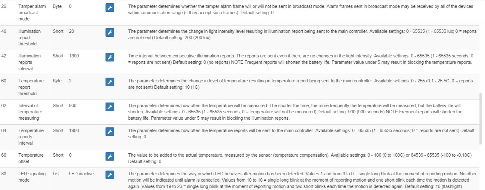
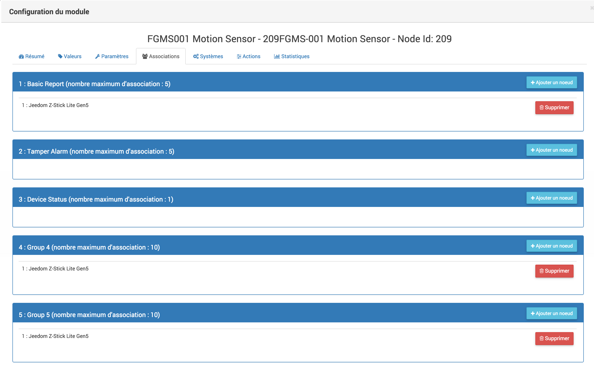

# Fibaro-Bewegungssensor - FGMS-001

**Das Modul**

 **Das Jeedom Visual**

## Zusammenfassung

Der Fibaro-Bewegungsmelder ist ein Z-Wave-Multifunktionsdetektor. . .

. .

.

## Fonctions

-   Drahtloser Bewegungsmelder
-   Erkennt Bewegungen mithilfe eines passiven Infrarotsensors
-   Temperaturmessung
-   Lichtintensitätsmessung
-   Seismische Intensitätsmessung
-   Einbruch- und Diebstahlschutz
-   
-   Taste zum Ein- / Ausschließen des Detektors
-   Erkennung schwacher Batterie
-   Sehr kleine, reduzierte Abmessungen
-   Einfache Installation an einer Wand oder einer anderen Oberfläche

## Technische Daten

-   Modultyp : Z-Wave + Sender
-   Versorgung : CR123A 3,6VDC Batterie
-   Empfohlene Höhe für die Installation : 2,4m
-   Gemessener Temperaturbereich : -20 ° C bis 100 ° C
-   Messgenauigkeit : 0,5°C
-   Helligkeitsmessbereich : 0-32000 LUX
-   Frequenz : 868,42 MHz
-   Übertragungsentfernung : 50 m freies Feld, 30 m drinnen
-   Dimensions: 4,4 cm Durchmesser
-   Betriebstemperatur : 0-40 ° C
-   Zertifizierungen : 

## Moduldaten

-   Machen Sie : Fibar Group
-   Name : Fibaro FGMS-001-ZW5 \ [Bewegungssensor \]
-   Hersteller ID : 271
-   Produkttyp : 2048
-   Produkt-ID : 4097

## Configuration

Informationen zum Konfigurieren des OpenZwave-Plugins und zum Einfügen von Jeedom finden Sie hier [Dokumentation](https://doc.jeedom.com/de_DE/plugins/automation%20protocol/openzwave/).

> **Wichtig**
>
> Um dieses Modul in den Einschlussmodus zu versetzen, drücken Sie die Einschlusstaste gemäß der Papierdokumentation dreimal.

 :

### Commandes

. Sobald das Modul erkannt wurde, sind die dem Modul zugeordneten Befehle verfügbar.

Hier ist die Liste der Befehle :

-   Präsenz : Es ist der Befehl, der eine Anwesenheitserkennung erkennt
-   Temperatur : Es ist der Befehl, der es ermöglicht, die Temperatur zu erhöhen
-   Helligkeit : Es ist der Befehl, der es ermöglicht, die Helligkeit zu erhöhen
-   Seismisch : 
-   Sabotage : 
-   Batterie : Es ist der Batteriebefehl

### Konfiguration des Moduls

> **Wichtig**
>
> Wecken Sie das Modul bei einer ersten Aufnahme immer unmittelbar nach der Aufnahme auf.

Wenn Sie das Modul dann entsprechend Ihrer Installation konfigurieren möchten, müssen Sie die Schaltfläche "Konfiguration" des OpenZwave-Plugins von Jeedom aufrufen.

Sie gelangen auf diese Seite (nachdem Sie auf die Registerkarte Einstellungen geklickt haben)

Parameterdetails :

-   Aufwachen : 
-   1: Stellt die Empfindlichkeit des Anwesenheitssensors ein
-   2: Stellt die Trägheit des Anwesenheitssensors ein
-   3: Es wird nicht empfohlen, diese Einstellung zu ändern
-   4: Es wird nicht empfohlen, diese Einstellung zu ändern
-   6: 
-   8:  : immer aktiv)
-   9: 
-   12: 
-   14: idem
-   16: idem
-   20: Empfindlichkeit des Kreiselsensors (empfohlener Wert 15)
-   22: 
-   24: Hier erfahren Sie, wie die Sabotage gemeldet wird (WICHTIG : empfohlener Wert : 
-   26: nur zu ändern, wenn Sie wissen, warum Sie es tun
-   40: 
-   42: 
-   60: .2 Grad)
-   62: 
-   64: 
-   66: ermöglicht die Einstellung der Temperatur
-   80: 
-   81: ermöglicht die Einstellung der Helligkeit der LED
-   82: 
-   83: 
-   86: 
-   87: 
-   89: 

### Groupes

> **Spitze**
>
> .

Die Namen der Gruppen in der Z-Wave + -Version lauten wie folgt:

-   1 : Lifeline, Modulstatus-Feedback. .
-   2 : Bewegung, Bewegungssensor.
-   3 : Manipulation, Sabotagealarm.
-   4 : Bewegung BC, Bewegungssensor. .
-   5 : Tamper BC, Sabotagealarm. .

## Gut zu wissen

### Besonderheiten

> **Spitze**
>
> . .

### Alternative visuelle

## Wakeup

Um dieses Modul aufzuwecken, gibt es nur einen Weg :

-   . 

## Faq.

Dieses Modul wird durch dreimaliges Drücken der Einschlusstaste aktiviert.

Dieses Modul ist sehr pingelig. .

Dieses Modul ist ein Batteriemodul, die neue Konfiguration wird beim nächsten Aufwecken berücksichtigt.

## Wichtiger Hinweis

> **Wichtig**
>
> Sie müssen das Modul aufwecken : nach seiner Aufnahme, nach einer Änderung der Konfiguration, nach einer Änderung des Aufweckens, nach einer Änderung der Assoziationsgruppen
