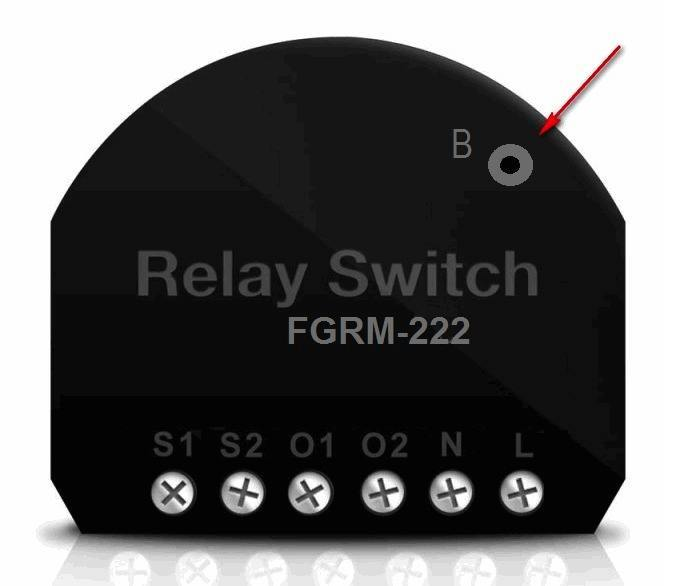

# Fibaro FGR-222 "Rollladen"

**Das Modul**

**Das Jeedom Visual**

## Zusammenfassung

Mit dem Mikromodul FGR-222 können Sie dank des Z-Wave-Protokolls die Motorisierungen des Verschlusses mit elektronischem Stopp, Jalousien oder sogar Garagentoren verwalten und dabei Ihren vorhandenen Schalter beibehalten. Sie können den angeschlossenen Motor daher über den vorhandenen Schalter, einen Z-Wave-Sender oder direkt über die Taste am Mikromodul aktivieren.

Darüber hinaus kann dieses Mikromodul den momentanen (W) und kumulativen (KWh) Stromverbrauch der daran angeschlossenen Geräte übertragen.

Ein Z-Wave-Controller (Fernbedienung, Dongle usw.) ist erforderlich, um dieses Modul in Ihr Netzwerk zu integrieren, wenn Sie bereits über ein vorhandenes Netzwerk verfügen.

Jedes Z-Wave-Modul funktioniert wie ein drahtloser Repeater mit den anderen Modulen, um eine vollständige Abdeckung Ihres Hauses zu gewährleisten.

Notiz : Dieses Modul benötigt zum Betrieb einen Neutralleiter.

## Funktionen

-   Steuern Sie Ihre Jalousien oder Rollläden fern
-   Kompatibel mit BSO und Jalousie mit Lamellenpositionierung
-   Wird hinter einem vorhandenen Switch installiert
-   Auf / Ab und Positionierungsfunktion
-   Kompatibel mit Motoren mit mechanischem oder elektronischem Anschlag
-   Messung des momentanen und kumulativen Verbrauchs
-   Drahtloses Update mit der Fibaro Home Center 2-Box
-   Testfunktion für die Z-Wave-Netzabdeckung
-   Klein, diskret und ästhetisch
-   Benutzerfreundlichkeit und Installation

## Technische Daten

-   Modultyp : Z-Wave Empfänger
-   Versorgung : 230 V, 50 Hz
-   Stromverbrauch : &lt; 0,8W
-   Verkabelung : 3 Draht, Neutralleiter erforderlich
-   Maximale Belastung : 1000W
-   Frequenz : 868,42 MHz
-   Signalstärke : 1mW
-   Übertragungsentfernung : 50 m freies Feld, 30 m drinnen
-   Dimensions: 17 x 42 x 37 mm
-   Betriebstemperatur : 0-40 ° C
-   Temperatur begrenzen : 105°C
-   Standards : )

## Moduldaten

-   Machen Sie : Fibar Group
-   Name : Fibaro FGR-222
-   Hersteller ID : 271
-   Produkttyp : 770
-   Produkt-ID : 4096

## Konfiguration

Informationen zum Konfigurieren des OpenZwave-Plugins und zum Einfügen von Jeedom finden Sie hier [Dokumentation](https://doc.jeedom.com/de_DE/plugins/automation%20protocol/openzwave/).

> **Wichtig**
>
> Um dieses Modul in den Einschlussmodus zu versetzen, drücken Sie die Einschlusstaste gemäß der Papierdokumentation dreimal.

Einmal enthalten, sollten Sie dies erhalten :

### Befehle

Sobald das Modul erkannt wurde, sind die dem Modul zugeordneten Befehle verfügbar.

Hier ist die Liste der Befehle :

-   Zustand : Mit diesem Befehl können Sie die Position Ihres Verschlusses ermitteln
-   Positionierung : Es ist der Befehl, mit dem der Prozentsatz der Öffnung definiert werden kann
-   Auf : Mit diesem Befehl können Sie den Verschluss vollständig öffnen
-   Runter : Es ist der Befehl, der den Verschluss vollständig schließt
-   Aktualisieren : Mit diesem Befehl können Sie erneut nach der Position des Verschlusses fragen
-   Macht : Befehl, der den Verbrauch des Moduls zulässt
-   Verbrauch : Befehl, mit dem die vom Modul verbrauchte Momentanleistung ermittelt werden kann
-   STOP : Steuerung, um die Bewegung des Verschlusses zu stoppen
-   STOP BSO : )
-   Kippen : )
-   Ablehnen : )
-   Nicht : Wird verwendet, um den Schritt zum Drücken von Ablehnen oder Neigen zu definieren

### Konfiguration du module

Wenn Sie das Modul dann entsprechend Ihrer Installation konfigurieren möchten, müssen Sie die Schaltfläche "Konfiguration" des OpenZwave-Plugins von Jeedom aufrufen.

Sie gelangen auf diese Seite (nachdem Sie auf die Registerkarte Einstellungen geklickt haben)

Parameterdetails :

-   1: )
-   2: Das Gleiche gilt für zwave-Befehle
-   3: )
-   10: )
-   12: )
-   13: Hier können Sie auswählen, wann die Lamellen in ihre vorherige Position zurückkehren sollen
-   14: ermöglicht die Auswahl des Schaltertyps
-   17: Hier können Sie auswählen, wie lange nach dem in 18 festgelegten Grenzwert der Verschluss stoppt
-   18: Motorsicherheitsleistung
-   22: NA
-   29: ermöglicht die Kalibrierung der Klappe
-   30 bis 35: ermöglicht es, das Verhalten des Moduls vor den verschiedenen zwave-Alarmen zu definieren
-   40: )
-   42: Info Feedback Zeitraum
-   43: )
-   44: ermöglicht die Auswahl, ob der Verbrauch und die Leistung den des Moduls selbst umfassen müssen oder nicht
-   50: Hier können Sie auswählen, ob das Modul die Informationen im Szenenmodus oder im Assoziationsmodus in Zuordnung an die Knoten senden soll

### Gruppen

Dieses Modul hat 3 Assoziationsgruppen, nur die dritte ist wesentlich.

## Gut zu wissen

### Zurücksetzen

Sie können Ihren Verbrauchszähler zurücksetzen, indem Sie auf diese Schaltfläche auf der Registerkarte System klicken.

### Wichtig

> **Wichtig**
>
> ").

### Alternative visuelle

## Aufwachen

Keine Vorstellung von Aufwecken auf diesem Modul.
