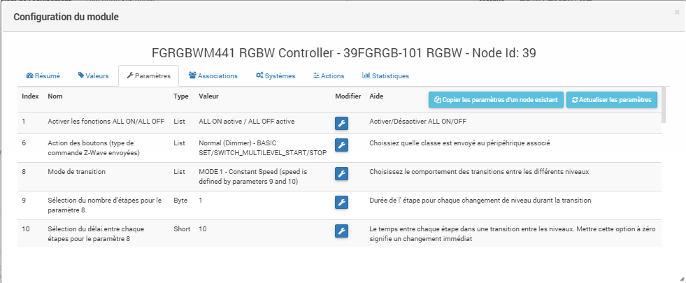

# Fibaro RGVB Controler - FGRGB-101

-   **Das Modul**

-   **Das Jeedom Visual**

## Zusammenfassung

Mit dem Mikromodul Z-Wave Fibaro FGRGB-101 können Sie zwischen 12 / 24V-Niederspannungsbeleuchtung (Halogen oder LED), einem weißen RGB- oder RGB + -LED-Streifen wählen oder sogar analoge Sonden mit dem 0-Standard anschließen. 10V.

-   4 analoge Eingänge 0 bis 10 V zum Anschluss an viele kompatible Sensoren, Potentiometer, Drucktasten (monostabil) oder Schalter (bistabil).
-   4 Dimmerausgänge (PWM) zur Steuerung :
-   1 Kanal mit RGB + weißer LED (RGBW) 12 / 24V
-   \* oder 4 Kanäle mit weißen LEDs 12 / 24V
-   \* oder 4 Kanäle von 12 / 24V-Halogenlampen (144W 12V / 288W 24V max.)
-   \* oder 12 / 24V-Lüfter.
-   Benötigt separate 12 / 24V Stromversorgung.
-   Globale oder sofortige oder kumulative Verbrauchsmessung.
-   Repeater-Funktion (Router) zur Erweiterung des Z-Wave-Netzwerks.

## Funktionen

-   Bestellen Sie Niederspannungslichter 12 / 24V (Halogen oder LED)
-   Wird hinter einem vorhandenen Switch installiert
-   Zuvor programmierte Lichtsimulation
-   EIN / AUS und Variationsfunktion
-   Klein, diskret und ästhetisch
-   Benutzerfreundlichkeit und Installation

## Technische Daten

-   Versorgung : 12 V oder 24 V DC
-   Maximale Ausgangsleistung :
-   \* 12A insgesamt (Addition aller Kanäle),
-   \* 6A max. pro Kanal
-   Maximale Leistung mit Halogenlampen :
-   \* 12V - 144W insgesamt (alle Kanäle),
-   \* 24V - 288W insgesamt (alle Kanäle)
-   PWM-Modulationsfrequenz : 244 Hz
-   Verbrauch : 0,3W
-   Funkprotokoll : Z-Wave bei 868,4 MHz (EU)
-   Z-Wave Sendeleistung : 1mW
-   Betriebstemperatur : 0 - 40 C
-   Zur Installation in Boxen : Ø ≥ 50 mm
-   Abmessungen : 42 x 37 x 17 mm
-   Europäische Standards : EMV 2004/108 / EG R & TTE 199/5 / WE
-   Für dieses Modul ist ein Z-Wave-Controller erforderlich.

## Moduldaten

-   Machen Sie : Fibar Group
-   Name : Fibaro FGRGB-101 RGBW
-   Hersteller ID : 271
-   Produkttyp : 2304
-   Produkt-ID : 4096

## Konfiguration

Informationen zum Konfigurieren des OpenZwave-Plugins und zum Einfügen von Jeedom finden Sie hier [Dokumentation](https://doc.jeedom.com/de_DE/plugins/automation%20protocol/openzwave/).

> **Wichtig**
>
> Um dieses Modul in den Einschlussmodus zu versetzen, drücken Sie die Einschlusstaste gemäß der Papierdokumentation dreimal.

Einmal enthalten, sollten Sie dies erhalten :

### Befehle

Sobald das Modul erkannt wurde, sind die dem Modul zugeordneten Befehle verfügbar.

Hier ist die Liste der Befehle :

-   Farbe : Mit diesem Befehl können Sie den anzuzeigenden Farbcode anpassen
-   Schornstein : Dies ist der Befehl, der eine Kaminatmosphäre simuliert
-   Gewitter : Dies ist der Befehl, der eine Sturmatmosphäre simuliert
-   Morgendämmerung : Es ist der Befehl, der eine Aude-Atmosphäre simuliert (progressiver Sonnenaufgang)
-   Verblassen : Dies ist der Befehl, der das gesamte Farbspektrum simuliert
-   RBB : Dies ist der Befehl, der eine Cop-Atmosphäre simuliert
-   Kaltes Weiß : Dies ist der Befehl, der eine kühle weiße Farbe simuliert, wenn der Farbstreifen dies zulässt. (Dieser Befehl ist standardmäßig nicht sichtbar.)
-   Warmes Weiß : Dies ist der Befehl, der eine warmweiße Farbe simuliert, wenn der Farbstreifen dies zulässt. (Dieser Befehl ist standardmäßig nicht sichtbar.)
-   Ein : Dies ist der Befehl, mit dem das Banner in der zuletzt ausgewählten Farbe aktiviert wird
-   Aus : Dies ist der Befehl, der das Banner ausschaltet
-   Intensität : Es ist die Steuerung, mit der die Lichtintensität eingestellt werden kann

Beachten Sie, dass sich im Dashboard alle Informationen auf demselben Symbol befinden

### Konfiguration du module

Sie können das Modul entsprechend Ihrer Installation konfigurieren. Gehen Sie dazu auf die Schaltfläche "Konfiguration" des OpenZwave-Plugins von Jeedom.

Sie gelangen auf diese Seite (nachdem Sie auf die Registerkarte Einstellungen geklickt haben)

Parameterdetails :

Bitte beachten Sie den vorherigen Screenshot, dessen Parameter ins Französische übersetzt werden.

### Gruppen

Dieses Modul hat fünf Assoziationsgruppen, nur die fünfte ist wesentlich.

## Gut zu wissen

### Besonderheiten

Verwendung von 0-10V Sensoren.

> **Kaution**
>
> Im Moment erlaubt die Standardkonfiguration von jeedom dies nicht, aber eine bestimmte Konfiguration kann in Betracht gezogen werden.

### Alternative visuelle

## Aufwachen

Keine Vorstellung von Aufwecken auf diesem Modul.
