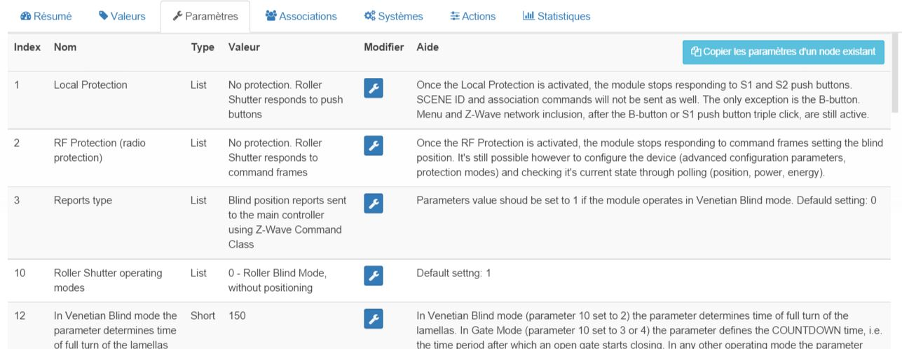
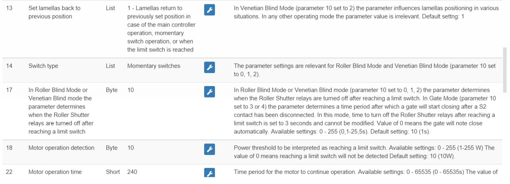

# Fibaro FGRM-222 "Rollladen"

**Das Modul**

**Das Jeedom Visual**

## Zusammenfassung

Mit dem Mikromodul FGRM-222 können Sie dank des Z-Wave-Protokolls die Motorisierungen der elektronischen Verschlüsse, die Jalousien oder sogar die Garagentore verwalten und dabei Ihren vorhandenen Schalter beibehalten. Sie können den angeschlossenen Motor daher über den vorhandenen Schalter, einen Z-Wave-Sender oder direkt über die Taste am Mikromodul aktivieren.

Darüber hinaus kann dieses Mikromodul den momentanen (W) und kumulativen (KWh) Stromverbrauch der daran angeschlossenen Geräte übertragen.

Ein Z-Wave-Controller (Fernbedienung, Dongle usw.) ist erforderlich, um dieses Modul in Ihr Netzwerk zu integrieren, wenn Sie bereits über ein vorhandenes Netzwerk verfügen.

Jedes Z-Wave-Modul funktioniert wie ein drahtloser Repeater mit den anderen Modulen, um eine vollständige Abdeckung Ihres Hauses zu gewährleisten.

Notiz : Dieses Modul benötigt zum Betrieb einen Neutralleiter.

## Fonctions

-   Steuern Sie Ihre Jalousien oder Rollläden fern
-   Kompatibel mit BSO und Jalousie mit Lamellenpositionierung
-   Wird hinter einem vorhandenen Switch installiert
-   Auf / Ab und Positionierungsfunktion
-   Kompatibel mit Motoren mit mechanischem oder elektronischem Anschlag
-   Messung des momentanen und kumulativen Verbrauchs
-   Drahtloses Update mit der Fibaro Home Center 2-Box
-   Testfunktion für die Z-Wave-Netzabdeckung
-   Klein, diskret und ästhetisch
-   Benutzerfreundlichkeit und Installation

## Technische Daten

-   Modultyp : Z-Wave Empfänger
-   Versorgung : 230 V, 50 Hz
-   Stromverbrauch : &lt; 0,8W
-   Verkabelung : 3 Draht, Neutralleiter erforderlich
-   Maximale Belastung : 1000W
-   Frequenz : 868,42 MHz
-   Signalstärke : 1mW
-   Übertragungsentfernung : 50 m freies Feld, 30 m drinnen
-   Dimensions: 17 x 42 x 37 mm
-   Betriebstemperatur : 0-40 ° C
-   Temperatur begrenzen : 105°C
-   Standards : LVD (2006/95 / EG), EMV (2004 / 10B / EG), R & TTE (1999/5 / EG)

## Moduldaten

-   Machen Sie : Fibar Group
-   Name : Fibaro FGRM-222
-   Hersteller ID : 271
-   Produkttyp : 769
-   Produkt-ID : 4097

## Configuration

Informationen zum Konfigurieren des OpenZwave-Plugins und zum Einfügen von Jeedom finden Sie hier [Dokumentation](https://doc.jeedom.com/de_DE/plugins/automation%20protocol/openzwave/).

> **Wichtig**
>
> Um dieses Modul in den Einschlussmodus zu versetzen, drücken Sie die Einschlusstaste gemäß der Papierdokumentation dreimal.

Einmal enthalten, sollten Sie dies erhalten :

### Commandes

Sobald das Modul erkannt wurde, sind die dem Modul zugeordneten Befehle verfügbar.

Hier ist die Liste der Befehle :

-   Zustand : Mit diesem Befehl können Sie die Position Ihres Verschlusses ermitteln
-   Positionierung : Es ist der Befehl, mit dem der Prozentsatz der Öffnung definiert werden kann
-   Auf : Mit diesem Befehl können Sie den Verschluss vollständig öffnen
-   Runter : Es ist der Befehl, der den Verschluss vollständig schließt
-   Aktualisieren : Mit diesem Befehl können Sie erneut nach der Position des Verschlusses fragen
-   Macht : Befehl, der den Verbrauch des Moduls zulässt
-   Verbrauch : Befehl, mit dem die vom Modul verbrauchte Momentanleistung ermittelt werden kann
-   STOP : Steuerung, um die Bewegung des Verschlusses zu stoppen
-   STOP BSO : Befehl zum Stoppen der Bewegung (im einstellbaren Lamellenmodus)
-   Kippen : Ermöglicht das Neigen der Lamellen (einstellbarer Lamellenmodus)
-   Ablehnen : Ermöglicht das Ablehnen der Lamellen (einstellbarer Lamellenmodus)
-   Nicht : Wird verwendet, um den Schritt zum Drücken von Ablehnen oder Neigen zu definieren

### Konfiguration des Moduls

Wenn Sie das Modul dann entsprechend Ihrer Installation konfigurieren möchten, müssen Sie die Schaltfläche "Konfiguration" des OpenZwave-Plugins von Jeedom aufrufen.

Sie gelangen auf diese Seite (nachdem Sie auf die Registerkarte Einstellungen geklickt haben)

Parameterdetails :

-   1: ermöglicht das Blockieren des Moduls (zum Einfrieren eines Verschlusses) (beim Drücken eines Schalters)
-   2: Das Gleiche gilt für zwave-Befehle
-   3: Art der Berichte (klassisch oder faserig)
-   10: Betriebsart (Jalousie, Verschluss usw.)
-   12: Dauer einer vollen Runde (im Jalousiemodus)
-   13: Hier können Sie auswählen, wann die Lamellen in ihre vorherige Position zurückkehren sollen
-   14: ermöglicht die Auswahl des Schaltertyps
-   17: Hier können Sie auswählen, wie lange nach dem in 18 festgelegten Grenzwert der Verschluss stoppt
-   18: Motorsicherheitsleistung
-   22: NA
-   29: ermöglicht die Kalibrierung der Klappe
-   30 bis 35: ermöglicht es, das Verhalten des Moduls vor den verschiedenen zwave-Alarmen zu definieren
-   40: Leistungsdelta, um eine Erhöhung der Informationen auszulösen (auch außerhalb des in 42 definierten Zeitraums)
-   42: Info Feedback Zeitraum
-   43: Energiedelta, um einen Informationsanstieg auszulösen (auch außerhalb des in 42 definierten Zeitraums)
-   44: ermöglicht die Auswahl, ob der Verbrauch und die Leistung den des Moduls selbst berücksichtigen müssen
-   50: Hier können Sie auswählen, ob das Modul die Informationen im Szenenmodus oder im Assoziationsmodus in Zuordnung an die Knoten senden soll

### Groupes

Dieses Modul hat 3 Assoziationsgruppen, nur die dritte ist wesentlich.

## Gut zu wissen

### Reset

Sie können Ihren Verbrauchszähler zurücksetzen, indem Sie auf diese Schaltfläche auf der Registerkarte System klicken.

### Important

> **Wichtig**
>
> Damit die Statusrückmeldung in Jeedom funktioniert, muss die Gerätekalibrierung erzwungen werden (Parameter 29 bis "Ja") und die Positionierung muss aktiv sein (Parameter 10 mit den Werten "Active Direct", "Active Venetian" "oder" Aktive Tür ").

## Wakeup

Keine Vorstellung von Aufwecken auf diesem Modul.
