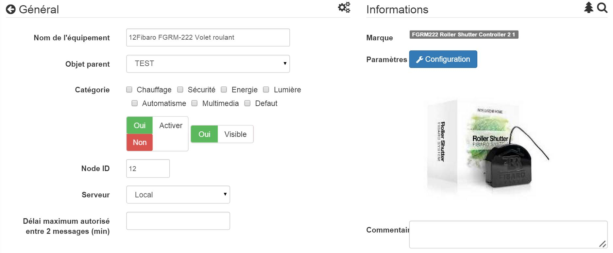

# Fibaro FGRM-222 "Rollladen"

**Das Modul**

**Das Jeedom Visual**

## Zusammenfassung

. .

.

.

Jedes Z-Wave-Modul funktioniert wie ein drahtloser Repeater mit den anderen Modulen, um eine vollständige Abdeckung Ihres Hauses zu gewährleisten.

Notiz : Dieses Modul benötigt zum Betrieb einen Neutralleiter.

## Fonctions

-   Steuern Sie Ihre Jalousien oder Rollläden fern
-   
-   Wird hinter einem vorhandenen Switch installiert
-   Auf / Ab und Positionierungsfunktion
-   Kompatibel mit Motoren mit mechanischem oder elektronischem Anschlag
-   Messung des momentanen und kumulativen Verbrauchs
-   Drahtloses Update mit der Fibaro Home Center 2-Box
-   Testfunktion für die Z-Wave-Netzabdeckung
-   Klein, diskret und ästhetisch
-   Benutzerfreundlichkeit und Installation

## Technische Daten

-   Modultyp : Z-Wave Empfänger
-   Versorgung : 230 V, 50 Hz
-   Stromverbrauch : &lt; 0,8W
-   Verkabelung : 3 Draht, Neutralleiter erforderlich
-   Maximale Belastung : 1000W
-   Frequenz : 868,42 MHz
-   Signalstärke : 1mW
-   Übertragungsentfernung : 50 m freies Feld, 30 m drinnen
-   Dimensions: 17 x 42 x 37 mm
-   Betriebstemperatur : 0-40 ° C
-   Temperatur begrenzen : 105°C
-   Standards : LVD (2006/95 / EG), EMV (2004 / 10B / EG), R & TTE (1999/5 / EG)

## Moduldaten

-   Machen Sie : Fibar Group
-   Name : Fibaro FGRM-222
-   Hersteller ID : 271
-   Produkttyp : 769
-   Produkt-ID : 4097

## Configuration

Informationen zum Konfigurieren des OpenZwave-Plugins und zum Einfügen von Jeedom finden Sie hier [Dokumentation](https://doc.jeedom.com/de_DE/plugins/automation%20protocol/openzwave/).

> **Wichtig**
>
> Um dieses Modul in den Einschlussmodus zu versetzen, drücken Sie die Einschlusstaste gemäß der Papierdokumentation dreimal.

Einmal enthalten, sollten Sie dies erhalten :

### Commandes

Sobald das Modul erkannt wurde, sind die dem Modul zugeordneten Befehle verfügbar.

Hier ist die Liste der Befehle :

-   Zustand : 
-   Positionierung : 
-   Auf : Mit diesem Befehl können Sie den Verschluss vollständig öffnen
-   Runter : Es ist der Befehl, der den Verschluss vollständig schließt
-   Aktualisieren : 
-   Macht : Befehl, der den Verbrauch des Moduls zulässt
-   Verbrauch : 
-   STOP : Steuerung, um die Bewegung des Verschlusses zu stoppen
-   STOP BSO : 
-   Kippen : Ermöglicht das Neigen der Lamellen (einstellbarer Lamellenmodus)
-   Ablehnen : Ermöglicht das Ablehnen der Lamellen (einstellbarer Lamellenmodus)
-   Nicht : 

### Konfiguration des Moduls

Wenn Sie das Modul dann entsprechend Ihrer Installation konfigurieren möchten, müssen Sie die Schaltfläche "Konfiguration" des OpenZwave-Plugins von Jeedom aufrufen.

Sie gelangen auf diese Seite (nachdem Sie auf die Registerkarte Einstellungen geklickt haben)

Parameterdetails :

-   1: 
-   2: Das Gleiche gilt für zwave-Befehle
-   3: Art der Berichte (klassisch oder faserig)
-   10: Betriebsart (Jalousie, Verschluss usw.)
-   12: Dauer einer vollen Runde (im Jalousiemodus)
-   13: 
-   14: ermöglicht die Auswahl des Schaltertyps
-   17: 
-   18: Motorsicherheitsleistung
-   22: NA
-   29: ermöglicht die Kalibrierung der Klappe
-   30 bis 35: 
-   40: 
-   42: Info Feedback Zeitraum
-   43: 
-   44: 
-   50: 

### Groupes

.

## Gut zu wissen

### Reset

.

### Important

> **Wichtig**
>
> .

## Wakeup

Keine Vorstellung von Aufwecken auf diesem Modul.
