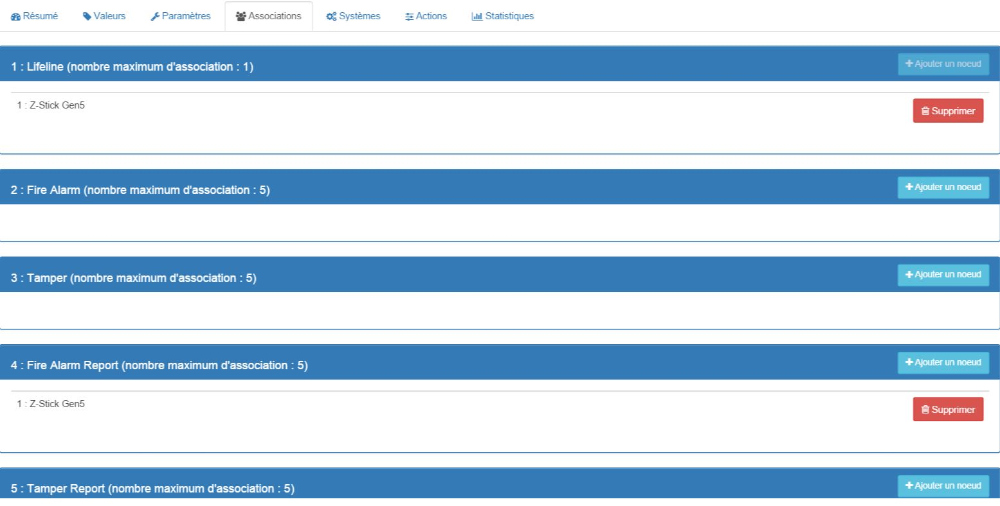

# Fibaro FGSD-002 "Rauchsensor 2"

**Das Modul**

**Das Jeedom Visual**

## Zusammenfassung

. . .

:2005. .

Einige Materialien brennen ohne zu rauchen. . . . .

## Fonctions

-   Z-Wave Rauchmelder
-   Batteriebetrieben
-   Einstellbare Sensorempfindlichkeit (3 Stufen)
-   Manipulationsschutz
-   Alarm durch Ton, LED-Licht und Z-Wave-Signal
-   Branderkennung durch Messung der Lufttemperatur
-   Automatischer Effizienztest, alle 5 Sekunden durchgeführt
-   Integrierter Z-Wave-Netzabdeckungstester
-   Entspricht der Norm EN 14604:2005
-   Z-Wave Plus kompatibel
-   

## Technische Daten

-   Modultyp : Z-Wave Sender
-   Versorgung : 3V CR123A Lithiumbatterie
-   Akkulaufzeit : 3 Jahre
-   Frequenz : 868,42 MHz
-   Übertragungsentfernung : 50 m freies Feld, 30 m drinnen
-   Abmessungen : 65 x 28 mm (Durchmesser x Höhe)
-   Betriebstemperatur : 0-55 ° C
-   Betriebsfeuchtigkeit : 0% - 93%
-   Temperaturmessbereich : -20 bis 100 ° C.
-   Rauchempfindlichkeit : 
-   Geräuschpegel: 85 dB bei 3 m
-   Messgenauigkeit : 0,5 ° C (in einem Bereich von 0 bis 55 ° C)
-   Standards : EMC 2004/108 / EC und R & TTE 199/5 / WE
-   Zertifizierungen : EN 14604:2005

## Moduldaten

-   Machen Sie : Fibar Group
-   Name : Fibaro Rauchsensor FGSD-002
-   Hersteller ID : 271
-   Produkttyp : 3074
-   Produkt-ID : 4098

## Configuration

Informationen zum Konfigurieren des OpenZwave-Plugins und zum Einfügen von Jeedom finden Sie hier [Dokumentation](https://doc.jeedom.com/de_DE/plugins/automation%20protocol/openzwave/).

> **Wichtig**
>
> .

Einmal enthalten, sollten Sie dies erhalten :

### Commandes

Sobald das Modul erkannt wurde, sind die dem Modul zugeordneten Befehle verfügbar.

Hier ist die Liste der Befehle :

-   Rauch : 
-   Temperatur : Es ist der Temperaturmessbefehl
-   Sabotage : Dies ist der Sabotagebefehl. 
-   Testalarm : 
-   Hitzealarm : 
-   Batterie : Es ist der Batteriebefehl

### Konfiguration des Moduls

> **Wichtig**
>
> Wecken Sie das Modul bei einer ersten Aufnahme immer unmittelbar nach der Aufnahme auf.

Dann ist es notwendig, das Modul entsprechend Ihrer Installation zu konfigurieren. Gehen Sie dazu auf die Schaltfläche "Konfiguration" des OpenZwave-Plugins von Jeedom.

Sie gelangen auf diese Seite (nachdem Sie auf die Registerkarte Einstellungen geklickt haben)

Parameterdetails :

-   Aufwachen : 
-   1: Passt die Empfindlichkeit der Raucherkennung an
-   2:  : toutes)
-   3: 
-   4: 
-   10: 
-   11: idem
-   12: idem
-   13: 
-   20: Zeit zwischen zwei Temperaturberichten
-   21: 
-   30: Temperatur des Wärmealarmauslösers
-   31: Berichtsintervall für Temperaturspitzen
-   32: Signalintervall bei Verlust von Zwave

### Groupes

Für einen optimalen Betrieb Ihres Moduls. :

## Gut zu wissen

### Besonderheiten

## Wakeup

Um dieses Modul zu aktivieren, drücken Sie dreimal die zentrale Taste

## Wichtiger Hinweis

> **Wichtig**
>
> Sie müssen das Modul aufwecken : nach seiner Aufnahme, nach einer Änderung der Konfiguration, nach einer Änderung des Aufweckens, nach einer Änderung der Assoziationsgruppen
