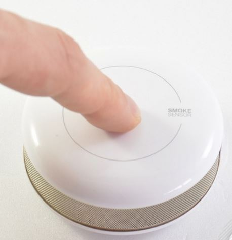
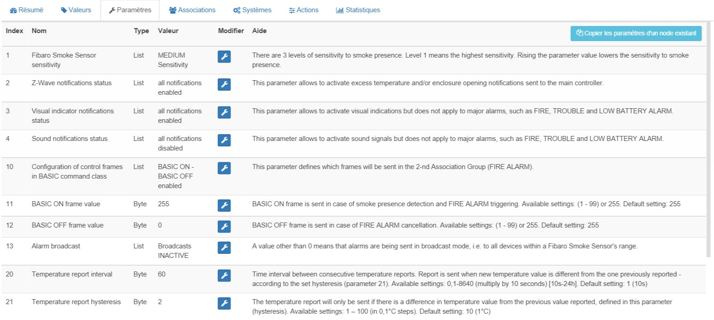

# Fibaro FGSD-002 "Rauchsensor 2"

**Das Modul**

**Das Jeedom Visual**

## Zusammenfassung

Mit glatten Linien, einer polierten Oberfläche und einer geringen Größe können Sie mit mehrfarbigen RGB-LEDs und einer integrierten Sirene auf eine Bedrohung aufmerksam gemacht werden. Das große Format des Gitters ermöglicht es, die kleinste Rauchmenge zu erfassen, um eine schnelle Reaktion zu erzielen. Es wird sehr leicht seinen Platz in Ihrem Haus finden, um die Sicherheit der ganzen Familie zu bewahren.

Der Rauchmelder Fibaro FGSD-002 ist ein autonomer Rauchmelder (DAAF) gemäß der Norm EN 14604:2005. Obwohl autonom, ist es dank der Z-Wave Plus-Technologie auch kommunikativ.

Einige Materialien brennen ohne zu rauchen. Aus diesem Grund haben die Fibaro-Ingenieure beschlossen, ihren Rauchmelder in Form eines Temperatursensors zusätzlich zu schützen. Wenn nicht genügend Rauch vorhanden ist, um den Alarm auszulösen, kann das Gerät dennoch eine Bedrohung erkennen, indem es eine durch das Feuer verursachte schnelle Temperaturänderung erkennt. Eine schnelle Änderung der Temperatur oder ein Anstieg auf 54 ° C reicht aus, damit der Rauchsensor eine Bedrohung erkennt und sie den Bewohnern des Hauses meldet. Nur diese Art von Rauchsensor bietet einen hohen Wirkungsgrad, unabhängig davon, was verbrennt.

## Funktionen

-   Z-Wave Rauchmelder
-   Batteriebetrieben
-   Einstellbare Sensorempfindlichkeit (3 Stufen)
-   Manipulationsschutz
-   Alarm durch Ton, LED-Licht und Z-Wave-Signal
-   Branderkennung durch Messung der Lufttemperatur
-   Automatischer Effizienztest, alle 5 Sekunden durchgeführt
-   Integrierter Z-Wave-Netzabdeckungstester
-   Entspricht der Norm EN 14604:2005
-   Z-Wave Plus kompatibel
-   Sehr einfache Installation - installieren Sie es einfach an einem Ort, an dem Brandgefahr besteht

## Technische Daten

-   Modultyp : Z-Wave Sender
-   Versorgung : 3V CR123A Lithiumbatterie
-   Akkulaufzeit : 3 Jahre
-   Frequenz : 868,42 MHz
-   Übertragungsentfernung : 50 m freies Feld, 30 m drinnen
-   Abmessungen : 65 x 28 mm (Durchmesser x Höhe)
-   Betriebstemperatur : 0-55 ° C
-   Betriebsfeuchtigkeit : 0% - 93%
-   Temperaturmessbereich : -20 bis 100 ° C.
-   Rauchempfindlichkeit : 1. Stufe - 1,20 +/- 0,5% obs / m; 2. Stufe - 1,80 +/- 0,5% obs / m; 3. Stufe - 2,80 +/- 0,5% obs / m
-   Geräuschpegel: 85 dB bei 3 m
-   Messgenauigkeit : 0,5 ° C (in einem Bereich von 0 bis 55 ° C)
-   Standards : EMC 2004/108 / EC und R & TTE 199/5 / WE
-   Zertifizierungen : EN 14604:2005

## Moduldaten

-   Machen Sie : Fibar Group
-   Name : Fibaro Rauchsensor FGSD-002
-   Hersteller ID : 271
-   Produkttyp : 3074
-   Produkt-ID : 4098

## Konfiguration

Informationen zum Konfigurieren des OpenZwave-Plugins und zum Einfügen von Jeedom finden Sie hier [Dokumentation](https://doc.jeedom.com/de_DE/plugins/automation%20protocol/openzwave/).

> **Wichtig**
>
> Um dieses Modul in den Einschlussmodus zu versetzen, drücken Sie die zentrale Einschlusstaste gemäß der Papierdokumentation dreimal.

Einmal enthalten, sollten Sie dies erhalten :

### Befehle

Sobald das Modul erkannt wurde, sind die dem Modul zugeordneten Befehle verfügbar.

Hier ist die Liste der Befehle :

-   Rauch : Dies ist der Modulalarmbefehl (für Rauch, Hitze usw.)
-   Temperatur : Es ist der Temperaturmessbefehl
-   Sabotage : Dies ist der Sabotagebefehl. Es signalisiert das Öffnen des Gehäuses
-   Testalarm : Es ist der Befehl, der die Tatsache anzeigt, dass sich das Modul im Testmodus befindet
-   Hitzealarm : Es ist die Steuerung, die einen Wärmealarm auslöst (noch nicht zuverlässig)
-   Batterie : Es ist der Batteriebefehl

### Konfiguration du module

> **Wichtig**
>
> Wecken Sie das Modul bei einer ersten Aufnahme immer unmittelbar nach der Aufnahme auf.

Dann ist es notwendig, das Modul entsprechend Ihrer Installation zu konfigurieren. Gehen Sie dazu auf die Schaltfläche "Konfiguration" des OpenZwave-Plugins von Jeedom.

Sie gelangen auf diese Seite (nachdem Sie auf die Registerkarte Einstellungen geklickt haben)

Parameterdetails :

-   Aufwachen : Dies ist das Aufweckintervall des Moduls (empfohlener Wert 21600)
-   1: Passt die Empfindlichkeit der Raucherkennung an
-   2: Hier können Sie auswählen, welche Benachrichtigungen an Jeedom gesendet werden sollen (Beratung : toutes)
-   3: ermöglicht die Auswahl, welche Benachrichtigungen von einer visuellen Anzeige begleitet werden
-   4: ermöglicht die Auswahl, welche Benachrichtigungen von einer akustischen Anzeige begleitet werden (in allen Fällen ertönt das Modul durch die Hitze- und Branderkennung)
-   10: Ändern Sie diese Einstellung nur, wenn Sie wissen, was Sie tun
-   11: idem
-   12: idem
-   13: Ermöglicht das Benachrichtigen anderer zwave-Module (zum Deaktivieren, sofern Sie nicht wissen, warum Sie es aktivieren)
-   20: Zeit zwischen zwei Temperaturberichten
-   21: Temperaturdifferenz, von der aus die Temperatur an Jeedom gesendet wird, auch wenn die Dauer der Spitze nicht erreicht wird
-   30: Temperatur des Wärmealarmauslösers
-   31: Berichtsintervall für Temperaturspitzen
-   32: Signalintervall bei Verlust von Zwave

### Gruppen

Für einen optimalen Betrieb Ihres Moduls. Jeedom muss mindestens den Gruppen 1, 4 und 5 zugeordnet sein:

## Gut zu wissen

### Besonderheiten

## Aufwachen

Um dieses Modul zu aktivieren, drücken Sie dreimal die zentrale Taste

## Wichtiger Hinweis

> **Wichtig**
>
> Sie müssen das Modul aufwecken : nach seiner Aufnahme, nach einer Änderung der Konfiguration, nach einer Änderung des Aufweckens, nach einer Änderung der Assoziationsgruppen
