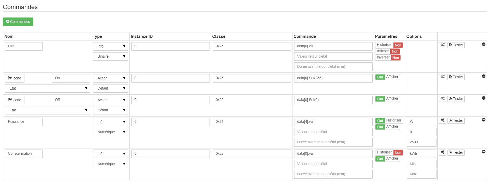

" 
=============================

\.

-   **Das Modul**

\.

\.

-   **Das Jeedom Visual**

\.

\.

Zusammenfassung 
------

\.

. 

. 

. 

\.

Funktionen 
---------

\.

-   .

-   .

-   : Relais.

-   
    .

\.

Technische Daten 
---------------------------

\.

-   Modultyp : Z-Wave Empfänger

-   Versorgung : 

-   Stromverbrauch : 

-   Maximale Belastung : 

-   Frequenz : 

-   Übertragungsentfernung : 50 m freies Feld, 30 m drinnen

-   Abmessungen: 17 x 42 x 37 mm

-   Betriebstemperatur : 0-40 ° C.

-   Temperatur begrenzen : 105 ° C.

-   Standards : 

\.

Moduldaten 
-----------------

\.

-   Machen Sie : Fibar Group

-   Name : 

-   Hersteller ID : 271

-   Produkttyp : 1536

-   Produkt-ID : 4096

\.

Konfiguration 
-------------

\.

So konfigurieren Sie das OpenZwave-Plugin und wissen, wie Sie Jeedom einsetzen
Aufnahme beziehen sich darauf
[documentation](https://jeedom.fr/doc/documentation/plugins/openzwave/de_DE/openzwave.html).

\.

> **Wichtig**
>
> Um dieses Modul in den Einschlussmodus zu versetzen, drücken Sie die Taste dreimal
> Einschlussknopf gemäß seiner Papierdokumentation.

\.

\.

Einmal enthalten, sollten Sie dies erhalten :

\.

\.

### Befehle 

\.

Sobald das Modul erkannt wurde, werden die dem Modul zugeordneten Befehle ausgeführt
verfügbar.

\.

\.

Hier ist die Liste der Befehle :

\.

-   Zustand : Es ist der Befehl, mit dem der Status des
    Steckdose

-   Ein : Dies ist der Befehl, der die Steckdose einschaltet

-   Aus : Es ist der Befehl, der es ermöglicht, den Fang zu löschen

-   Macht : Dies ist der Befehl, der die momentane Leistung erhöht
    verbraucht

-   Verbrauch : Es ist die Bestellung, die den Gesamtverbrauch angibt

\.

Beachten Sie, dass im Dashboard die Befehle ON / OFF / STATUS zusammengefasst sind
in einer Taste.

\.

### Konfiguration des Moduls 

\.

Dann, wenn Sie das Modul entsprechend konfigurieren möchten
Ihrer Installation müssen Sie durch die Schaltfläche gehen
"Konfiguration "des OpenZwave-Plugins von Jeedom.

\.

\.

Sie gelangen auf diese Seite (nachdem Sie auf die Registerkarte geklickt haben
Einstellungen)

\.

\.

Parameterdetails :

\.

-   1: 

-   16: 
    

-   34: 
    

-   35: 

-   39: 

-   40: 
    

-   42: 
    

-   43: 

-   45: 

-   47: 
    

-   49: 
    Werte

-   50: 

-   51: 

-   52: 
    

-   60: 

-   61: 

-   62: 

-   63: 

-   70: 
    

\.

### Gruppen 

\.

Dieses Modul hat 3 Assoziationsgruppen, nur die dritte ist
wesentlich.

\.

\.

Gut zu wissen 
------------

\.

### Zurücksetzen 

\.

\.

Sie können Ihre Verbrauchsanzeige zurücksetzen, indem Sie auf klicken
auf dieser Schaltfläche auf der Registerkarte System verfügbar. Du musst wählen
Drücken Sie die Taste.

\.

### Alternative visuelle 

\.

\.

Aufwachen 
------

\.

Keine Vorstellung von Aufwecken auf diesem Modul.

\.

Faq. 
------

\.

Lesen Sie den Abschnitt Zurücksetzen in diesem Dokument.

\.

**@sarakha63**
