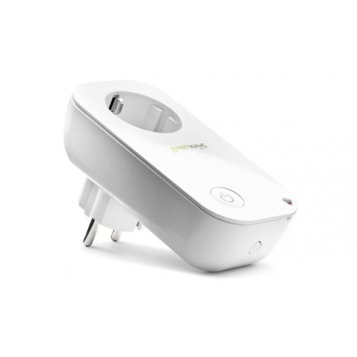

# Greenwave PowerNode - 1 Stecker

**Das Modul**

**Das Jeedom Visual**

## Zusammenfassung

.

.

. .

. Zum Beispiel "blau für das Schlafzimmer ". . . .

 : .

. . .

## Fonctions

-   Steuern Sie eine Lampe oder ein Gerät fern
-   Steckermodul, das direkt zwischen einer Steckdose und der zu steuernden Last integriert ist
-   Ermöglicht die Überwachung des Verbrauchs des angeschlossenen Geräts
-   EIN / AUS-Funktion
-   
-   Ein / Aus-Taste direkt an der Steckdose
-   Überstromschutz
-   Lichtstatusanzeige

## Technische Daten

-   Versorgung : 250 V AC, 50 Hz
-   Maximaler Ladestrom : 10A
-   Maximale Lastleistung : 2400 W (bei 240 V)
-   Standby-Verbrauch : 0,4 W.
-   Messgenauigkeit : ± 0,1 W.
-   Überstromschutz : 10A interne Sicherung
-   Steckertyp : DIN49440 / EWG 7/7 (Schuko)
-   Z-Wave-Radiofrequenz : 868,42 MHz
-   Maximale Reichweite Z-Wave : 30m
-   Betriebstemperatur : 0 ° C bis + 25 ° C
-   Lagertemperatur : -20 ° C bis + 60 ° C
-   Maximale Luftfeuchtigkeit : 5% bis 90%
-   IP-Klasse (Feuchtigkeitstoleranz) : IP20

## Moduldaten

-   Machen Sie : GreenWave
-   Name : GreenWave \ [1 x Stecker \]
-   Hersteller ID : 153
-   Produkttyp : 2
-   Produkt-ID : 2

## Configuration

Informationen zum Konfigurieren des OpenZwave-Plugins und zum Einfügen von Jeedom finden Sie hier [Dokumentation](https://doc.jeedom.com/de_DE/plugins/automation%20protocol/openzwave/).

> **Wichtig**
>
> .

Einmal enthalten, sollten Sie dies erhalten :

### Commandes

Sobald das Modul erkannt wurde, sind die dem Modul zugeordneten Befehle verfügbar.

Hier ist die Liste der Befehle :

-   Zustand : Es ist der Befehl, mit dem der Status des Sockets ermittelt werden kann
-   Ein : Dies ist der Befehl, der die Steckdose einschaltet
-   Aus : Es ist der Befehl, der es ermöglicht, den Fang zu löschen
-   Macht : 
-   Verbrauch : Es ist die Bestellung, die den Gesamtverbrauch angibt

.

### Konfiguration des Moduls

Sie können das Modul entsprechend Ihrer Installation konfigurieren. Gehen Sie dazu auf die Schaltfläche "Konfiguration" des OpenZwave-Plugins von Jeedom.

Sie gelangen auf diese Seite (nachdem Sie auf die Registerkarte Einstellungen geklickt haben)

.

Parameterdetails :

-   1 : Verzögerung, bevor die Taste blinkt : 
-   2 : Ausgewählte Radfarbe (automatisch erkannt)

### Groupes

.

## Gut zu wissen

.

### Reset

. .

### Besonderheiten

## Wakeup

Keine Vorstellung von Aufwecken auf diesem Modul.
